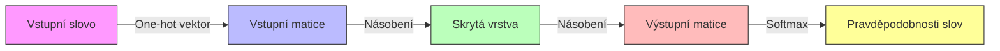
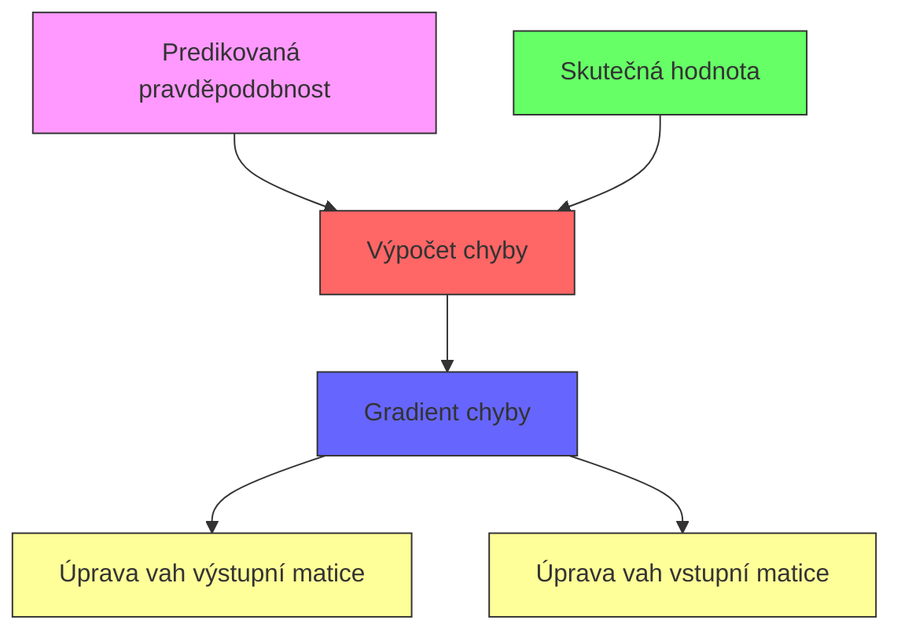
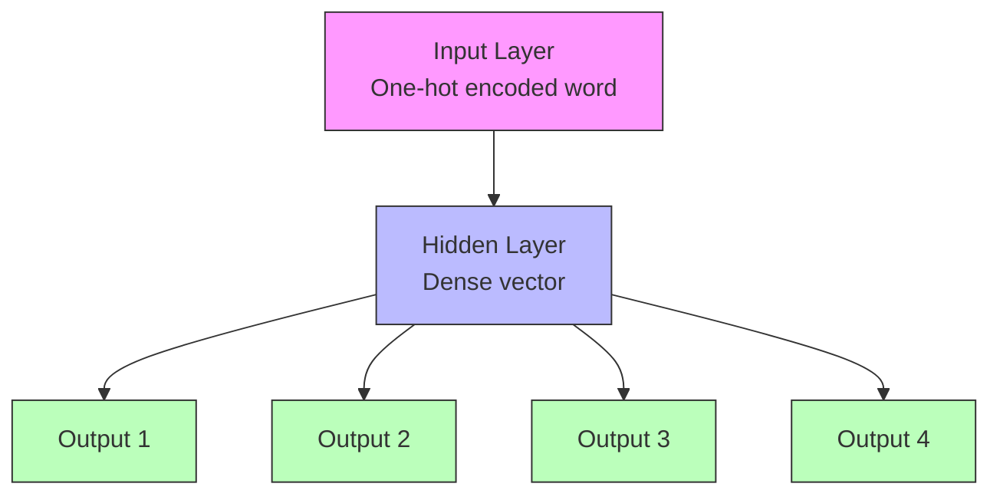
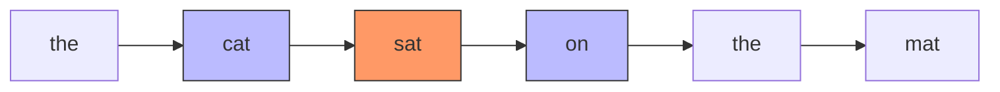

Představte si, že se snažíte naučit počítač rozumět významům slov. Jak byste to udělali? [Word2vec](/ai/word2vec/), průlomová technologie v oblasti zpracování přirozeného jazyka, přišla s elegantním řešením: učí počítač chápat slova skrze jejich kontext - tedy podle toho, jaká jiná slova se obvykle vyskytují v jejich okolí.

## Základní princip: Učení z kontextu

[Word2vec](/ai/word2vec/) vychází z jednoduché, ale mocné myšlenky: význam slova lze pochopit podle slov, která se vyskytují v jeho okolí. Například ve větě "Kočka sedí na měkkém koberci" se slovo "kočka" objevuje v kontextu slov souvisejících s domácím prostředím a odpočinkem.

Podívejme se na konkrétní příklad. Mějme větu:
"The cat sat on the mat"

V tomto případě [Word2vec](/ai/word2vec/) vezme slovo "sat" jako centrální a snaží se předpovědět slova v jeho okolí ("cat" a "on"). Tento proces se nazývá Skip-gram model.

## Jak to funguje technicky

[Word2vec](/ai/word2vec/) převádí každé slovo na vektor čísel - dlouhou řadu čísel (typicky 100-300 hodnot), která reprezentují různé aspekty významu slova. Tyto vektory jsou zpočátku náhodné, ale během tréninku se postupně upravují tak, aby slova s podobným významem měla podobné vektory.

Model pracuje ve dvou hlavních krocích:

1. Predikce: Pro dané centrální slovo se snaží předpovědět okolní slova
2. Učení: Podle úspěšnosti předpovědi upravuje číselné hodnoty ve vektorech

### Jak probíhá predikce ve [Word2vec](/ai/word2vec/)

Predikce ve [Word2vec](/ai/word2vec/) je matematický proces, který převádí vstupní slovo na pravděpodobnosti výskytu okolních slov. Pojďme si tento proces rozebrat krok po kroku.

#### 1. Reprezentace vstupního slova

Nejprve se vstupní slovo převede na takzvaný "one-hot" vektor. Je to dlouhý vektor obsahující samé nuly a jedinou jedničku na pozici odpovídající danému slovu ve slovníku. Například pro slovník o velikosti 10000 slov by to byl vektor o 10000 prvcích.

#### 2. První transformace - vstupní matice

Tento one-hot vektor se vynásobí se vstupní maticí (označovanou často jako matice W). Tato matice má rozměry [velikost_slovníku × velikost_skryté_vrstvy]. Díky one-hot kódování se z matice vlastně vybere jeden řádek, který reprezentuje naše vstupní slovo jako hustý vektor (například 300 čísel).

#### 3. Skrytá vrstva

Vektor ze skryté vrstvy představuje samotnou reprezentaci slova v sémantickém prostoru. Tento vektor zachycuje význam slova v koncentrované podobě.

#### 4. Druhá transformace - výstupní matice

Vektor ze skryté vrstvy se vynásobí s další maticí (označovanou jako matice W'), která má rozměry [velikost_skryté_vrstvy × velikost_slovníku]. Výsledkem je vektor skóre pro každé slovo ve slovníku.

#### 5. Softmax funkce

Poslední krok převádí tato skóre na pravděpodobnosti pomocí softmax funkce:

Pro každé slovo i ve slovníku se vypočítá pravděpodobnost jako:

P(slovo_i) = exp(skóre_i) / suma(exp(skóre_všech_slov))

Tento vzorec zajistí, že:
- Všechny pravděpodobnosti jsou kladná čísla
- Součet všech pravděpodobností je 1
- Větší skóre znamená větší pravděpodobnost

### Konkrétní příklad

Vezměme větu "kočka sedí na _____" a předpokládejme, že model předpovídá následující slovo:

1. Slovo "na" se převede na one-hot vektor
2. Tento vektor se transformuje přes vstupní matici na vektor ve skryté vrstvě
3. Skrytá vrstva se transformuje přes výstupní matici na skóre pro všechna slova
4. Softmax funkce převede skóre na pravděpodobnosti
5. Model může předpovědět například:
   - koberci: 0.3
   - střeše: 0.2
   - židli: 0.15
   - stole: 0.1
   - ...další slova s nižšími pravděpodobnostmi

### Vylepšení procesu

V praxi se používají různá vylepšení pro zefektivnění výpočtu:
- Negative sampling: místo výpočtu pravděpodobností pro celý slovník se počítá jen pro malý vzorek slov
- Hierarchický softmax: používá binární strom pro efektivnější výpočet pravděpodobností
- Subsampling častých slov: častá slova (například "a", "the") se občas přeskakují, protože nepřinášejí tolik informací

Celý tento proces predikce se během tréninku neustále opakuje a model postupně upravuje váhy ve vstupní a výstupní matici tak, aby jeho předpovědi byly co nejpřesnější.

Vysvětlím proces učení ve [Word2vec](/ai/word2vec/) modelu.

## Proces učení ve [Word2vec](/ai/word2vec/)

Učení je klíčovým procesem, při kterém se Word2vec model zdokonaluje ve svých predikcích. Pojďme si podrobně vysvětlit, jak tento proces funguje. Učení ve Word2vec je založeno na principu minimalizace chyby mezi tím, co model předpověděl, a tím, co skutečně pozorujeme v textu. Proces probíhá v několika krocích:

#### 1. Výpočet chyby

Pro každou predikci model vypočítá chybu. Představme si konkrétní příklad:
- Máme větu: "Kočka sedí na koberci"
- Model se snaží předpovědět slovo "koberci" na základě kontextu "na"
- Model možná předpoví:
  - koberci: 0.3
  - střeše: 0.2
  - židli: 0.15
  
Skutečnost je, že "koberci" má mít pravděpodobnost 1 a ostatní slova 0. Rozdíl mezi těmito hodnotami tvoří chybu.

#### 2. Zpětná propagace chyby

Chyba se následně "propaguje" zpět skrz síť. Používá se k tomu matematická operace zvaná gradient, který určuje, jak by se měly změnit váhy v obou maticích (vstupní i výstupní), aby se chyba zmenšila.

#### 3. Úprava vah - Gradientní sestup

Model používá techniku zvanou gradientní sestup. Je to jako když se snažíte najít dno údolí v mlze:
1. Zjistíte, kterým směrem vede cesta dolů (gradient)
2. Uděláte malý krok tímto směrem
3. Znovu zjistíte směr a opakujete

V kontextu Word2vec to znamená:
- Malé úpravy čísel ve vstupní matici (reprezentace vstupních slov)
- Malé úpravy čísel ve výstupní matici (predikce kontextových slov)

#### 4. Učící parametry

Důležitou roli hrají tzv. učící parametry:
- Velikost kroku (learning rate): jak velké změny se provádějí
- Velikost dávky (batch size): kolik příkladů se zpracuje najednou
- Počet epoch: kolikrát se projde celý dataset

### Optimalizační techniky

Word2vec používá několik technik pro zefektivnění učení:

#### Negative Sampling
Místo úpravy vah pro všechna slova ve slovníku se upravují jen váhy pro:
- Správné slovo (positive sample)
- Několik náhodně vybraných nesprávných slov (negative samples)

To výrazně zrychluje učení při zachování kvality výsledků.

#### Stochastic Gradient Descent (SGD)
- Nepočítá se gradient pro celý dataset najednou
- Používají se malé náhodné vzorky dat
- Umožňuje učit model i na velkých datasetech

#### Adaptivní učící rychlost
- Učící rychlost se může měnit během tréninku
- Na začátku větší kroky pro rychlé učení
- Později menší kroky pro jemné doladění

### Konvergence učení

Proces učení pokračuje, dokud:
1. Model nedosáhne předem stanoveného počtu iterací, nebo
2. Chyba neklesne pod určitou hranici, nebo
3. Chyba se přestane významně zmenšovat

Na konci učení máme model, který:
- Umí reprezentovat slova jako vektory
- Zachycuje sémantické vztahy mezi slovy
- Dokáže předpovídat slova na základě kontextu

Kvalitu naučeného modelu lze testovat různými způsoby:
- Analogické úlohy (král - muž + žena = královna)
- Hledání podobných slov
- Shlukování slov do významových skupin

Celý tento proces učení je to, co dává Word2vec jeho schopnost zachytit významy slov a jejich vzájemné vztahy v podobě číselných vektorů.

## Architektura modelu

První diagram ukazuje základní architekturu Word2vec Skip-gram modelu:
- Vstupní vrstva přijímá jedno slovo
- Skrytá vrstva vytváří hustou reprezentaci slova
- Výstupní vrstvy předpovídají okolní slova

Druhý diagram ukazuje, jak model pracuje s kontextovým oknem - v našem příkladu se slovo "sat" učí předpovídat slova "cat" a "on" ve svém okolí.

## Praktické využití

Po natrénování můžeme s vektory slov provádět zajímavé operace:

1. Najít podobná slova (podle vzdálenosti vektorů)
2. Řešit analogie: například "král - muž + žena = královna"
3. Seskupovat související slova
4. Analyzovat významové vztahy mezi slovy

## Výsledek učení

Po natrénování dokáže model například doplnit větu "Kočka sedí na ___" slovem "koberci" nebo jiným vhodným slovem, protože se naučil, že tato slova se často vyskytují v podobných kontextech. Nejde o pouhé statistické počítání společných výskytů - model skutečně zachycuje významové vztahy mezi slovy.

Word2vec představuje základní kámen moderního zpracování přirozeného jazyka a jeho principy jsou dodnes využívány v pokročilejších modelech. Jeho největším přínosem je schopnost zachytit jemné významové nuance slov způsobem, který je pro počítače použitelný a matematicky zpracovatelný.