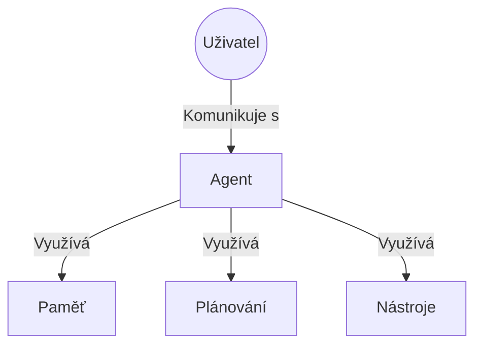

Důležitým tématem v umělé inteligenci se stali v poslední době “agenti”, relativně autonomně působící systémy, které v určitých mantinelech vykonávají samostatně nějakou činnost. Agent v AI je nástroj, který může mít svou vlastní “vůli”, nejsou pevně ošetřeny všechny jeho podmínky a mají zadané pouze téma, kterým se zabývají. Vůli v AI reprezentuje kvalitně natrénovaný velký jazykový model LLM, jenž umožňuje klouzavé zadání úkolu. Jak si takového AI agenta můžete představit?

Tak například můžete vytvořit agenta, který hlídá tweety na síti X a v případě, že dojde k názoru, že příspěvky věnované určitým firmám mohou mít vliv na kurz jejich akcií, upozorní vás nebo rovnou dá přes API pokyn k obchodní transakci. Jak definovat ono “vliv na kurz akcií”? Za starých časů byste definovali seznam slov, které se pozitivně či negativně podepíšou na kurzu akcií a definovali, kolik sledujících musí mít účet, který takový příspěvek vydá. A hlídali byste, kdy na sledovaném účtu vyjde “úspěch” nebo “fail” či jiná klíčová slova.

Jiným příkladem může být vytvoření agenta, který zjistí, kdy je nejvhodnější koupit letenky na vaši dovolenou tak, aby byla nejlepší cena za předstih - a následně je v tuto nejvhodnější chvili objedná. 

Díky LLM může být agent výrazně úspěšnější, protože je schopno výrazně lépe rozpoznávat “sentiment” příspěvku, nemusíte tedy vytvářet slovníky pozitivních či negativních slov a také LLM snadno rozpozná, jaký úspěch takový příspěvek ve virálním šíření může mít. S pomocí LLM agenta je tedy výrazně jednodušší takový systém vytvořit.

Agenti v AI jsou zatím nový a začínající koncept. Ale také velmi slibný. Zatím vám neujíždí vlak - vytvořit agenta zejména pro české prostředí, jazyk a reálie není úplně přímočaré. Ale situace se bude postupně měnit, proto je rozumné být informován a připraven.

Úspěch agentů bude záviset na tom, jak se jednotlivé systémy budou moci pomocí nejrůznějších API propojovat a jak budou konkrétní LLM umět se na tato API napojit pomocí soukromých klíčů. Dnes například není možné se z obecného LLM jako je Claude připojit se na firemní Github, projít zdrojové kódy a hledat chyby v kódu, ačkoliv teoreticky to možné je. Je ale nutná manuální práce. Tu by agenti mohli nahradit.

Pojďme se tedy podívat na to, co dnes agenti obnášejí, jak je použít a být na ně připraven.

## Co jsou to agenti?

„Agenta“ lze definovat několika způsoby. Někteří zákazníci definují agenty jako plně autonomní systémy, které pracují nezávisle po delší dobu a používají různé nástroje k plnění složitých úkolů. Jiní používají tento termín k popisu více preskriptivních implementací, které se řídí předem definovanými pracovními postupy. Osobně považuji za důležitou část agentů řízení pomocí LLM, díky čemuž jsou agenti adaptabilní i na nepředvídatelné možnosti. Tím se liší od systémů, které používají k rozhodování jen například strojové učení a neuronové sítě, tedy předvídatelné statistické modely.

Klíčové vlastnosti agentů zahrnují:

-   Flexibilitu a adaptivitu: Dynamicky si volí postupy a nástroje podle aktuální situace.
-   Samostatnost: Udržují kontrolu nad svým procesem a přizpůsobují se požadavkům úkolu.
-   Rozhodovací schopnosti řízené modelem: Využívají sílu LLM k plánování a realizaci komplexních úloh.
    

Samostatné agentní systémy můžeme rozlišovat do dvou základních architektonických skupin:

-   Workflow jsou systémy, kde jsou LLM a nástroje orchestrovány prostřednictvím předem definovaných cest kódu.
-   Agenti jsou naproti tomu systémy, kde LLM dynamicky řídí své vlastní procesy a použití nástrojů a udržují si kontrolu nad tím, jak plní úkoly.
    

Z popisu vidíme, že Workflow jsou více rigidní systémy, které mají přesně a úzce vymezený mantinel. Agenti oproti tomu mají mnohem širší pole působnosti omezené spíše schopností či vlastnostmi použitého LLM.

Podíváme se postupně na oba systémy.

## Klíčové schopnosti agentů AI

Agenti pro své fungování potřebujují sadu schopností, které jim umožní plnit zadání.

-   Rozumové uvažování: Dokážou plánovat, promýšlet problémy a upravovat svůj přístup, pokud původní řešení nefunguje, což je činí efektivními při řešení složitých úkolů.
    
-   Jednání: Kromě chápání mohou provádět akce pomocí nástrojů, jako je vyhledávání na webu nebo dotazy do databáze, což jim umožňuje přístup k informacím v reálném čase.
    
-   Paměť: Dokážou uchovávat informace z minulých interakcí, což umožňuje personalizované reakce a přizpůsobení na základě historie uživatele.
    

## Kdy (a kdy) používat agenty

Při vytváření aplikací s LLM doporučujeme hledat co nejjednodušší řešení a složitost zvyšovat pouze v případě potřeby. To může znamenat, že agentové systémy nebudete budovat vůbec. Agentové systémy často vyměňují latenci a náklady za lepší výkonnost či širší obslužnost úloh a měli byste zvážit, kdy má tento kompromis smysl. Je to jako s každým programováním, musíte zvážit, zda nejdete s kanonem na vrabce. Například pád kurzu akcií není třeba analyzovat pomocí LLM, stačí běžná statistická matematická analýza, která je rychlejší a méně náročná na strojový čas. Na analýzu sentimentu z Twitteru z prvního příkladu ji ale už použít nejde.

Pokud je větší složitost opodstatněná, Workflowy nabízejí předvídatelnost a konzistenci pro dobře definované úlohy, zatímco agenti jsou lepší volbou, pokud je potřeba flexibilita a rozhodování založené na modelu v měřítku. Pro mnoho aplikací však obvykle stačí optimalizovat jednotlivá volání LLM s vyhledáváním a příklady v kontextu.

## Existující frameworky

Existuje mnoho vývojových frameworků, které usnadňují implementaci agentových systémů. Řada z nich umožňuje low-code nebo no-code přístup, kdy k jejich použití je potřeba málo či žádné programování. Mají různé výkonnostní i cenové parametry a možnosti napojení, některé z nich jsou velmi omezené.

### Srovnání nástrojů pro tvorbu AI agentů

| Nástroj AI agentů | Open Source | Cenový model | Klíčové silné stránky | Možnosti integrace | Jedinečné funkce |
|-----------------|-------------|--------------|----------------------|-------------------|-----------------|
| [Relevance AI](https://relevance.ai/) | Ne | Freemium/Placené | Tvorba agentů bez kódování | Podpora OpenAI, Anthropic, Cohere | Analýza dat v reálném čase |
| [Zapier Central](https://zapier.com/central) | Ne | Předplatné | Propojení 6 000+ aplikací | Široká integrace aplikací | Přístup k živým datům napříč platformami |
| [Microsoft Copilot Studio](https://www.microsoft.com/en-us/microsoft-copilot/microsoft-copilot-studio) | Ne | Součást Microsoft 365 | Bezproblémová integrace ekosystému Microsoft | Microsoft 365, SAP, Workday, ServiceNow | Schopnosti generativní AI |
| [Salesforce Agentforce](https://www.salesforce.com/) | Ne | Součást ekosystému Salesforce | Tvorba agentů specifických pro CRM | Salesforce CRM | Bezpečnostní záruky, proaktivní automatizace |
| [AgentGPT](https://agentgpt.reworkd.ai/) | Ne | Freemium | Rychlé vytváření agentů v prohlížeči | Integrace GPT-3.5 | Předpřipravené šablony |
| [Beam](https://www.beamdata.ai/) | Ne | Předplatné | Automatizace procesů | Integrace CRM, ERP, CMS | Přizpůsobitelné chování agentů |
| [Vertex AI](https://cloud.google.com/vertex-ai) (Google Cloud) | Ne | Placeno dle využití | Podpora no-code a code-first přístupů | Zdroje podnikových dat, JIRA, ServiceNow | Monitorování v reálném čase |
| [Spell](https://spell.so/) | Ne | Freemium/Placené | Paralelní úlohy | Rozsáhlá knihovna zásuvných modulů | Napájeno GPT-4 |
| [AutoGPT](https://github.com/Significant-Gravitas/Auto-GPT) | **Ano** | Zdarma | Pokročilé samostatné zadávání | Schopnost vyhledávání na internetu | Schopnost spouštění kódu |
| [MetaGPT](https://github.com/geekan/MetaGPT) | **Ano** | Zdarma | Spolupráce více agentů | Pokročilé generování kódu | Adaptivní učení |
| [AutoGen](https://github.com/microsoft/autogen) (Microsoft) | **Ano** | Zdarma | Systém více agentů | Podpora open-source LLM | Dynamické konverzace |
| [Flowise](https://github.com/FlowiseAI/Flowise) | **Ano** | Zdarma | Rozhraní drag-and-drop | Přes 100 integrací | Vlastní nástroje a šablony |
| [ChatDev](https://github.com/OpenBMB/ChatDev) | **Ano** | Zdarma | Virtuální vývoj softwaru | Integrace GitHub | Tvorba softwaru přirozeným jazykem |
| [Langflow](https://github.com/langflow-ai/langflow) | **Ano** | Zdarma | Grafické uživatelské rozhraní | Integrace LangChain a LlamaIndex | Modulární design |
| [CrewAI](https://github.com/joaomdmoura/CrewAI) | **Ano** | Zdarma | Automatizace workflow více agentů | Podpora Webhook a gRPC | Přizpůsobitelné nástroje |
| [SuperAGI](https://github.com/TransformerOptimus/SuperAGI) | **Ano** | Zdarma | Správa souběžných agentů | Rozšiřitelné schopnosti | Nasazení agentů připravených do produkce |
| [LangGraph](https://github.com/langchain-ai/langgraph) (LangChain) | **Ano** | Zdarma | Tvorba komplexních grafů pro LLM | Nativní integrace s LangChain | Stavové grafy pro LLM agenty |
| [Amazon Bedrock AI Agent](https://aws.amazon.com/bedrock/) | Ne | Placeno dle využití | Škálovatelné AI agenti | Integrace s AWS ekosystémem | Bezpečnostní a soukromé AI modely |
| [Rivet](https://github.com/Ironclad/rivet) | **Ano** | Zdarma | Grafické rozhraní pro pracovní postupy LLM | Podpora více modelů | Vizuální tvorba a ladění pracovních toků |
| [Vellum](https://www.vellum.ai/) | Ne | Předplatné | Testování a ladění AI pracovních toků | Podpora více jazykových modelů | Robustní rozhraní pro vývoj AI |

### Klíčová zjištění
- 10 platforem je open source
- Většina komerčních řešení nabízí freemium nebo předplatitelské modely
- Platformy se zaměřují na no-code nebo low-code řešení pro tvorbu agentů

### Doporučená kritéria výběru
1. Technické dovednosti: Open-source pro vývojáře, no-code pro netechnické uživatele
2. Rozpočet: Open-source možnosti vs. podniková řešení
3. Potřeby integrace: Zkontrolujte kompatibilitu specifických aplikací a nástrojů
4. Specifický případ použití: Některé jsou lepší pro konkrétní domény (např. Salesforce pro CRM)

Tyto frameworky usnadňují začátky tím, že zjednodušují standardní nízkoúrovňové úlohy, jako je volání LLM, definování a rozbor nástrojů a obsluhu volání externích zdrojů. Často však vytvářejí další vrstvy abstrakce, které mohou zakrýt základní problémy a také odpovědi systémů, což ztěžuje ladění. Mohou také svádět k přidávání složitosti, když by stačilo jednodušší nastavení. Pamatujte na to, že ve vývoji neustále platí Keep it simple, stupid! Poenchávejte vše tak jednoduché, jak to jen jde (já vím, že to není doslovný překlad)...

Vývojářům doporučujeme, aby začali používat rozhraní LLM API přímo: mnoho vzorů lze implementovat v několika řádcích kódu. Pokud použijete framework, ujistěte se, že rozumíte základnímu kódu. Nesprávné předpoklady o tom, co je pod kapotou, jsou častým zdrojem chyb zákazníků.

## [Stavební bloky, workflow a agenti](/ai/architektura-agentu/)
V této části se budeme zabývat běžnými druhy agentových systémů. Začneme základním stavebním blokem - rozšířeným LLM - a postupně budeme zvyšovat složitost, od jednoduchých workflow až po autonomní agenty.
👉 [pokračuj ve čtení zde](/ai/architektura-agentu/)