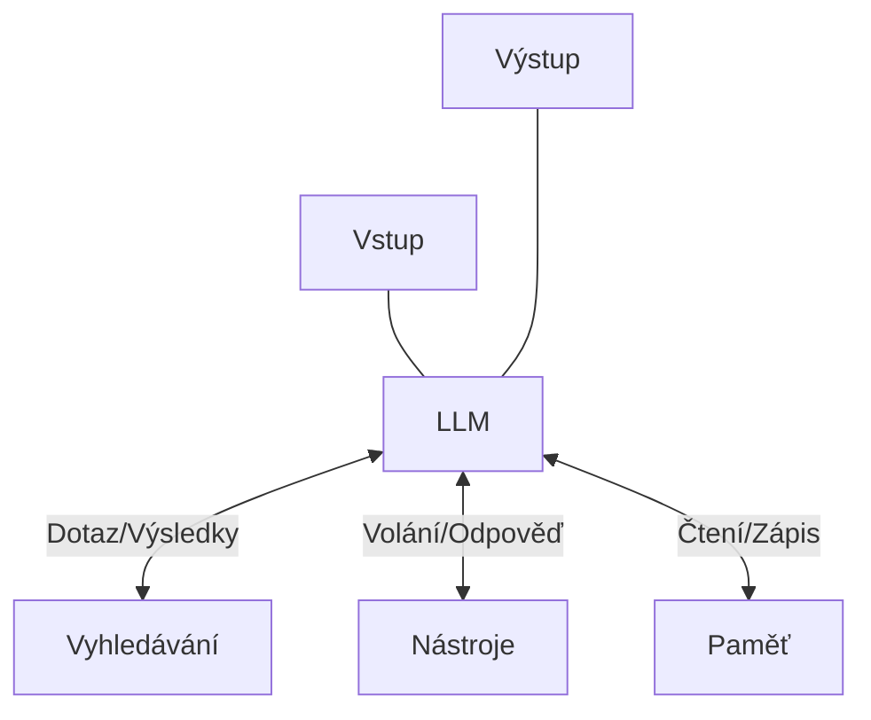
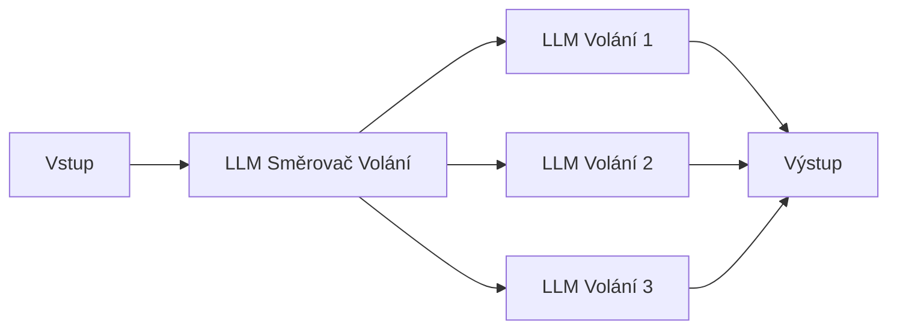
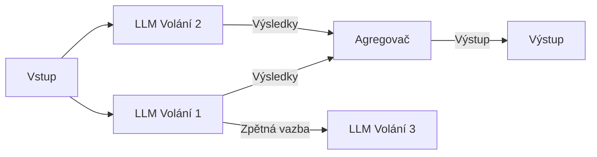
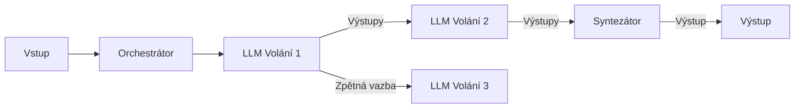
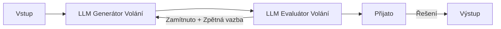
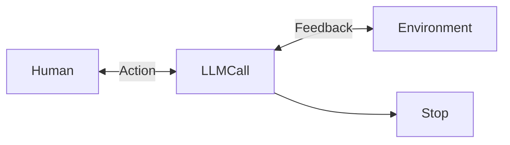

V této části se budeme zabývat běžnými druhy agentových systémů. Začneme základním stavebním blokem - rozšířeným LLM - a postupně budeme zvyšovat složitost, od jednoduchých workflow až po autonomní agenty.

### Stavební blok: Rozšířené LLM

Základním stavebním prvkem agentních systémů je LLM obohacený o rozšíření, jako je vyhledávání, nástroje a paměť. Špičkové současné modely LLM od OpenAI i Anthropicu mohou tyto schopnosti aktivně využívat. Mohou generovat vlastní rešeršní dotazy, vybírat vhodné nástroje a určovat, jaké informace si mají uchovat. Pro jednoduché úkoly je to zcela dostačující.



Doporučujeme zaměřit se na dva klíčové aspekty implementace: přizpůsobení těchto schopností konkrétnímu případu použití a zajištění snadného a dobře zdokumentovaného rozhraní pro váš LLM. Ačkoli existuje mnoho způsobů, jak tato rozšíření implementovat, jedním ze zajímavých a stále málo využívaných přístupů je nedávno vydaný [protokol Model Context Protocol](https://www.anthropic.com/news/model-context-protocol), který vývojářům umožňuje integraci s rostoucím ekosystémem nástrojů třetích stran pomocí jednoduché [klientské implementace](https://modelcontextprotocol.io/tutorials/building-a-client#building-mcp-clients).

Je potřeba pamatovat na to, že přes běžné webové rozhraní je dnes obtížné dosáhnout online napojení na jiné datové zdroje. Pokud potřebujete používat svoje (či firemní) data v online režimu, je třeba propojovat LLM přes API na úrovni programování a přes výše uvedené frameworky.

Ve zbytku tohoto příspěvku budeme předpokládat, že každé volání LLM má přístup k těmto rozšířeným možnostem.

### Workflow: Řetězení povelů

Prompt chaining rozkládá úlohu na posloupnost kroků, kde každé volání LLM zpracovává výstup předchozího volání. Můžete přidat programové kontroly (viz „brána“ ve schématu níže) na všechny mezikroky, abyste zajistili, že proces stále probíhá podle plánu.

```mermaid
graph LR
  In[Vstup] --> LLM1[LLM Volání 1]
  LLM1 --> Output1[Výstup 1]
  
  Output1 --> Gate[Brána]
  Gate --> LLM2[LLM Volání 2]
  LLM2 --> "Předání" 
  "Předání" --> LLM3[LLM Volání 3]
  LLM3 --> Output2[Výstup 2]
  
  Gate -- Selhání --> Exit[Ukončení]
  "Předání" -- Úspěch --> Out[Výstup]
```
  

Kdy toto Workflow použít: toto Workflow je ideální pro situace, kdy lze úlohu snadno a přehledně rozložit na pevné dílčí úlohy. Hlavním cílem je vyměnit latenci za vyšší přesnost tím, že každé volání LLM bude jednodušší úlohou.

Příklady, kdy je užitečné Řetězení povelů:
-   Generování kopie marketingového plánu pro reálie jiného trhu a následný překlad do jiného jazyka.
-   Napsání osnovy dokumentu, kontrola, zda osnova splňuje určitá kritéria, a poté napsání dokumentu na základě osnovy.

### Workflow: routování

Routování klasifikuje vstup a směruje jej na specializovanou následnou úlohu. toto Workflow umožňuje oddělit problémy a vytvářet specializovanější povely. Bez tohoto pracovního postupu může optimalizace pro jeden druh vstupů poškodit výkon u jiných vstupů.



Kdy toto Workflow použít: Routování funguje dobře u složitých úloh, kde existují odlišné kategorie, které je lépe zpracovávat odděleně, a kde lze klasifikaci přesně zpracovat buď pomocí LLM, nebo tradičnějšího klasifikačního modelu/algoritmu.

Příklady, kdy je routování užitečné:
-   Routování různých typů dotazů zákaznického servisu (obecné dotazy, žádosti o vrácení peněz, technická podpora) do různých navazujících procesů, povelů a nástrojů.
-   Routování snadných/běžných dotazů na menší modely, jako je Claude 3.5 Haiku, a obtížných/neobvyklých dotazů na schopnější modely, jako je Claude 3.5 Sonnet, aby se optimalizovaly náklady a rychlost.
    

### Workflow: Paralelizace

Modely LLM mohou někdy pracovat na úloze současně a jejich výstupy se programově agregují. toto Workflow, paralelizace, se objevuje ve dvou klíčových variantách:

-   Sekcionování: Rozdělení úlohy na nezávislé dílčí úlohy spouštěné paralelně.  
-   Hlasování: Spuštění stejné úlohy vícekrát za účelem získání různých výstupů.
    

  

Kdy toto Workflow použít: Paralelizace je účinná, pokud lze rozdělené dílčí úlohy paralelizovat kvůli rychlosti nebo pokud je třeba více pohledů nebo pokusů pro získání výsledků s vyšší důvěryhodností. U složitých úloh s více hledisky je obecně lepší, když je každé hledisko zpracováno samostatným voláním LLM, což umožňuje soustředit pozornost na každé konkrétní hledisko.

Příklady, kdy je paralelizace užitečná:
-   Sekcionování:
    -   Implementace ochranných zábran, kdy jedna instance modelu zpracovává uživatelské dotazy, zatímco jiná je kontroluje, zda neobsahují nevhodný obsah nebo požadavky. To bývá výkonnější, než kdyby stejné volání LLM zpracovávalo jak guardrails, tak základní odpověď.
    -   Automatizace hodnocení pro vyhodnocování výkonu LLM, kdy každé volání LLM vyhodnocuje jiný aspekt výkonu modelu na danou výzvu.
-   Hlasování:
    -   Přezkoumání části kódu na zranitelnosti, kdy několik různých výzev přezkoumá a označí kód, pokud v něm naleznou problém.        
    -   Vyhodnocování, zda je daný kus obsahu nevhodný, přičemž několik výzev vyhodnocuje různé aspekty nebo vyžaduje různé prahové hodnoty hlasování, aby se vyvážily falešně pozitivní a negativní výsledky.
    

### Workflow: Orchestrator-workery

Ve workflow orchestrátor-workery centrální LLM dynamicky rozděluje úlohy, deleguje je na pracovní LLM a syntetizuje jejich výsledky.



Kdy toto Workflow použít: toto Workflow je vhodný pro složité úlohy, u nichž nelze předvídat potřebné dílčí úlohy (například při kódování, kdy počet souborů, které je třeba změnit, a povaha změny v jednotlivých souborech pravděpodobně závisí na úloze). Zatímco topograficky je podobná, klíčovým rozdílem oproti paralelizaci je její flexibilita - dílčí úlohy nejsou předem definovány, ale určuje je orchestrátor na základě konkrétního vstupu.

Příklad, kde je užitečný orchestrátor-worker
-   Kódování produktů, které pokaždé provádějí složité změny ve více souborech.
-   Úlohy vyhledávání, které zahrnují shromažďování a analýzu informací z více zdrojů pro případné relevantní informace.
    
### Workflow Evaluátor-optimalizátor

V pracovním postupu evaluátor-optimalizátor jedno volání LLM generuje odpověď, zatímco jiné poskytuje vyhodnocení a zpětnou vazbu ve smyčce.



Kdy toto Workflow použít: toto Workflow je obzvláště efektivní, když máme jasná kritéria hodnocení a když iterativní zpřesňování poskytuje měřitelnou hodnotu. Dvěma známkami dobré shody jsou zaprvé to, že odpovědi LLM lze prokazatelně zlepšit, když člověk vyjádří svou zpětnou vazbu, a zadruhé to, že LLM může takovou zpětnou vazbu poskytnout. To je analogické iterativnímu procesu psaní, kterým může projít lidský spisovatel při tvorbě vybroušeného dokumentu.

Příklady, kdy je hodnotitel-optimalizátor užitečný:
-   Literární překlad, kde existují nuance, které překladatel LLM nemusí zpočátku zachytit, ale kde hodnotitel LLM může poskytnout užitečnou kritiku.
-   Složité rešeršní úlohy, které vyžadují více kol vyhledávání a analýzy pro získání komplexních informací, kde hodnotitel rozhoduje, zda je další vyhledávání opodstatněné.
    

### Agenti

Agenti se postupně objevují v průmyslovém nasazení, protože LLM jsou již pomalu použitelné v klíčových schopnostech, jako je chápání složitých vstupů, zapojení do uvažování a plánování, spolehlivé používání nástrojů a zotavování se z chyb. Agenti začínají svou práci buď příkazem od lidského uživatele, nebo interaktivní diskusí s ním. Jakmile je úkol jasný, agenti plánují a pracují samostatně, případně se vracejí k člověku pro další informace nebo úsudek. Během vykonávání je pro agenty zásadní, aby v každém kroku získávali „základní pravdu“ z prostředí (např. výsledky volání nástrojů nebo provádění kódu), aby mohli posoudit svůj postup. Agenti se pak mohou v kontrolních bodech nebo při setkání s překážkami pozastavit a získat zpětnou vazbu od člověka. Úloha tak často doběhne v nějakém předpokládaném režimu dokončení, ale je také běžné zahrnout podmínky zastavení (například maximální počet iterací), aby se zachovala kontrola nad systémem.

Agenti mohou zvládnout složité úlohy, ale jejich implementace je často jednoduchá. Obvykle jsou to jen LLM využívající nástroje založené na zpětné vazbě z prostředí ve smyčce. Proto je velmi důležité navrhovat sady nástrojů a jejich dokumentaci jasně a promyšleně. 



Kdy používat agenty: Agenty lze použít u otevřených problémů, kde je obtížné nebo nemožné předvídat požadovaný počet kroků a kde nelze natvrdo nakódovat pevnou cestu. Agent LLM bude potenciálně pracovat po mnoho kroků a musíte mít určitou míru důvěry v jeho rozhodování. Autonomie agentů je ideální pro škálování úloh v důvěryhodném prostředí.

Autonomní povaha agentů znamená vyšší náklady a možnost vzniku složitých chyb. Doporučujeme rozsáhlé testování v prostředí sandboxu spolu s vhodnými ochrannými prvky.

## Kombinace a přizpůsobení těchto vzorů

Tyto stavební bloky nepředstavují nepřekročitelné limity softwarové architektury. Jsou to obvyklé vzory, které mohou vývojáři přizpůsobovat a kombinovat tak, aby vyhovovaly různým případům použití. Klíčem k úspěchu je, stejně jako u všech funkcí LLM, měření výkonu a iterace implementací. Zopakujme si základní pravidlo: o přidání složitosti byste měli uvažovat pouze tehdy, pokud prokazatelně zlepšuje výsledky.

## Shrnutí

Úspěch v oblasti LLM nespočívá v budování nejsložitějšího systému. Jde o vybudování správného systému pro vaše potřeby. Začněte s jednoduchými výzvami, optimalizujte je pomocí komplexního hodnocení a vícekrokové agentové systémy přidávejte pouze tehdy, když jednodušší řešení selhávají.

Při implementaci agentů se snažíme dodržovat tři základní zásady:

1.  Zachovejte jednoduchost návrhu agenta.
2.  Upřednostněte transparentnost explicitním zobrazením kroků plánování agenta.
3.  Pečlivě vytvářejte rozhraní agent-počítač (ACI) prostřednictvím důkladné dokumentace nástroje a testování.
    
Rámce vám mohou pomoci rychle začít, ale neváhejte redukovat vrstvy abstrakce a stavět se základními komponentami, jakmile přejdete do produkce. Dodržováním těchto zásad můžete vytvořit agenty, kteří jsou nejen výkonní, ale také spolehliví, udržovatelní a důvěryhodní pro své uživatele.