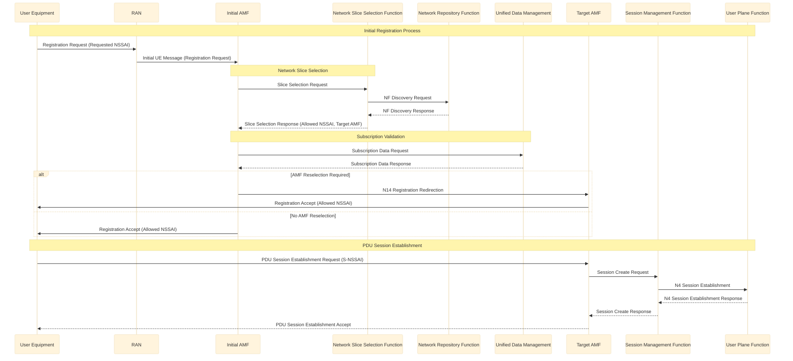

Network slicing představuje jednu z nejvýznamnějších technologií zavedených v 5G sítích, která umožňuje operátorům vytvářet více virtuálních sítí (tzv. slices) na sdílené fyzické infrastruktuře. Proč? Inu proto, že tento přístup umožňuje za prvé kvalitnější a rychlejší obsluhu uživatele v síti a pak šetřit zdroje sítě. 

Zjednodušeně řečeno si operátor sítě zjistí, jakou úroveň služeb které uživatelské zařízení v síti vyžaduje, například podle tarifu či podle profilu zařízení. A pak provoz tohoto zařízení posílá pouze přes ty prvky sítě, které jsou pro takový provoz vhodné či nutné. Tak je možné používat jiné procedury a jiné prvky sítě pro low-power zařízení v síti a jiné pro multimediální terminály. A protože se tento přístup dá připodobnit k používání "plátků" sítě, kdy každý plátek je určený pro jiný typ mobilních terminálů, vžil se marketingově přiléhavý pojem "network slicing". 

Koncept je ostatně zřejmý z následujícího obrázku.

Pojďme si podrobněji posat, co se na obrázku děje.

Tento diagram ilustruje implementaci Network Slicing architektury podle 3GPP Release 16 v 5G síti, demonstrující tři oddělené síťové slice optimalizované pro specifické uživatelské scénáře:

1. UHD Video Slice pro přenos vysokorychlostního videa
- Implementuje specializovanou konfiguraci pro vysokorychlostní přenos Ultra HD video obsahu
- Využívá MEC (Multi-access Edge Computing) cache pro optimalizaci latence a redukci zatížení core sítě
- CU/DU (Centralized Unit/Distributed Unit) disagregovaná architektura v RAN segmentu
- vCore (virtualized Core) implementace v core cloud infrastruktuře

2. Telefonní Slice
- Dedikovaná instance pro hlasové služby
- End-to-end konfigurace zahrnující:
  * CU/DU v RAN doméně
  * vCore implementaci v core cloudu
  * vIMS (virtualized IP Multimedia Subsystem) pro řízení hlasových služeb
- Optimalizace pro nízkou latenci a vysokou spolehlivost

3. Critical IoT Slice
- Specializovaná konfigurace pro mission-critical IoT aplikace
- Integrace V2X (Vehicle-to-Everything) serveru v edge cloud infrastruktuře
- Lokalizovaný vCore pro minimalizaci latence
- Optimalizace pro ultra-reliable low-latency communication (URLLC)

Architektura implementuje hierarchickou strukturu cloud infrastruktury:
- Edge cloud pro lokalizované služby vyžadující nízkou latenci
- Core cloud pro centralizované síťové funkce
- Transport network zajišťující propojení jednotlivých domén

Každá slice instance je end-to-end izolována a optimalizována pro specifické QoS požadavky příslušného use-case, demonstrující pokročilou implementaci network slicing technologie v 5G síťové architektuře.

## Počátky Network Slicingu: DECOR a eDECOR

První úvahy o možnosti oddělení provozu uživatelských zařízení k příslušným zdrojům se promítly již do Release 13, n ajehož přípravě se začalo pracovat před deseti lety a byl schválen v roce 2016.  V Release 13 a 14 byly položeny první základy pomocí konceptů DECOR (Dedicated Core Network) a eDECOR (enhanced Dedicated Core Network), na faktické užití ale čekaly až s Release 16. Nicméně pro úplnost se podívejme i na tyto první přístupy, ze kterých později koncept Network Slicingu vzešel. Připomeňme, že dnes (listopad 2024) je Network Slicing v mobilních sítích spíše ve fázi pilotních pokusů.

**DECOR (Release 13):**
- Představoval první pokus o vytvoření dedikovaných core sítí
- Umožňoval směrovat různé typy zařízení do různých instancí core sítě
- Využíval mechanismus, kdy MME (Mobility Management Entity) na základě informací od UE rozhodovala o směrování do příslušné core sítě
- Měl však omezené možnosti a vyžadoval manuální konfiguraci

**eDECOR (Release 14):**
- Rozšířil koncept DECOR o pokročilejší funkce
- Zavedl DCN-ID (Dedicated Core Network ID) pro identifikaci dedikované core sítě
- Umožnil UE získat informace o dostupných DCN přímo od sítě
- Přinesl vylepšené mechanismy pro výběr MME
- Představil podporu pro více DCN pro jedno UE
- Zlepšil možnosti správy mobility mezi různými DCN

Tyto koncepty položily základní principy pro pozdější plnohodnotný Network Slicing v 5G, zejména v oblastech:
- Identifikace a výběru dedikovaných síťových zdrojů
- Směrování provozu do příslušných síťových instancí
- Základní izolace síťových funkcí
- Správy mobility mezi různými instancemi sítě

DECOR a eDECOR lze tak považovat za přímé předchůdce Network Slicingu, kteří ověřili základní koncepty a připravili půdu pro komplexnější řešení v 5G.

## Vývoj Network Slicingu v rámci 3GPP Release

### Release 15 (Počáteční 5G architektura)
- Zavedení základních konceptů network slicingu
- Definice Single Network Slice Selection Assistance Information (S-NSSAI)
- Podpora až 8 současných síťových slices pro jedno UE
- Zavedení Network Slice Selection Function (NSSF)
- Základní výběr AMF na základě požadavků slice

Nejprve proběhne identifikace a výběr jednotlivých slice pomocí S-NSSAI (Single Network Slice Selection Assistance Information), který se skládá ze dvou hlavních částí - SST (Slice/Service Type) definující typ služby a volitelného SD (Slice Differentiator) pro další rozlišení slice.

V této první implementaci bylo stanoveno důležité omezení, kdy každé koncové zařízení (UE) může být současně připojeno maximálně k 8 různým network slice, přičemž každý slice je asociován s konkrétní PDU session. Z hlediska síťových funkcí bylo definováno, že AMF (Access and Mobility Management Function) musí být společná pro všechny slice obsluhující dané UE, zatímco SMF a UPF mohou být dedikovány pro konkrétní slice. Důležitým prvkem bylo také zavedení NSSF (Network Slice Selection Function) pro výběr vhodného slice.

Architektura v Release 15 se opírá o RAN komponenty, které podporují základní směrování provozu na základě slice identifikátorů a umožňují konfiguraci přidělování rádiových zdrojů pro různé slice. V jádru sítě byla implementována podpora Service-Based Architecture (SBA), která umožňuje sdílení nebo dedikaci síťových funkcí pro různé slice a poskytuje základní mechanismy pro izolaci provozu mezi slice.

Proces výběru slice začíná při registraci UE, kdy zařízení poskytuje seznam požadovaných S-NSSAI. NSSF následně rozhoduje o přípustných slice pro UE a AMF je vybrán na základě podporovaných slice. Při vytváření PDU session je pro každou session vybrán jeden slice a příslušné SMF a UPF jsou vybírány podle požadavků daného slice.
Release 15 měl však určitá omezení. Nabízel pouze základní možnosti izolace mezi slice a chyběly pokročilé mechanismy pro QoS mezi slice. Správa zdrojů byla omezená na základní funkce s omezenými možnostmi pro dynamickou alokaci zdrojů a základní podporou pro sdílení síťových funkcí. Management slice poskytoval pouze základní podporu pro životní cyklus slice a omezené možnosti pro automatizaci správy.

### Release 16 (Vylepšený Slicing)
- Zavedení pokročilé slice-aware funkcionality v RAN
- Vylepšená izolace mezi síťovými slice
- Podpora autentizace specifické pro slice
- Zavedení QoS frameworku zohledňujícího slice
- Vylepšená podpora pro správu a orchestraci slice

Klíčovou změnou v Release 16 je zavedení pokročilé slice-aware funkcionality v RAN, která umožňuje efektivnější správu rádiových zdrojů s ohledem na požadavky jednotlivých slice. RAN nyní dokáže lépe rozlišovat mezi různými typy provozu a přidělovat zdroje na základě specifických požadavků každého slice. To vede k lepší předvídatelnosti výkonu a efektivnějšímu využití dostupné kapacity sítě.

Release 16 přináší také významné vylepšení v oblasti autentizace specifické pro jednotlivé slice. Tato funkcionalita umožňuje implementovat různé úrovně zabezpečení pro různé slice, což je klíčové zejména pro podnikové a kritické aplikace. Každý slice může nyní využívat vlastní autentizační mechanismy odpovídající jeho bezpečnostním požadavkům.
V oblasti QoS dochází k zavedení komplexního framework pro řízení kvality služeb, který zohledňuje specifické požadavky jednotlivých slice. Tento framework umožňuje jemnější granularitu při definování a vynucování QoS parametrů, což vede k lepšímu naplnění SLA požadavků různých typů služeb.

Významného vylepšení se dočkala také oblast správy a orchestrace slice. Release 16 zavádí pokročilejší mechanismy pro životní cyklus slice, včetně lepší podpory pro dynamickou rekonfiguraci a optimalizaci využití zdrojů. To operátorům umožňuje pružněji reagovat na měnící se požadavky sítě a efektivněji spravovat dostupné síťové zdroje.
V jádru sítě došlo k vylepšení mechanismů pro sdílení síťových funkcí mezi slice při současném zachování potřebné úrovně izolace. Byla také posílena schopnost sítě dynamicky přizpůsobovat alokaci zdrojů na základě aktuálního zatížení a požadavků jednotlivých slice.

Release 16 také přináší vylepšení v oblasti monitorování a analýzy výkonu slice. Byly zavedeny nové metriky a mechanismy pro sběr dat, které umožňují lepší sledování výkonu a včasnou identifikaci potenciálních problémů. Tyto informace jsou klíčové pro optimalizaci výkonu a zajištění kvality služeb.

Z pohledu end-to-end služeb Release 16 poskytuje lepší podporu pro různé případy použití, zejména v oblasti průmyslového IoT a kritických komunikací. Vylepšená flexibilita a řízení QoS umožňují lépe přizpůsobit charakteristiky slice specifickým požadavkům různých vertikálních segmentů.

Všechna tato vylepšení v Release 16 významně rozšiřují možnosti Network Slicingu a přibližují tuto technologii reálnému komerčnímu nasazení. Pokud se někde Network Slicing nasazuje v pilotních testech, tak se vychází z Release 16. 

### Release 17 (Pokročilé funkce)

- Vylepšená alokace zdrojů založená na slice
- Vylepšené monitorování výkonu slice
- Zavedení síťových funkcí specifických pro slice
- Vylepšená podpora edge computingu v síťových slice
- Pokročilá správa životního cyklu slice

Release 17 přináší v oblasti Network Slicingu další významná vylepšení. Klíčovou inovací je vylepšená alokace zdrojů založená na *slice*, která umožňuje ještě přesnější a efektivnější rozdělování síťových prostředků mezi jednotlivé slice. Systém nyní dokáže dynamičtěji reagovat na měnící se požadavky a lépe optimalizovat využití dostupné kapacity sítě.

Významným pokrokem je zlepšené *monitorování výkonu slice*, které přináší detailnější vhled do fungování jednotlivých virtuálních sítí. Toto vylepšení umožňuje operátorům lépe sledovat dodržování SLA parametrů a rychleji identifikovat případné problémy. Systém také poskytuje pokročilejší analytické nástroje pro vyhodnocování výkonnosti slice.

#### Monitoring výkonu síťových Slice

Release 17 přináší sofistikovaný systém monitorování výkonu Network Slice, který představuje významný pokrok v oblasti řízení a optimalizace virtualizovaných síťových instancí. Tento monitorovací framework implementuje vícevrstvou architekturu sběru a analýzy dat, která umožňuje precizní sledování výkonnostních parametrů napříč celou síťovou infrastrukturou.

Jádrem systému monitorování výkonu slice je **Performance Measurement Framework (PMF)**, který operuje na dvou klíčových úrovních. Collection Layer zajišťuje kontinuální sběr telemetrických dat z jednotlivých Network Function instancí prostřednictvím standardizovaných Performance Measurement Jobs. Tato vrstva implementuje jak counter-based, tak gauge-based metriky s vysokou granularitou měření na úrovni jednotlivých instancí síťových slice. Counter-based metriky slouží primárně pro dlouhodobou analýzu trendů, zatímco gauge-based metriky umožňují real-time optimalizaci alokace zdrojů. Processing Layer následně provádí real-time agregaci získaných dat a kalkulaci Key Quality Indicators, přičemž zohledňuje vzájemné korelace mezi různými instancemi síťových Slice subnetů.

Counter-based a gauge-based metriky představují dva fundamentálně odlišné přístupy k měření výkonnostních parametrů v telekomunikačních systémech:
**Counter-based metriky**: Reprezentují kumulativní hodnoty, které se monotónně zvyšují v čase. Tyto metriky jsou implementovány jako čítače, které se nikdy nesnižují, pouze se resetují při dosažení maximální hodnoty nebo při restartu měřícího systému. Typickými příklady jsou:
- Celkový počet přenesených paketů
- Kumulativní počet chybových stavů
- Agregovaný objem přenesených dat

Matematicky lze vyjádřit jako: M(t) = ∑(t0→t) E(t), kde E(t) reprezentuje výskyt měřené události.

**Gauge-based metriky**: Reprezentují okamžité hodnoty měřených parametrů v daném časovém bodě. Tyto metriky mohou fluktuovat oběma směry a poskytují snapshot aktuálního stavu systému. Charakteristické příklady zahrnují:
- Aktuální využití CPU
- Momentální zatížení síťového rozhraní
- Okamžitá velikost front

Matematicky lze vyjádřit jako: G(t) = V(t), kde V(t) je aktuální hodnota měřeného parametru v čase t.

Systém monitoruje tři základní kategorie výkonnostních parametrů. **Resource Utilization Metrics** sledují využití systémových zdrojů včetně CPU, paměti a síťových rozhraní. Service Quality Metrics se zaměřují na kvalitativní parametry služeb, jako je end-to-end latence, packet loss ratio a throughput. Slice-Specific KPIs pak poskytují specializované metriky pro hodnocení efektivity izolace zdrojů, inter-slice interference a plnění QoS požadavků.

Architektura monitorovacího systému využívá distribuované **Data Collection Points** implementované v klíčových síťových uzlech. Tyto body poskytují standardizované rozhraní pro export metrik a podporují vysokofrekvenční vzorkování s integrovaným buffer managementem. Performance Data Analytics Function zajišťuje real-time analýzu výkonnostních trendů, včetně prediktivního modelování zatížení a detekce anomálií. Management Data Analytics Function se pak zaměřuje na dlouhodobou analýzu trendů a podporu capacity planningu.

Významnou inovací je implementace víceúrovňové granularity měření, která umožňuje sledování výkonu na úrovni jednotlivých slice, service flow, koncových zařízení a síťových funkcí. Data processing pipeline zahrnuje real-time stream processing, historické warehousing dat a pokročilé analytické nástroje využívající strojové učení pro prediktivní analýzu.

Tento komplexní monitorovací systém poskytuje operátorům bezprecedentní úroveň visibility do fungování jejich virtualizovaných síťových instancí, což umožňuje efektivní optimalizaci výkonu a proaktivní řešení potenciálních problémů. Release 17 tak představuje významný milník v evoluci Network Slicingu, který posouvá možnosti monitorování a řízení výkonu na kvalitativně vyšší úroveň.

#### Další vylepšení v Release 17

Release 17 zavádí koncept Slice-Specific Network Functions, což jsou síťové funkce specificky navržené a optimalizované pro konkrétní typy slice. Tento přístup umožňuje lepší přizpůsobení síťových funkcí specifickým požadavkům různých use-cases a vede k efektivnějšímu využití síťových zdrojů.

Významného vylepšení se dočkala podpora edge computingu v kontextu network slicingu. Release 17 přináší lepší integraci edge computing zdrojů do slice architektury a umožňuje efektivnější využití distribuovaných výpočetních kapacit. To je klíčové zejména pro use-cases vyžadující nízkou latenci a zpracování dat blízko koncovému uživateli.

V oblasti správy životního cyklu slice došlo k zavedení pokročilejších mechanismů, které umožňují flexibilnější správu a dynamičtější přizpůsobení slice měnícím se požadavkům. Systém nyní poskytuje lepší podporu pro automatizované přizpůsobování konfigurace slice a optimalizaci využití zdrojů v reálném čase.

Release 17 také přináší vylepšení v oblasti koordinace mezi různými slice, což umožňuje efektivnější sdílení zdrojů a lepší správu v případech, kdy různé slice sdílejí společnou infrastrukturu. Byly zavedeny nové mechanismy pro řešení konfliktů a optimalizaci výkonu v případě současného provozu více slice.

Z pohledu bezpečnosti byly implementovány dodatečné mechanismy pro zajištění izolace mezi slice a lepší ochranu proti potenciálním bezpečnostním hrozbám. Release 17 také zavádí vylepšené možnosti pro audit a monitoring bezpečnostních aspektů jednotlivých slice.

Významnou novinkou je také lepší podpora pro integraci s externími systémy a aplikacemi třetích stran, což otevírá nové možnosti pro vytváření inovativních služeb a uživatelských scénářů. Toto vylepšení je zvláště důležité pro podporu různých vertikálních řešení a firemní aplikací.

V oblasti QoS došlo k dalšímu vylepšení mechanismů pro zajištění kvality služeb, včetně podpory pro sofistikovanější QoS modely a lepší granularity při definování QoS parametrů. To umožňuje přesnější nastavení a garantování požadované úrovně služeb pro různé typy aplikací.

Release 17 tak představuje významný krok vpřed v evoluci Network Slicingu, přičemž přináší řadu vylepšení, která činí tuto technologii praktičtější a použitelnější pro reálné nasazení. Zároveň vytváří solidní základ pro další vývoj v následujících vydáních 3GPP specifikací.

### Release 18 (Další vylepšení)
- AI/ML optimalizace slice
- Vylepšená správa mobility slice
- Pokročilé vyvažování zátěže zohledňující slice
- Vylepšené mechanismy izolace slice
- Vylepšené analytické schopnosti slice

Primární technologickou inovací je integrace AI/ML algoritmů do procesu optimalizace slice, což umožňuje prediktivní alokaci síťových zdrojů na základě komplexní analýzy historických dat a predikce budoucích požadavků.

V oblasti mobility managementu Release 18 zavádí sofistikovaný systém řízení handoverů mezi různými slice instancemi, který využívá pokročilé prediktivní modely pro optimalizaci procesu přepínání mezi slice. Tento mechanismus významně redukuje latenci při handoverech a minimalizuje potenciální degradaci služeb během procesu mobility.

Významnou architektonickou inovací je implementace pokročilých load balancing mechanismů, které využívají real-time analýzu zatížení jednotlivých slice instancí pro dynamickou redistribuci síťových zdrojů. Systém implementuje adaptivní algoritmy pro optimalizaci využití síťové infrastruktury při současném zachování definovaných SLA parametrů.

Release 18 také významně posiluje mechanismy izolace mezi jednotlivými slice prostřednictvím implementace víceúrovňového systému resource partitioning. Tento systém využívá hierarchickou architekturu pro alokaci a management síťových zdrojů, což zajišťuje striktní dodržování definovaných výkonnostních parametrů pro každou slice instanci.

V oblasti analytických schopností přináší Release 18 integrovaný framework pro pokročilou analýzu výkonnostních metrik, který kombinuje real-time monitoring s prediktivní analytikou. Tento systém umožňuje proaktivní identifikaci potenciálních výkonnostních problémů a automatickou rekonfiguraci síťových parametrů pro jejich prevenci.

Významnou inovací je také implementace edge computing optimalizace v kontextu Network Slicing, která umožňuje efektivnější využití distribuovaných výpočetních zdrojů pro specific use-cases vyžadující minimální latenci. Systém implementuje pokročilé algoritmy pro optimální placement výpočetních zdrojů v síťové infrastruktuře.

Release 18 tak představuje významný kvalitativní posun v evolučním vývoji Network Slicing technologie, především díky integraci pokročilých AI/ML capabilities a implementaci sofistikovaných optimalizačních mechanismů. Tyto inovace poskytují solidní technologický základ pro další rozvoj této klíčové 5G technologie.

Release 19 (Ve vývoji)
- Očekávaná vylepšení v automatizaci slice
- Vylepšené mechanismy spolehlivosti slice
- Pokročilé možnosti přizpůsobení slice
- Vylepšená koordinace mezi slice
- Vylepšené bezpečnostní funkce

Release 19 se počátkem roku 2024 dokončovala a na větší zhodnocení posunu ve Slicingu si ještě počkejme. 

## Technologické komponenty

1. Service-Based Architecture (SBA)
- Umožňuje flexibilní nasazení síťových funkcí
- Podporuje dynamické vytváření slice
- Usnadňuje sdílení síťových funkcí mezi slice

Service-Based Architecture (SBA) představuje fundamentální architektonický koncept implementovaný v kontextu 5G core infrastruktury Jádra sítě, který vyjednává postupné rozložení síťových funkcí do samostatně škálovatelných a spravovatelných microservice komponent. Tato architektura umožňuje vysokou flexibilitu při instantizaci síťových funkcí prostřednictvím standardizovaných REST-based API rozhraní, přičemž implementuje robustní mechanismy pro service discovery a inter-service komunikaci. SBA framework poskytuje esenciální infrastrukturní základ pro dynamickou alokaci a redistribuci síťových funkcí mezi jednotlivými network slice instancemi, optimalizovanou dle specifických výkonnostních požadavků.

2. Network Function Virtualization (NFV)
- Umožňuje sdílení zdrojů mezi slice
- Podporuje dynamickou alokaci zdrojů
- Usnadňuje izolaci slice

Network Function Virtualization (NFV) technologie představuje kritickou součást pro implementaci network slicing konceptu, poskytující abstrakční vrstvu mezi fyzickou síťovou infrastrukturou a virtualizovanými síťovými funkcemi. NFV framework implementuje sofistikované mechanismy pro management virtuálních zdrojů, včetně CPU, paměti a síťové kapacity, umožňující efektivní multiplexing fyzické infrastruktury mezi multiple network slice instance. Integrální součástí NFV architektury jsou pokročilé mechanismy správy zajišťující automatizované řízení virtualizovaných síťových funkcí a garantující striktní izolaci mezi jednotlivými slice instancemi.

3. Software-Defined Networking (SDN)
- Umožňuje programovatelné řízení sítě
- Podporuje směrování provozu mezi komponenty slice
- Usnadňuje směrovací politiky specifické pro slice

Software-Defined Networking (SDN) technologie implementuje centralizovanou control plane architekturu, která umožňuje programatické řízení síťové infrastruktury prostřednictvím standardizovaných *southbound* a *northbound* API rozhraní. SDN controller poskytuje unifikovanou abstrakční vrstvu pro management síťových toků, implementaci QoS politik a optimalizaci směrování provozu mezi komponentami jednotlivých network slice instancí. Tato architektura facilituje implementaci sofistikovaných traffic engineering mechanismů specifických pro jednotlivé use-case scénáře, včetně podpory advanced service chaining a traffic steering funkcionalit.

Southbound API: Realizuje komunikační rozhraní mezi SDN kontrolerem a síťovou infrastrukturou (network forwarding plane) \
Northbound API: Implementuje rozhraní mezi SDN kontrolerem a aplikační vrstvou (network application plane)

Tato trojice technologických frameworků vytváří integrovaný architektonický fundament pro implementaci end-to-end network slicing řešení, poskytující nezbytnou flexibilitu, škálovatelnost a programovatelnost vyžadovanou pro efektivní management virtualizované síťové infrastruktury v kontextu 5G networks.

## Architektonické komponenty:

1. Network Slice Management Function (NSMF)
- Spravuje instance síťových slice end-to-end
- Řídí životní cyklus slice
- Koordinuje zdroje slice napříč doménami

2. Network Slice Subnet Management Function (NSSMF)
- Spravuje zdroje slice na úrovni podsítí
- Koordinuje s kontrolery specifickými pro domény
- Řídí alokaci zdrojů na úrovni podsítí

3. Communication Service Management Function (CSMF)
- Překládá požadavky služeb na požadavky slice
- Spravuje mapování služeb na slice
- Řídí monitorování na úrovni služeb

## Dopad na architekturu:

1. RAN architektura
- Zavedení funkcí RAN zohledňujících slice
- Podpora pro rozdělení zdrojů RAN
- Vylepšené plánovací mechanismy

2. Architektura jádra sítě
- Modulární nasazení síťových funkcí
- Podpora pro sdílené a dedikované NF
- Vylepšené směrovací mechanismy

3. Architektura správy
- Zavedení roviny správy slice
- Vylepšené orchestrační schopnosti
- Pokročilé monitorování a analytika

## Procedura připojení zařízení do sítě 5G s podporou Network Slicingu

Procedura připojení uživatelského zařízení (User Equipment, UE) do 5G sítě s podporou Network Slicing v Release 16 představuje komplexní sekvenci signalizačních a autentizačních procesů, která zahrnuje následující kroky:

1. Initial Registration Process
- UE iniciuje registrační proceduru pomocí Požadavku na registraci (Registration Request) obsahující Requested NSSAI (Network Slice Selection Assistance Information)
- Requested NSSAI obsahuje množinu S-NSSAI (Single-NSSAI) identifikátorů reprezentujících požadované síťové slice
- Každý S-NSSAI je kompozitní identifikátor obsahující:
  * SST (Slice/Service Type) - 8-bitový identifikátor typu služby
  * SD (Slice Differentiator) - 24-bitový volitelný differentiátor

2. Access Network Selection
- RAN (Radio Access Network) přijímá signalizaci a vyhodnocuje Requested NSSAI
- Na základě slice informací RAN vybírá vhodné AMF (Access and Mobility Management Function)
- Přenos púvodní zprávy uživatelského zařízení obsahující Rožadavek na registraci k vybranému AMF

3. Network Slice Selection Process
- AMF komunikuje s NSSF (Network Slice Selection Function) pro určení:
  * Povolená NSSAI - subset požadovaných slice dostupných pro UE
  * Network Slice Instance(s) - konkrétní instance odpovídající Povolené NSSAI
  * Cílové AMF - případný znovuvýběr optimálního AMF pro daný set slice

4. Subscription Validation
- AMF ověřuje data o uživatelově předplatném prostřednictvím UDM (Unified Data Management)
- Ověření oprávnění UE pro přístup k požadovaným slice
- Rozhoduntí o předvybraném slice pro UE v případě absence výslovného požadavku

5. PDU Session Establishment
- Post-registrační etablování PDU (Protocol Data Unit) sessions
- Každá PDU session je asociována s konkrétním S-NSSAI
- Výběr odpovídajícího SMF (Session Management Function) a UPF (User Plane Function)
- Ustanovení end-to-end konektivity v rámci přiděleného slice

6. Resource Allocation
- Dynamická alokace síťových zdrojů pro každý aktivovaný slice
- Implementace QoS parametrů specifických pro jednotlivé slice
- Aktivace izolačních mechanismů mezi slice

7. Session Management
- Kontinuální sledování a řízení aktivních PDU sessions
- Dynamická změna přidělených zdrojů dle aktuálních požadavků
- Implementace procedur správy mobility specifických pro jednotlivé slice

Tato sekvence zajišťuje řízení připojení UE do multimodální síťové infrastruktury s podporou Network Slicingu, přičemž zajišťuje adekvátní izolaci a QoS parametry pro různé typy síťových služeb.

Na obrázku je vidět proces podle specifikace 3GPP TS 23.501 v grafu:

## Historie vývoje Network Slicingu

Jak vůbec Network Slicing vznikl a které firmy za ním stojí? Jeho vznik a standardizace byla velmi komplexní proces, na kterém se podílelo několik klíčových hráčů z telekomunikačního průmyslu.

Nokia byla jedním z prvních průkopníků konceptu network slicingu, když v roce 2013 představila svoji vizi "Network Slicing for 5G". Společnost přišla s základními koncepty pro izolaci síťových zdrojů a jejich dedikaci různým typům služeb. Nokia také významně přispěla k definici architektury Service-Based Architecture (SBA), která je fundamentální pro implementaci network slicingu.

Ericsson následně významně rozvinul koncept slicingu představením své architektury "Dynamic Network Slicing" v roce 2015. Společnost přinesla klíčové inovace v oblasti orchestrace a managementu network slice, včetně konceptů pro automatizovanou alokaci zdrojů a lifecycle management. Ericsson také významně přispěl k standardizaci Network Slice Management Function (NSMF).

Huawei přišla s významným příspěvkem v oblasti RAN slicingu, když představila svoji technologii "CloudRAN" a koncepty pro flexibilní rozdělení rádiových zdrojů mezi různé slice. Společnost také významně přispěla k definici mechanismů pro izolaci a sdílení fyzických síťových zdrojů mezi virtuálními network slice.

Samsung se zaměřil především na vývoj end-to-end řešení pro network slicing, včetně integrace s edge computing a podpory pro různé vertikální use-cases. Společnost významně přispěla k definici rozhraní mezi různými doménami network slice a k standardizaci slice-aware funkcí v RAN.

ZTE přinesla významné inovace v oblasti automatizace a orchestrace network slice, včetně využití umělé inteligence pro optimalizaci alokace zdrojů. Společnost také přispěla k definici mechanismů pro dynamickou rekonfiguraci network slice.

Deutsche Telekom jako významný operátor přispěl k definici praktických požadavků na implementaci network slicingu z pohledu poskytovatele služeb. Společnost se významně podílela na definici business requirements a use-cases pro network slicing.

Všechny tyto příspěvky byly postupně integrovány do 3GPP standardů, počínaje Release 15, který představil základní koncepty network slicingu, přes Release 16, který přinesl pokročilé funkce pro management a orchestraci, až po současné Release 17 a 18, které dále rozvíjejí možnosti této technologie.

Významnou roli v procesu standardizace hrála také NGMN (Next Generation Mobile Networks) Alliance, která již v roce 2015 publikovala svůj white paper definující základní požadavky a architekturu pro 5G network slicing. Tento dokument významně ovlivnil následný vývoj standardů v 3GPP.

Nicméně práce na rozvoji Network Slicingu pokračují i v dalších Release standardu, takže se jistě přidá celé množství dalších firem. 

## Závěr

Tento vývoj schopností network slicingu napříč vydáními 3GPP ukazuje rostoucí sofistikovanost a vyspělost technologie. Architektonický dopad se rozšiřuje napříč všemi síťovými doménami a vyžaduje významné změny v návrhu, nasazení a provozu sítě. Od budoucích vydání se očekává další vylepšení těchto schopností, zejména v oblastech automatizace, optimalizace a přizpůsobení služeb.

Network slicing představuje fundamentální změnu v tom, jak jsou mobilní sítě navrhovány a provozovány, což umožňuje bezprecedentní úroveň přizpůsobení sítě a diferenciace služeb. Pokračující vývoj této technologie bude hrát klíčovou roli v podpoře různorodých případů použití 5G a dalších generací.