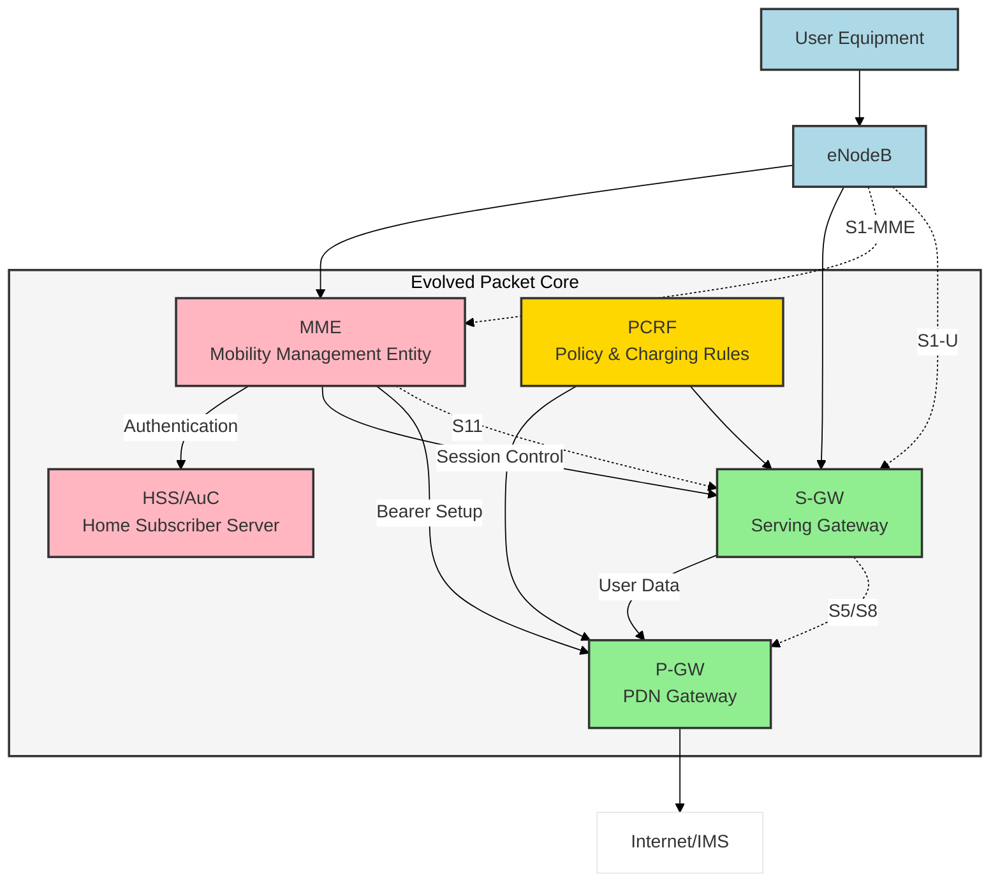

S 3G sítěmi vznikl nepříjemný problém. Kvůli kompatibilitě se systémy GSM zde byla "zavlečena" okruhově spínaná technologie, která dříve dobře sloužila pro telefonování. Jak by ne, packetový přenos hlasu přes IP byl v době vzniku GSM v plenkách a ani s technologií GPRS to s ním nebylo nijak jednoduché. Jenže rychlosti a kvalita datového spojení se v mobilních sítích zvyšovala a bylo možné se na starou okruhově spínanou technologii vykašlat. To by mělo zásadní přínos v efektivnějším využití přenosového pásma. Jenže 3G k tomu prostě neměla dost odvahy, doba nenazrála. Ale v prvním desetiletí nového tisíciletí už bylo možné k něčemu takovému sáhnout. A tak vznikla definice jádra sítě v podobě Evolved Packet Core (EPC). 

EPC je zásadní komponentou LTE ekosystému a představuje revoluční architektonický skok oproti starším generacím sítí. Proč k tomu došlo, co konkrétně EPC nahradilo a jaké změny s sebou přineslo? Pojďme se na to podívat podrobně.

## Historický kontext a motivace k přechodu

V předchozích generacích mobilních sítí (2G, 3G) sloužil k přenosu dat a k obsluze datových služeb tzv. GPRS Core Network (GPRS CN), případně později UMTS Packet Core (v rámci 3G sítí). Tyto architektury byly navrženy v době, kdy ještě dominovala především hlasová komunikace a datové přenosy byly brány spíše jako doplněk. Struktura jádra proto kombinovala přepojování okruhů (CS – Circuit Switched) pro hlas a přepojování paketů (PS – Packet Switched) pro data, přičemž logika přenosu hlasu a dat byla oddělena.

Nástup LTE byl ovšem spojen s prudce rostoucími nároky na datovou kapacitu, rychlost a nízkou latenci. LTE síť je proto koncipována jako čistě paketová IP síť – veškerá komunikace (včetně tradičního hlasu, který se nyní realizuje technologiemi VoLTE) probíhá přes IP datové toky. Tato revoluční změna proto vyžadovala i zásadní přestavbu na úrovni jádrové sítě. A právě zde vstupuje do hry Evolved Packet Core.

## Co EPC nahradilo a proč?

EPC nahradilo starší GPRS Core, respektive UMTS Packet Core, které bylo navrženo pro kombinovaný provoz sítě. Důvodem pro nahrazení byla zejména: \
1.	All-IP Architektura: EPC je navrženo jako plně IP-orientované řešení. Zatímco starší generace se musely vypořádat s oddělenou částí pro hlas (CS doména) a data (PS doména), EPC integruje veškerou komunikaci do paketové domény založené čistě na IP. To přináší zjednodušení, snížení nákladů a vyšší flexibilitu.
2.	Vyšší kapacita a výkon: Díky jednodušší a efektivnější architektuře dokáže EPC lépe pracovat s rostoucím objemem dat, které dnešní uživatelé běžně generují (streamování videa ve vysokém rozlišení, online hraní s nízkou latencí, náročné cloudové služby).
3.	Nižší latence: LTE a EPC byly navrženy s cílem minimalizovat doby odezvy. U starších technologií mohla být latence řádově vyšší. EPC je zkonstruováno tak, aby data a řídicí signály měly co nejkratší cestu sítí, což koncovému uživateli přináší rychlejší odezvu aplikací i služeb.

## Architektonické změny a nové funkční prvky v EPC

Zatímco starší architektura pracovala s uzly jako SGSN (Serving GPRS Support Node) a GGSN (Gateway GPRS Support Node), v EPC došlo k jejich nahrazení a zároveň k výraznému přepracování celkové topologie. EPC se skládá z několika klíčových komponent:

1.	MME (Mobility Management Entity):
    - 	Čistě řídicí prvek EPC, starající se o signalizaci, registraci uživatelů v síti, přidělování dočasných identit a řízení mobilnosti (handovery mezi eNodeB).
    - 	MME neřeší přímo uživatelská data, pouze řídí spojení a autentizaci uživatelů.
    -	Nahradil funkcionality SGSN v kontrolní rovině a výrazně je zjednodušil.
2.	S-GW (Serving Gateway):
    - 	Prvek zajišťující přepojování uživatelských datových paketů mezi rádiovou přístupovou sítí (eNodeB) a páteřní (IP) sítí.
    - 	S-GW funguje jako kotva pro mobilitu v rámci LTE sítě. Pokud se uživatel pohybuje mezi různými eNodeB, S-GW udržuje datovou cestu, aniž by bylo nutné měnit koncové adresování.
    - 	Nahradil uživatelskou rovinu SGSN.
3.	P-GW (Packet Data Network Gateway):
    - 	Brána k vnějším paketovým sítím (např. internet, operátorské služby, IMS platforma).
    - 	P-GW provádí úkoly jako přidělování IP adres uživatelům a zajišťuje QoS (Quality of Service) pravidla, firewalling, směrování a IP politiku.
    - 	Svým způsobem odpovídá dřívějšímu GGSN, avšak s mnohem pokročilejší logikou a IP funkcionalitami.
4.	PCRF (Policy and Charging Rules Function) a PCEF (Policy and Charging Enforcement Function):
    - 	Tyto prvky dávají operátorům granulární kontrolu nad kvalitou služeb, řízením kapacit, účtováním (billing) a dalšími pokročilými funkcemi.
    - 	PCRF definuje pravidla pro konkrétní služby, zatímco P-GW s PCEF je aplikuje na data, která proudí přes EPC.
5.	HSS (Home Subscriber Server):
    - 	Centralizovaná databáze obsahující informace o uživatelích, jejich autentizaci a oprávnění k přístupu k síti.
    - 	Odpovídá dřívější kombinaci HLR (Home Location Register) a AUC (Authentication Center), avšak s rozšířenými schopnostmi.

Výsledkem je čistá, jednoduchá a efektivní architektura

V čem EPC skutečně vyniká? Především v tom, že sjednocuje komunikaci v jeden datový tok a minimalizuje počet mezilehlých uzlů v řídicí i uživatelské rovině. To vede k:
- 	Zvýšení propustnosti sítě a zkrácení latence: Pro uživatele to znamená plynulejší videostreaming, rychlejší webové prohlížení a obecně lepší uživatelský dojem.
- 	Lepší integraci s dalšími technologiemi: Například VoLTE (Voice over LTE) je postavena na čistě IP bázi a EPC jí umožňuje hladkou integraci. Stejně tak M2M/IoT komunikace těží z jednoduchosti a škálovatelnosti EPC.
- 	Možnost flexibilních přístupů k řízení kvality a účtování služeb: Díky PCRF a pokročilým funkcím P-GW mají operátoři nástroje ke spravedlivějšímu a flexibilnějšímu nastavení priorit a účtování datových služeb.

## Závěr

Evolved Packet Core představuje fundamentální změnu v přístupu k návrhu jádrové sítě mobilního operátora. Není to jen nahrazení staršího GPRS Core Networku modernějším řešením, je to celkový posun směrem k plně IP-orientované architektuře, která lépe odpovídá současným trendům a nárokům. EPC nejenže poskytuje vyšší rychlosti a nižší latenci, ale také připravuje síť pro budoucí technologie, jako je 5G a masivní IoT. Pokud vás mobilní technologie fascinují, pak EPC je jedním z klíčových stavebních kamenů, který stojí za vaši pozornost.