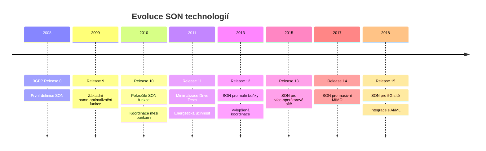
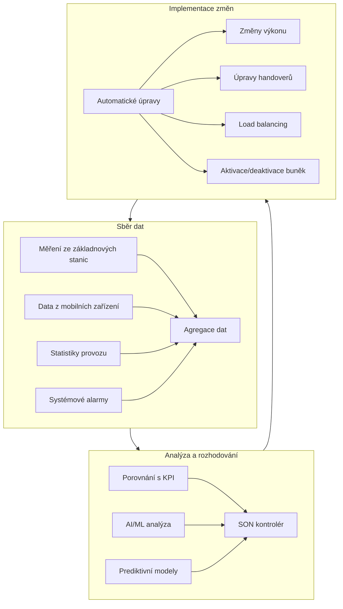
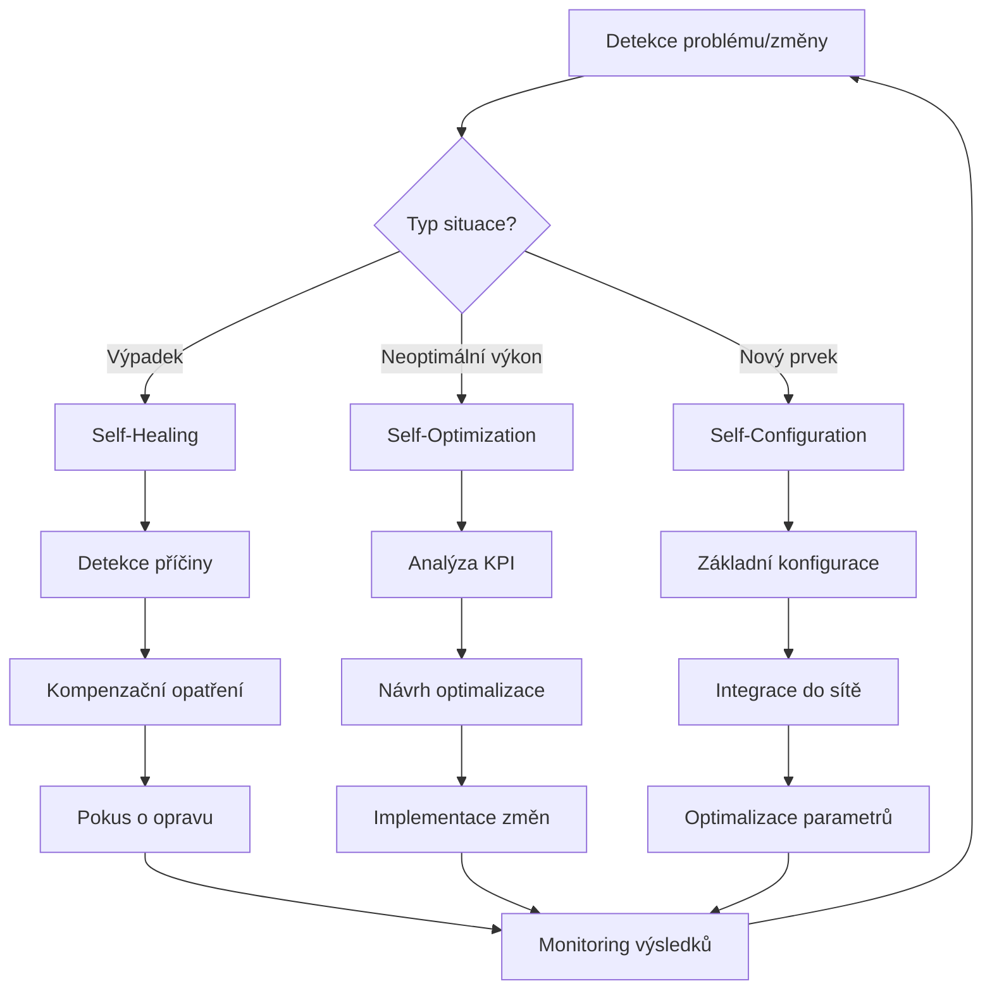
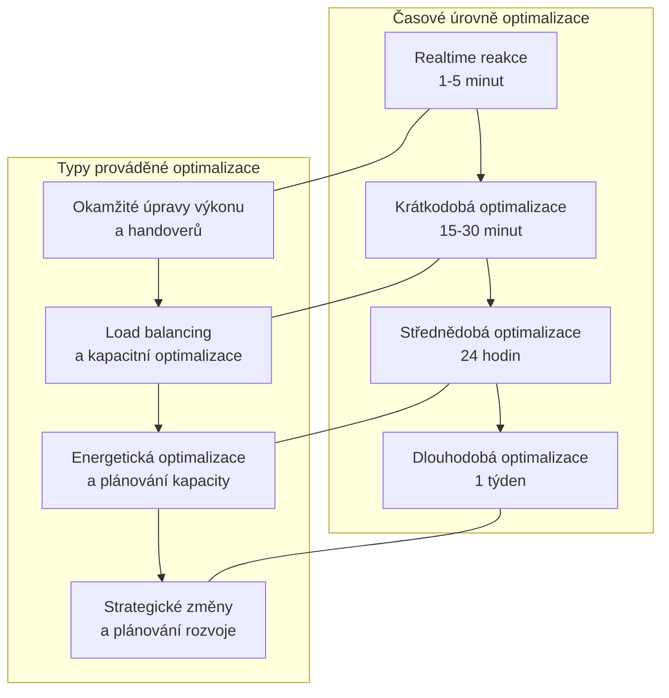

---
categories:
- LTE
- LTE-Advanced
- 4G
- Mobilní sítě
date: 2024-12-25
hide: true
layout: post
title: SON - Self-Organizing Networks - samoorganizující se sítě
---

Self-Organizing Networks (SON) jsou reakcí na neustále narůstající komplexnost mobilních sítí, kdy by bylo příhodné, aby sama síť mohla pomáhat se svojí organizací tam, kde je to možné. Technologie SON, která se vyvíjí už od 3GPP Release 8, přináší automatizaci do procesů, které byly dříve závislé na manuální konfiguraci a optimalizaci. S příchodem 5G sítí a přípravou na 6G se SON stává nikoli volbou, ale nutností pro efektivní provoz mobilních sítí.

## Historický vývoj a standardizace

První specifikace SON byly představeny v Release 8 spolu s uvedením LTE technologie. Od té doby prošly významným vývojem:

### Release 8-9 (2008-2009)
Zavedení základních konceptů SON včetně automatické konfigurace sousedních vztahů (ANR) a základních samo-optimalizačních funkcí. Tyto první implementace se soustředily především na zjednodušení nasazení nových základnových stanic.

### Release 10-11 (2010-2011)
Přinesly pokročilé SON funkce včetně koordinace mezi buňkami (eICIC) a vylepšené samo-optimalizace pro LTE-Advanced. Byla představena minimalizace drive testů (MDT) a pokročilé funkce úspory energie.

### Release 12-13 (2013-2015)
Zaměření na podporu heterogenních sítí a malých buněk. Představení SON pro více-operátorové sítě a vylepšená koordinace interference.

### Release 14-15 (2016-2018)
Integrace s umělou inteligencí a strojovým učením. Příprava na 5G sítě a podpora masivního MIMO.

### Release 16 a novější (2019+)
Komplexní podpora 5G sítí včetně nových scénářů využití jako jsou URLLC (Ultra-Reliable Low-Latency Communication) a mMTC (massive Machine-Type Communications).

## Základní pilíře SON

### Self-Configuration
Automatická konfigurace nově nasazených síťových prvků zahrnuje:
- Automatickou detekci hardwaru a softwaru
- Inicializaci základního nastavení
- Automatické navázání spojení se sousedními buňkami
- Dynamickou konfiguraci rádiových parametrů

### Self-Optimization
Kontinuální proces optimalizace sítě v reálném čase:
- Optimalizace pokrytí a kapacity
- Dynamické vyvažování zátěže
- Optimalizace handoverů
- Energetická optimalizace
- Využití dat z uživatelských zařízení pro zpětnou vazbu

### Self-Healing
Automatická detekce a řešení problémů:
- Detekce a diagnostika výpadků
- Automatická kompenzace pomocí okolních buněk
- Prediktivní údržba využívající AI/ML
- Automatické obnovení služeb

Vysvětlím praktické fungování SON v mobilní síti na konkrétním příkladu. Představme si typický den v životě mobilní sítě využívající SON technologii.

### Základní princip fungování

SON funguje jako uzavřená smyčka obsahující tři hlavní fáze:

1. **Sběr dat** - Síť neustále shromažďuje data z různých zdrojů:
- Měření z základnových stanic (výkon signálu, interference, využití kapacity)
- Data z mobilních zařízení (kvalita přijímaného signálu, rychlost přenosu dat)
- Statistiky o provozu a výkonnosti (počet spojení, úspěšnost handoverů)
- Alarmy a chybová hlášení

2. **Analýza a rozhodování** - SON kontrolér zpracovává sebraná data:
- Porovnává aktuální hodnoty s očekávanými (KPI - Key Performance Indicators)
- Identifikuje problémové oblasti nebo neefektivní nastavení
- Využívá algoritmy (často založené na AI/ML) k určení optimálního řešení

3. **Implementace změn** - Systém automaticky provádí potřebné úpravy:
- Mění parametry základnových stanic (výkon, natočení antén)
- Upravuje pravidla pro handovery
- Přenastavuje vyvažování zátěže

### Praktický příklad: Ranní špička v centru města

Podívejme se, jak SON reaguje na typickou situaci - ranní špičku v oblastí, kde jsou kancelářské budovy:

7:00 - Systém detekuje rostoucí provoz v oblasti:
- Senzory zaznamenávají zvyšující se počet připojených zařízení
- Roste využití kapacity buněk v dané lokalitě
- Začínají se objevovat první známky zahlcení

7:15 - SON aktivuje první úroveň optimalizace:
- Upravuje parametry handoverů, aby umožnil lepší rozložení zátěže
- Zvyšuje kapacitu přidělením dodatečných frekvenčních pásem
- Jemně dolaďuje výkony okolních buněk

8:00 - Špička dosahuje maxima:
- Systém detekuje, že některé buňky jsou na hranici své kapacity
- SON aktivuje agresivnější load balancing
- Dochází k dynamickému přesměrování části provozu na záložní buňky
- Systém může aktivovat dodatečné small cells v oblasti

### Ukázka self-healing funkce

Představme si, že během špičky dojde k výpadku jedné buňky:

1. **Detekce problému**:
- SON okamžitě zaznamená ztrátu spojení s buňkou
- Analyzuje poslední dostupná data pro určení příčiny
- Vyhodnocuje dopad na okolní síť

2. **Automatická reakce**:
- Okolní buňky automaticky zvýší výkon pro pokrytí problémové oblasti
- Upraví se směrování antén pro lepší pokrytí
- Aktivují se záložní kapacity v okolních buňkách

3. **Obnova služeb**:
- SON se pokusí o automatický restart problémové buňky
- Pokud se nepodaří problém vyřešit, systém optimalizuje okolní síť pro dlouhodobější kompenzaci výpadku
- Zároveň generuje detailní report pro techniky

### Kontinuální optimalizace

SON nepřetržitě provádí jemné dolaďování sítě:

- Každých několik minut kontroluje základní KPI
- V intervalech 15-30 minut provádí hlubší analýzu výkonnosti
- Denně vyhodnocuje dlouhodobé trendy a plánuje strategické změny
- Týdně generuje reporty o celkové výkonnosti a provedených optimalizacích

Toto vše probíhá automaticky, bez nutnosti zásahu operátora. Lidský dohled je potřeba pouze pro schvalování významných změn nebo řešení složitějších problémů, které SON nedokáže vyřešit samostatně.

Tyto diagramy znázorňují tři klíčové aspekty fungování SON:

1. **Hlavní smyčka** ukazuje základní princip nepřetržitého fungování SON - sběr dat, jejich analýzu a implementaci změn. Je vidět, jak různé zdroje dat přispívají k rozhodování a jaké typy změn mohou být implementovány.

2. **Rozhodovací proces** zobrazuje, jak SON reaguje na různé situace. Podle typu detekovaného problému nebo změny se aktivuje příslušná větev self-organizace (healing, optimization nebo configuration) a následuje specifická sekvence kroků.

3. **Hierarchie optimalizací** ukazuje různé časové horizonty, ve kterých SON operuje - od okamžitých reakcí až po dlouhodobé strategické změny. Každá úroveň má své specifické typy optimalizací a cíle.

Všechny tyto procesy probíhají současně a vzájemně se doplňují, vytvářejíc tak komplexní systém pro automatickou správu mobilní sítě. Diagramy také ukazují, jak se jednotlivé optimalizační smyčky vzájemně ovlivňují a jak jsou propojeny s monitorováním výsledků, což zajišťuje kontinuální zlepšování celého systému.

### Role AI a ML

V moderních implementacích SON využívá umělou inteligenci pro:

- Predikci zatížení sítě na základě historických dat
- Optimalizaci parametrů pomocí reinforcement learning
- Detekci anomálií a potenciálních problémů
- Automatickou klasifikaci a řešení běžných problémů

SON se tak neustále učí a zlepšuje své rozhodování na základě skutečných výsledků předchozích optimalizací.

## Moderní architektury SON

### Centralizovaná architektura (C-SON)
Veškerá inteligence je soustředěna v centrálním řídicím prvku. Výhodou je jednodušší správa a konzistence nastavení, nevýhodou může být pomalejší reakce na lokální změny.

### Distribuovaná architektura (D-SON)
Optimalizační algoritmy běží přímo v síťových prvcích. Umožňuje rychlou reakci na změny, ale může být náročnější na koordinaci.

### Hybridní architektura (H-SON)
Nejmodernější přístup kombinující výhody obou předchozích architektur. Lokální optimalizace probíhají na úrovni síťových prvků, zatímco globální optimalizace jsou řízeny centrálně.

## Pokročilé technologie v moderních SON

### Umělá inteligence a [strojové učení](/ai/strojove-uceni-machine-learning/)
Moderní SON systémy využívají pokročilé AI/ML techniky:
- Fuzzy Q-Learning pro optimalizaci mobility
- Hluboké učení pro predikci síťového provozu
- [Neuronové sítě](/ai/neuronove-site/) pro detekci anomálií
- Reinforcement learning pro optimalizaci parametrů

### Cognitive SON
Představený společností Nokia, využívá ML pro samotnou konfiguraci SON funkcí. Systém vyžaduje pouze definici vysokoúrovňových cílů a samostatně zajišťuje jejich dosažení.

### Open RAN a SON
Integrace SON s konceptem Open RAN přináší nové možnosti:
- Otevřené rozhraní pro vývoj vlastních optimalizačních aplikací
- Větší flexibilita při výběru dodavatelů
- Možnost kombinovat řešení různých výrobců

## Praktické aplikace a přínosy

### Optimalizace mobility (MRO)
- Automatické ladění parametrů handoverů
- Prevence zbytečných přepojení
- Optimalizace pro různé scénáře mobility

### Vyvažování zátěže (MLB)
- Dynamická distribuce provozu mezi buňkami
- Prevence přetížení
- Optimalizace využití zdrojů

### Energetická optimalizace
- Automatické vypínání nevyužitých komponent
- Přizpůsobení výkonu aktuální zátěži
- Snížení provozních nákladů

## Budoucí trendy a výzvy

### Integrace s 6G
Příprava na požadavky sítí šesté generace:
- Podpora extrémně vysokých rychlostí
- Ultra-nízká latence
- Masivní připojení IoT zařízení

### Rozšířená automatizace
- Plně autonomní sítě
- Prediktivní údržba
- Zero-touch provisioning

### Bezpečnost a spolehlivost
- Ochrana proti kybernetickým útokům
- Zajištění stability při automatických změnách
- Prevence kaskádových selhání

## Závěr

Self-Organizing Networks prošly od svého vzniku významným vývojem a dnes představují nezbytnou součást moderních mobilních sítí. S rostoucí komplexitou 5G sítí a přípravou na 6G se automatizace správy sítě stává kritickou nutností. Integrace umělé inteligence a [strojového učení](/ai/strojove-uceni-machine-learning/) otevírá nové možnosti pro ještě efektivnější a inteligentnější správu sítí, zatímco koncepty jako Open RAN přinášejí větší flexibilitu a otevřenost. Pro operátory je klíčové sledovat tyto trendy a připravit se na postupný přechod k plně automatizovaným sítím budoucnosti.