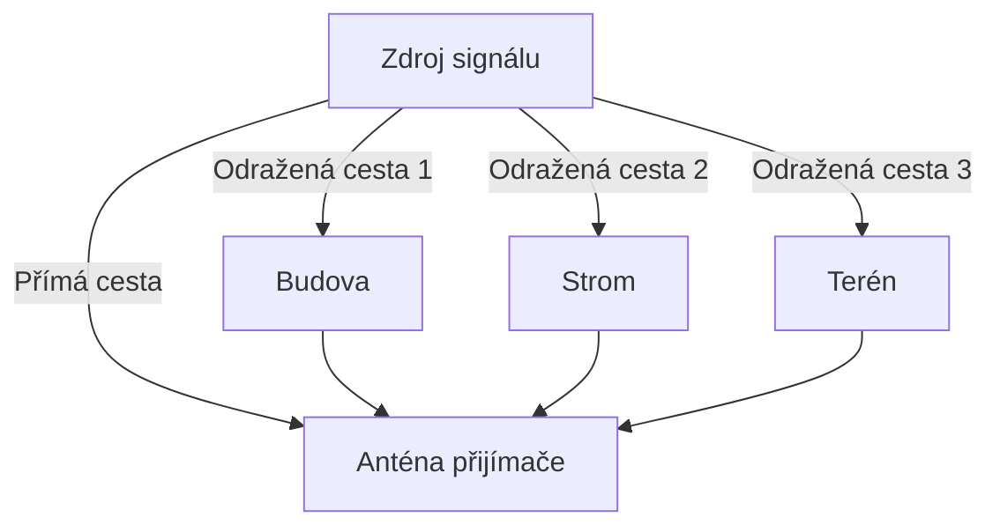

---
categories:
- LTE
- LTE-Advanced
- 4G
- Mobilní sítě
date: 2024-12-25
hide: true
layout: post
title: MIMO - Multiple In Multiple Out
---

Technologie MIMO – Vícecestného vstupu a výstupu signálu (Multiple In – Multiple Out) - byla zavedena s cílem zvýšit kapacitu a kvalitu bezdrátových sítí. Technologie je známa delší dobu, dnes se s ní běžně setkáváme ve WiFi sítích – zařízení, která mají více antén. Základní úvaha je jednoduchá: pokud může zařízení vysílat z více antén a na více anténách signál přijímat, bude možné si vybrat lepší kvalitu signálu, případně se snažit o rekonstrukci dat. Je to možné díky vícecestnému odrazu, kdy do antény přijímače dorazí nejenom původní signál, ale i jeho odrazy od překážek, které jsou časově zpomaleny a fakticky se projevují jako šum. Do toho přidejme jinou komunikaci sousedních zařízení (plus jejich odrazy) a je jasné, že nějaká snaha šum odfiltrovat bude prospěšná. Což je to, o co se MIMO účinně snaží.

Jen pro pořádek připomenu, že integraci MIMO do uživatelského terminálu (aka mobilky aka UE) nemusíte na první pohled poznat, nejsou to dvě antény trčící z mobilu, ale spíše dvě integrované antény na opačných koncích telefonu nebo dokonce jedna rozdělená na dvě poloviny, jelikož s ohledem na vlnovou délku už těch pár centimetrů udělá své. Na základnové stanici se používá koncept dvou vertikálně polarizovaných antén vzdálených minimálně 10 lambda (cca 1,4 m) nebo jedna anténa s polarizační diverzitou posunutou o 45 stupňů.

Proces vícecestného šíření signálu lze znázornit pomocí následujícího schématu: 

Tímto způsobem technologie MIMO využívá tyto údalosti pro prostorové multiplexování a zlepšení kvality přenosu dat. dříve představovalo šum, a proměnit ho v užitečné datové proudy.

### MIMO v Release 7: Základní koncepty

První implementace MIMO v mobilních sítích byla součástí HSPA+ Release 7. Zahrnovala konfiguraci 2x2 MIMO, tedy dvě antény na základnové stanici a dvě na uživatelském zařízení (UE). Technologie D-TxAA (Double Transmit Antenna Array) umožnila přenos dvou nezávislých datových proudů, což vedlo k teoretické přenosové rychlosti až 28 Mb/s v downlinku. MIMO bylo omezeno na downlink a neaplikovalo se na uplink.

### LTE Release 8: Rozšíření MIMO

LTE Release 8 přineslo širší využití MIMO, včetně podpory 64QAM (Quadrature Amplitude Modulation) spolu s 2x2 MIMO. Tento release zavedl pokročilé metody zpracování signálu, včetně precodingu a zpětné vazby od uživatelských zařízení pomocí PCI (Precoding Control Information) a CQI (Channel Quality Indicator).

### LTE Release 9–12: Vyšší kapacita a beamforming

### Beamforming: Směrování signálu pro vyšší efektivitu

Beamforming, nebo-li **vícenásobné směrování signálu**, je technologie využívaná k efektivnímu směrování signálu pomocí anténní matice. Umožňuje zesílit signál ve směru požadovaného uživatele a minimalizovat interferenci v jiných směrech. Beamforming existuje ve dvou hlavních formách – analogový a digitální.

**Analogový beamforming** směruje signál na úveru analogového zpracování, kdy je upravován fázový posun a amplituda signálů před jejich zesílením. Tento přístup je jednodušší na implementaci a energeticky účinnější, ale omezuje možnost obsluhy více uživatelů současně. V raných fázích LTE (Release 9) byl používán pro směrování signálu na okraje buněk.

**Digitální beamforming** zpracovává signály na úveru digitálních procesorů (DSP), což umožňuje vícenásobné směrování signálů a jejich optimalizaci pro každého uživatele zvlášť. Tento přístup je vysoce flexibilní a podporuje obsluhu více uživatelů, ale je náročnější na hardware a spotřebu energie. Poprvé byl zaveden v [LTE-Advanced](/mobilnisite/3gpp-release-10/) (Release 10) a stál se základem pro moderní sítě 5G (Release 15 a vyšší).

Postupný vývoj beamformingu v rámci LTE a 5G zahrnuje:

- **Release 9**: Zavedení kombinace beamformingu a MIMO, které zlepšilo signálovou kvalitu na okrajích buněk. Používal se především analogový beamforming.
- **Release 10 ([LTE-Advanced](/mobilnisite/3gpp-release-10/))**: Podpora digitálního beamformingu, který umožnil vícenásobné směrování signálu a jeho přizpůsobení každému uživateli. Konkrétně jde o podporu  konfigurací až 4x4 MIMO v downlinku a 2x2 MIMO v uplinku.
- **Release 11–12:** Pokrok ve využití koordinovaného MIMO (CoMP - Coordinated Multipoint) a zlepšení zpracování interferencí.
- **Release 13 (LTE-Advanced Pro)**: Hybridní beamforming kombinoval analogové a digitální metody pro vyšší flexibilitu.
- **Release 15 a vyšší (5G)**: Zavedení pokročilého digitálního beamformingu ve spojitosti s masivním MIMO a podporou vysokých frekvenčních pásem (např. mmWave).

### LTE-Advanced Pro a 5G (Release 13–16)

S příchodem LTE-Advanced Pro (Release 13) a 5G (Release 15 a dále) technologie MIMO dosáhla nových výšin:

- **Massive MIMO**: Nasazení masivního MIMO umožnilo konfigurace s desítkami až stovkami antén, přinášející zlepšení hustoty a výkonu sítě.
- **Beamforming**: Zavedení digitálního beamformingu umožnilo přesnější směrování signálu.
- **Full-Dimension MIMO (FD-MIMO)**: Rozšíření MIMO na všechny směry, včetně vertikálního paprsku.

### Současný vývoj a Release 17–19

Moderní standardy 5G, jako Release 17 a Release 18, integrují umělou inteligenci pro optimalizaci MIMO systémů. Tyto technologie zahrnují:

- **Algoritmy řízení spektra**: Automatizace výběru beamů a dynamického přizpůsobení kanálů.
- **Kooperativní MIMO**: Sdílení informací mezi základnovými stanicemi pro vyšší efektivitu.

### Role společností ve vývoji

- **Huawei a ZTE**: Přispěly k vývoji FD-MIMO a pokročilých beamformingových algoritmů.
- **Qualcomm**: Zajistil průlomové technologie precodingu a koordinovaného MIMO.
- **Ericsson a Nokia**: Podílely se na masivním MIMO a integraci sítě s nízkou latencí.

### Budoucí směřování

Další vývoj zahrnuje integraci MIMO s novými frekvenčními pásmy (např. mmWave) a využití integrovaného smyslového a komunikačního systému v rámci 6G.

---