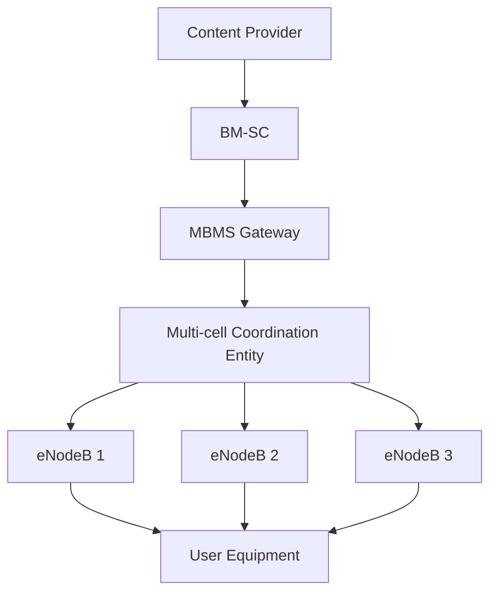

# LTE Broadcast / eMBMS: Evoluce technologie pro efektivní distribuci multimediálního obsahu

LTE Broadcast, také známý jako eMBMS (evolved Multimedia Broadcast Multicast Service), představuje významnou technologii v mobilních sítích, která umožňuje efektivní distribuci stejného obsahu velkému množství uživatelů současně. Pojďme se podrobně podívat na její vývoj, principy fungování a technické detaily.

## Základní princip a motivace

Tradiční mobilní sítě jsou primárně navrženy pro individuální komunikaci mezi základnovou stanicí a koncovým zařízením (unicast). Při distribuci populárního obsahu, jako je živé vysílání sportovních událostí nebo aktualizace software, však tento přístup není efektivní - stejná data musí být přenášena samostatně každému uživateli, což významně zatěžuje síťové prostředky.

eMBMS řeší tento problém zavedením broadcastového/multicastového přenosu, kdy je stejný obsah vysílán jednou a přijímán více zařízeními současně. To přináší významné úspory v využití rádiových zdrojů a zvyšuje celkovou kapacitu sítě.

## Evoluce v jednotlivých vydáních (Releases)

### Release 9: První implementace
V Release 9 byla technologie eMBMS poprvé představena jako součást LTE standardu. Základní implementace umožňovala:
- Broadcast/multicast přenos dat
- Základní synchronizaci mezi základnovými stanicemi
- Maximálně 60% využití rádiových zdrojů pro broadcast

### Release 10-13: Postupné vylepšování
Následující vydání přinesla řadu vylepšení:
- Zavedení služby "MBMS Operation on Demand" (MooD) v Rel-12
- Vylepšená podpora pro více-frekvenční nasazení
- Optimalizace pro skupinovou komunikaci

### Release 14: Zásadní rozšíření
Release 14 představoval významný milník s řadou klíčových vylepšení:
- Možnost využití až 100% rádiových zdrojů pro broadcast
- Zavedení "Receive-Only Mode" pro příjem bez SIM karty
- Nové OFDM numerologie pro větší vzdálenosti mezi vysílači
- Podpora sdílených vysílacích sítí

Podívejme se na architekturu systému:

## Technické principy fungování

### MBSFN (MBMS Single Frequency Network)
Klíčovým prvkem eMBMS je koncept MBSFN, kdy více základnových stanic vysílá synchronizovaně stejný obsah na stejné frekvenci. Pro přijímač se takové vysílání jeví jako příjem z jednoho zdroje s více cestami šíření. To umožňuje:

1. Eliminaci inter-cell interference
2. Zvýšení pokrytí díky konstruktivní interferenci
3. Efektivnější využití spektra

### Fyzická vrstva
eMBMS využívá speciální konfiguraci fyzické vrstvy:
- Prodloužený cyklický prefix pro eliminaci mezi-symbolové interference
- Speciální referenční signály pro MBSFN přenos
- Dedikované fyzické kanály (PMCH - Physical Multicast Channel)

### Síťová architektura
Systém obsahuje několik klíčových prvků:
- BM-SC (Broadcast Multicast Service Centre) - řídící prvek pro broadcast služby
- MBMS Gateway - distribuce dat k základnovým stanicím
- MCE (Multi-cell Coordination Entity) - koordinace vysílání mezi buňkami

## Praktické využití

eMBMS nachází uplatnění v různých scénářích:
1. Živé přenosy sportovních událostí
2. Distribuce aktualizací software/firmware
3. Nouzové vysílání a krizová komunikace
4. Veřejnoprávní vysílání
5. Firemní komunikace ve velkých areálech

## Výhody a omezení

### Výhody
- Významná úspora síťových zdrojů při distribuci populárního obsahu
- Možnost pokrytí velmi rozsáhlých oblastí
- Vysoká spektrální účinnost
- Podpora free-to-air vysílání

### Omezení
- Vyžaduje podporu na straně koncových zařízení
- Nutnost synchronizace základnových stanic
- Komplexnější plánování sítě
- Omezená zpětná vazba od přijímačů

## Budoucnost technologie

S příchodem 5G sítí přichází další evoluce broadcastových/multicastových přenosů. 3GPP pracuje na specifikacích pro 5G Broadcast, které by měly přinést:
- Vyšší přenosové rychlosti
- Nižší latenci
- Lepší podporu mobilního příjmu
- Flexibilnější alokaci síťových zdrojů

Je ale také dobré nepřehlédnout, že na internetu vládne spíše obsah na vyžádání a spolu s nárůstem obliby služeb, jako je Youtube nebo Netflix se může stát, že broadcastové a multicastové přenosy budou sloužit spíše pro specifické scénáře, kde je efektivní distribuce stejného obsahu velkému množství uživatelů klíčová. To neznamená, že se situace nemůže změnit a tak 3GPP pracuje na dalším vývoji broadcastových funkcí pro mobilní sítě.

Zatímco LTE eMBMS již dosáhla své finální podoby v Release 16 s označením "LTE-based 5G Terrestrial Broadcast", další evoluce směřuje k využití 5G New Radio (NR). Tato specifikace z Release 16 přinesla důležitá vylepšení jako podporu pro rozsáhlé SFN sítě s poloměrem buněk až 100 km a robustní mobilní příjem při vysokých rychlostech do 250 km/h.

3GPP nyní soustředí své standardizační úsilí na vývoj zcela nové generace multicast/broadcast funkcí pro 5G NR, která je součástí Release 17. Tato nová technologie již není evolucí LTE eMBMS, ale představuje kompletně nový přístup využívající možností 5G rádiového rozhraní. Očekává se, že přinese další vylepšení v oblasti spektrální efektivity, flexibility nasazení a podpory nových použití.

LTE eMBMS tak zůstává jako plně specifikovaná a ověřená technologie pro současná nasazení, zejména pro televizní vysílání a distribuci obsahu ve velkém měřítku. Její implementace probíhají v různých částech světa, například v Číně, Německu či Brazílii. Paralelně s tím se rozvíjí nová generace broadcast technologií založená na 5G NR, která v budoucnu nabídne další možnosti pro efektivní distribuci obsahu v mobilních sítích nové generace.

Toto rozdělení na etablovanou LTE eMBMS technologii a vyvíjející se 5G broadcast řešení umožňuje operátorům a vysílatelům volit nejvhodnější technologii podle svých konkrétních potřeb a časového horizontu nasazení. Zatímco některé služby mohou těžit z již dostupné LTE eMBMS infrastruktury, jiné případy užití mohou vyčkat na dokončení a nasazení pokročilejších 5G broadcast funkcí.