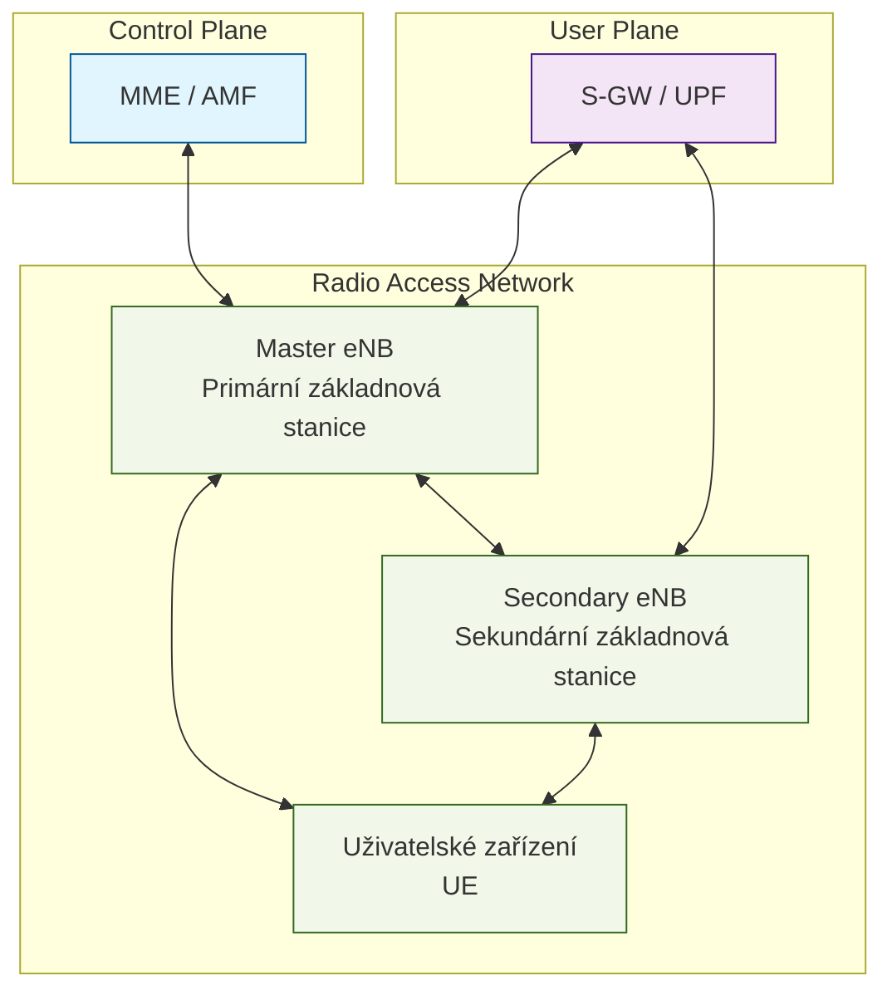

Dual Connectivity (DC) umožňuje mobilnímu telefonu současně komunikovat se dvěma základnovými stanicemi. Tato komunikace probíhá pomocí oddělených rádiových rozhraní, kde každé využívá vlastní frekvenční pásmo a modulaci. Mobilní telefon obsahuje dva nebo více rádiových přijímačů, které dokáží současně zpracovávat signály z obou základnových stanic. Primární základnová stanice (Master Node) zajišťuje hlavní řídící signalizaci a koordinuje připojení se sekundární stanicí (Secondary Node). Telefon průběžně měří kvalitu signálu z obou stanic a může dynamicky přesouvat datový provoz mezi nimi podle aktuálních podmínek.

Například při stahování velkého souboru může telefon přijímat část dat přes primární stanici v pásmu 800 MHz, které má lepší pokrytí uvnitř budov, a současně přijímat další část dat přes sekundární stanici v pásmu 3,5 GHz, které poskytuje vyšší přenosové rychlosti. Tento proces je pro uživatele zcela transparentní - vidí pouze jeden stabilní vysokorychlostní datový tok.

## Technické základy

V architektuře Dual Connectivity figurují následující klíčové prvky:

Master Node (MN) - Primární základnová stanice, která zajišťuje hlavní řízení připojení a signalizaci s páteřní sítí. V kontextu LTE se označuje jako MeNB (Master eNodeB), v 5G pak jako MgNB (Master gNodeB).

Secondary Node (SN) - Sekundární základnová stanice poskytující dodatečné rádiové prostředky. V LTE označována jako SeNB (Secondary eNodeB), v 5G jako SgNB (Secondary gNodeB).

User Equipment (UE) - Koncové uživatelské zařízení schopné současně komunikovat s oběma základnovými stanicemi.

Následující diagram znázorňuje základní architekturu Dual Connectivity včetně klíčových síťových prvků a jejich vzájemných vztahů:

## Vývoj v jednotlivých Release

# Dual Connectivity - Technický průvodce

Dual Connectivity (DC) představuje technologii v mobilních sítích, která umožňuje uživatelskému zařízení současně komunikovat se dvěma různými základnovými stanicemi. Tato architektura byla poprvé představena v Release 12 specifikací 3GPP a postupně se vyvíjela přes několik generací mobilních sítí.

## Technické základy

V architektuře Dual Connectivity figurují následující klíčové prvky:

Master Node (MN) - Primární základnová stanice, která zajišťuje hlavní řízení připojení a signalizaci s páteřní sítí. V kontextu LTE se označuje jako MeNB (Master eNodeB), v 5G pak jako MgNB (Master gNodeB).

Secondary Node (SN) - Sekundární základnová stanice poskytující dodatečné rádiové prostředky. V LTE označována jako SeNB (Secondary eNodeB), v 5G jako SgNB (Secondary gNodeB).

User Equipment (UE) - Koncové uživatelské zařízení schopné současně komunikovat s oběma základnovými stanicemi.

## Vývoj v jednotlivých Release

### Release 12 - První implementace
První specifikace DC byla zaměřena na scénář mezi makro buňkou (MeNB) a malou buňkou (SeNB) v nelicencovaném pásmu. Zavedla základní architekturu bearer rozdělení, kde kontrolní rovina zůstává na MeNB, zatímco uživatelská data mohou být přenášena přes obě stanice.

### Release 13 - Rozšíření funkcionality
Přidána podpora pro LAA (Licensed Assisted Access) v DC konfiguraci, umožňující využití nelicencovaného spektra v 5 GHz pásmu jako sekundárního nosiče. Představeny pokročilé mechanismy řízení mobility a handoveru.

### Release 14 - Optimalizace výkonu
Zavedeny vylepšené algoritmy pro rozdělení zátěže mezi MN a SN, včetně adaptivního přepínání bearerů založeného na kvalitě kanálu a zatížení sítě. Implementována podpora pro Enhanced LAA.

### Release 15 - Integrace s 5G
S příchodem 5G bylo DC rozšířeno o nové scénáře:
- EN-DC (E-UTRA NR Dual Connectivity) - kombinace LTE a 5G NR
- NE-DC (NR E-UTRA Dual Connectivity) - 5G NR jako primární s LTE sekundární
- NR-DC (NR-NR Dual Connectivity) - dual connectivity mezi dvěma 5G NR stanicemi

### Release 16 a 17 - Pokročilé funkce
Implementace pokročilých funkcí včetně:
- Vylepšené mechanismy QoS pro různé typy provozu
- Optimalizace spotřeby energie při DC operacích
- Rozšířená podpora pro průmyslové aplikace
- Integrace s edge computing architekturou

## Rozdíl mezi Carrier Aggregation a Dual Connectivity

Carrier Aggregation a Dual Connectivity představují dvě technologie pro zvýšení přenosové kapacity v mobilních sítích, každá však funguje na jiném principu. Carrier Aggregation, představená v LTE-A, umožňuje uživatelskému zařízení současně přijímat a vysílat data na více nosných frekvencích, ale vždy pouze od jedné základnové stanice (eNB). Systém může kombinovat až pět nosných v LTE-A a až 32 nosných v LTE-A Pro, čímž dosahuje teoretické přenosové rychlosti až 3,9 Gbps při použití 8x8 MIMO. Naproti tomu Dual Connectivity umožňuje zařízení současně komunikovat se dvěma různými základnovými stanicemi - Master eNB a Secondary eNB, které mohou pracovat na různých frekvencích a dokonce používat různé rádiové přístupové technologie (RAT). Zatímco CA je optimalizována především pro zvýšení přenosové rychlosti v rámci jedné buňky, DC přináší kromě navýšení přenosové kapacity také výhody v podobě lepší mobility, vyšší spolehlivosti spojení a možnosti efektivního rozdělení zátěže mezi různé typy buněk v heterogenní síti.

## Technická implementace

Technická realizace Dual Connectivity vyžaduje sofistikované protokolové řešení napříč několika vrstvami síťového stacku. Na nejvyšší úrovni protokol Radio Resource Control (RRC) zajišťuje celkovou koordinaci rádiových zdrojů. Zatímco primární stanice spravuje hlavní RRC spojení a řídí celkovou konfiguraci, sekundární stanice může mít vlastní podřízenou RRC konfiguraci. Toto uspořádání umožňuje flexibilní správu rádiových prostředků při zachování jednotného řízení.

V datové rovině hraje klíčovou roli Packet Data Convergence Protocol (PDCP). Tento protokol implementuje sofistikované mechanismy pro rozdělování datových toků mezi obě základnové stanice. Když přijde paket z vyšších vrstev, PDCP rozhodne, zda bude přenesen přes primární nebo sekundární stanici. Toto rozhodnutí se opírá o několik faktorů včetně aktuálního zatížení jednotlivých linek, kvality signálu a typu provozu. PDCP také zajišťuje, že pakety dorazí do cíle ve správném pořadí, i když byly přeneseny různými cestami s různým zpožděním.

Na nižších vrstvách má každá základnová stanice vlastní implementaci Radio Link Control (RLC) a Medium Access Control (MAC) protokolů. RLC zajišťuje spolehlivý přenos dat přes rádiové rozhraní pomocí mechanismů jako segmentace paketů a automatické opakování přenosu (ARQ). MAC vrstva pak řeší přímý přístup k rádiovému médiu včetně plánování přenosů a adaptace modulace podle kvality kanálu.

Architektura Dual Connectivity je standardizována ve dvou hlavních variantách, které se liší způsobem zpracování uživatelského provozu. První varianta, označovaná jako architektura 1A, využívá přímé S1-U terminace na obou základnových stanicích (MeNB i SeNB). To znamená, že obě základnové stanice mají přímé spojení s páteřní sítí přes rozhraní S1-U a mohou nezávisle zpracovávat uživatelská data, podobně jako v případě carrier aggregation. Každá základnová stanice v této architektuře implementuje kompletní protokolový zásobník včetně PDCP, RLC a MAC vrstev. Druhá varianta, označovaná jako architektura 3C, využívá S1-U terminaci pouze na MeNB a implementuje rozdělení datového toku (bearer split) přímo v rádiové přístupové síti. V této architektuře MeNB přijímá veškerá data z páteřní sítě a následně je rozděluje mezi vlastní rádiové rozhraní a SeNB pomocí X2 rozhraní. SeNB v tomto případě implementuje pouze RLC a MAC vrstvy, zatímco PDCP vrstva zůstává centralizována na MeNB. Toto uspořádání umožňuje efektivnější správu mobility a lepší koordinaci mezi oběma základnovými stanicemi, ale vyžaduje spolehlivé X2 spojení s nízkou latencí mezi MeNB a SeNB.

Dual Connectivity nachází uplatnění v různých síťových scénářích, přičemž každý klade specifické požadavky na implementaci. V městských oblastech často dochází ke kombinaci makro buněk pro široké pokrytí s malými buňkami pro zvýšení kapacity. Tento heterogenní přístup vyžaduje pečlivou koordinaci mezi stanicemi, aby se maximalizoval přínos dual connectivity a minimalizovala interference.

V průmyslovém prostředí, kde je klíčová nízká latence a vysoká spolehlivost, může dual connectivity poskytovat redundantní připojení s různými charakteristikami. Zatímco jedna cesta může být optimalizována pro nízkou latenci, druhá může zajišťovat vysokou spolehlivost přenosu. 

Implementace dual connectivity přináší také výkonnostní výhody v podobě vyšší agregované propustnosti dat. Teoreticky může být dosaženo až dvojnásobné přenosové rychlosti oproti single connectivity, v praxi však skutečné navýšení závisí na mnoha faktorech včetně kvality signálu, zatížení sítě a možností koncového zařízení.

Současná technická realizace dual connectivity čelí několika významným výzvám. Jednou z nich je potřeba přesné časové synchronizace mezi základnovými stanicemi. Bez dostatečně přesné synchronizace není možné efektivně agregovat provoz z obou připojení. Další výzvou je správa interference, která se stává komplexnější při využití více buněk. Řízení mobility také vyžaduje sofistikovanější algoritmy, protože handover musí brát v úvahu stav obou připojení.

Budoucí vývoj dual connectivity směřuje k podpoře více současných připojení, což dále zvýší flexibilitu a robustnost mobilních sítí. Integrace s pokročilými anténními systémy jako Massive MIMO otevírá nové možnosti pro zvýšení spektrální účinnosti. V kontextu průmyslu 4.0 a automobilových aplikací se vyvíjejí specializované varianty dual connectivity optimalizované pro specifické požadavky těchto vertikál.

Významným trendem je také vylepšená koordinace mezi stanicemi pro efektivnější využití spektra. To zahrnuje pokročilé algoritmy pro dynamické přidělování rádiových zdrojů a adaptivní formování paprsku (beamforming). Tyto techniky pomohou maximalizovat výhody dual connectivity při současné minimalizaci interference a energetické náročnosti.