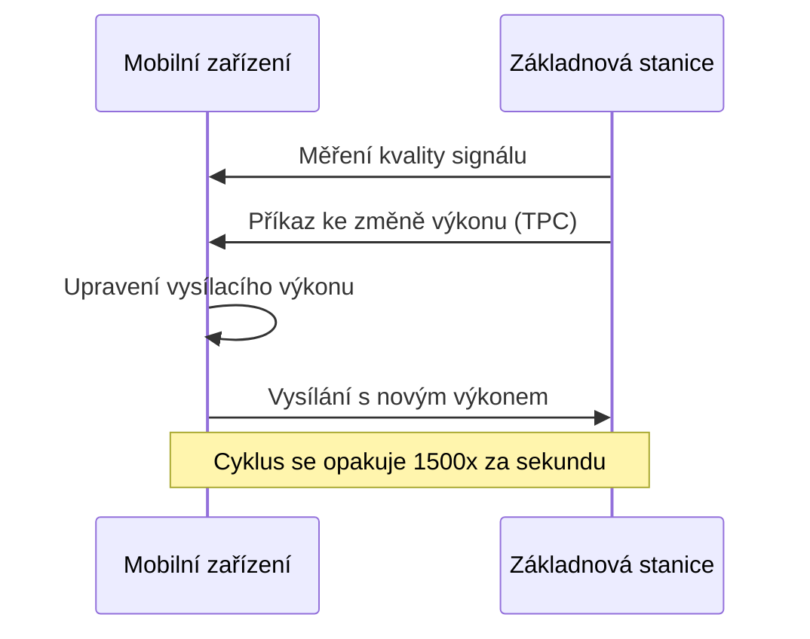
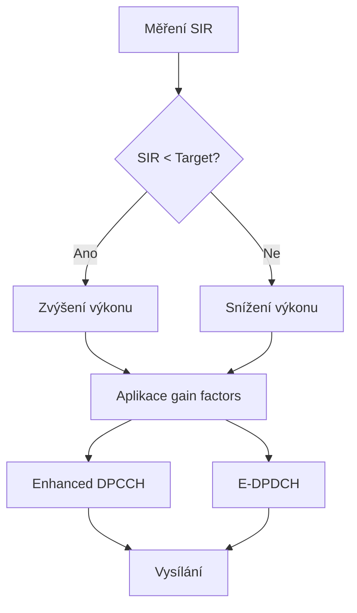

---
categories:
- LTE
- LTE-Advanced
- 4G
- Mobilní sítě
date: 2024-12-26
hide: true
layout: post
title: Enhanced Uplink Power Control v mobilních sítích
---

Řízení vysílacího výkonu v uplinku představuje základní mechanismus, který zajišťuje efektivní komunikaci mezi mobilním zařízením a základnovou stanicí. Tento článek se zaměří na vývoj a technické detaily Enhanced Uplink Power Control (EUL PC), který byl postupně vylepšován v různých vydáních 3GPP specifikací.

## Základní principy řízení výkonu

V uplinku mobilní zařízení vysílá signál směrem k základnové stanici. Vysílací výkon musí být dostatečně silný, aby signál dorazil k základnové stanici s požadovanou kvalitou, ale zároveň nesmí být příliš vysoký, aby nedocházelo k interferenci s ostatními uživateli. Řízení výkonu proto musí neustále balancovat mezi těmito protichůdnými požadavky.

Základní mechanismus řízení výkonu pracuje na principu uzavřené smyčky (closed loop power control). Základnová stanice měří kvalitu přijatého signálu a posílá mobilnímu zařízení příkazy ke zvýšení nebo snížení vysílacího výkonu. Tento proces se opakuje typicky 1500krát za sekundu.

## Vývoj v Release 99

V původní specifikaci Release 99 bylo řízení výkonu relativně jednoduché. Používal se pouze základní algoritmus uzavřené smyčky doplněný o otevřenou smyčku (open loop power control) pro iniciální nastavení výkonu. Systém pracoval s následujícími parametry:

- Rychlost změny výkonu: ±1, ±2 dB
- Frekvence příkazů: 1500 Hz
- Jeden společný algoritmus pro všechny služby



## Enhanced Uplink v Release 6

Release 6 přinesl významné vylepšení v podobě HSUPA (High Speed Uplink Packet Access). S tím souviselo i rozšíření řízení výkonu o nové funkce:

1. E-DPCCH Power Control
- Samostatné řízení výkonu pro řídicí kanál
- Adaptivní nastavení offsetu vůči datovému kanálu
- Možnost rychlé změny výkonu při změně přenosové rychlosti

2. E-DPDCH Power Control
- Zavedení referenční hodnoty βed pro různé formáty přenosu
- Gain factors pro různé kombinace fyzických kanálů
- Podpora scheduled a non-scheduled přenosů

## Vylepšení v Release 7

Release 7 přinesl další optimalizace:

1. Enhanced DPCCH Power Control
- Vylepšený algoritmus pro estimaci SIR (Signal-to-Interference Ratio)
- Přesnější řízení výkonu při vysokých rychlostech UE
- Redukce interference při soft handoveru

2. Zavedení Enhanced Fractional DPCH
- Možnost použití různých power offsetů pro různé služby
- Optimalizace pro MIMO přenosy
- Podpora různých Quality of Service (QoS) požadavků



## Technické detaily implementace

Enhanced Uplink Power Control pracuje s několika klíčovými parametry:

### SIR Target
Cílová hodnota SIR je dynamicky upravována na základě:
- Požadované přenosové rychlosti
- Aktuálních podmínek rádiového kanálu
- QoS požadavků služby
- Interference v buňce

### Gain Factors
Systém používá sadu gain faktorů pro různé kombinace kanálů:
- βc pro DPCCH
- βd pro DPDCH
- βec pro E-DPCCH
- βed pro E-DPDCH

Tyto faktory jsou nastavovány podle:
```
Pc = βc2 * Pref
Pd = βd2 * Pref
```
kde Pref je referenční výkon.

### Power Headroom
Důležitým parametrem je Power Headroom (PH), který indikuje, kolik výkonu má UE ještě k dispozici:
```
PH = Pmax - Ptx
```
kde:
- Pmax je maximální povolený vysílací výkon
- Ptx je aktuální vysílací výkon

## LTE a další vývoj

S příchodem LTE se principy řízení výkonu dále vyvíjely. Bylo zavedeno:

1. Fractional Power Control
- Kompenzace path loss pouze částečně (typicky 0.6-0.8)
- Lepší vyvážení mezi cell-edge a cell-center výkonem

2. Type 0 a Type 1 Power Control
- Type 0: Založeno na path loss a interferenci
- Type 1: Přidává dynamické příkazy pro rychlé změny

3. Accumulated vs. Absolute příkazy
- Accumulated: Relativní změny výkonu
- Absolute: Přímé nastavení na konkrétní hodnotu

## Praktické dopady

Enhanced Uplink Power Control přináší několik praktických výhod:

1. Energetická efektivita
- Optimalizace spotřeby energie v mobilních zařízeních
- Prodloužení výdrže baterie

2. Síťová kapacita
- Redukce interferencí mezi uživateli
- Vyšší celková kapacita systému

3. Quality of Service
- Lepší podpora různých typů služeb
- Stabilnější připojení na okraji buňky

4. Výkonnost systému
- Vyšší přenosové rychlosti
- Nižší latence

## Technické výzvy a budoucí směřování


Implementace Enhanced Uplink Power Control přináší několik významných technických výzev, které musí vývojáři a operátoři řešit. Zásadním aspektem je rychlost reakce systému na změny v rádiovém prostředí. Řídící mechanismus musí být schopen reagovat v řádu milisekund na náhlé změny podmínek šíření signálu, jako jsou třeba rychlé úniky nebo náhlé interference. Jakékoliv zpoždění v této zpětnovazební smyčce může vést k nestabilitě celého systému a degradaci kvality spojení.

Další kritickou oblastí je přesnost měření parametrů rádiového kanálu, zejména Signal-to-Interference Ratio (SIR). Měřicí algoritmy musí poskytovat spolehlivé výsledky i v prostředí s vysokým šumem a interferencí. To vyžaduje sofistikované metody kalibrace a průběžné ladění měřicích algoritmů. Výzvou je také samotná komplexnost celého systému - množství parametrů, které je třeba optimalizovat, je značné a jejich vzájemné interakce nejsou vždy intuitivní. Navíc tyto parametry musí být koordinovány s ostatními funkcemi síťového stack, jako je handover nebo řízení datových toků.

S příchodem nových generací mobilních sítí se Enhanced Uplink Power Control dále vyvíjí a adaptuje na nové požadavky. V kontextu 5G NR se pozornost zaměřuje především na podporu milimetrových vln (mmWave), kde je přesné řízení výkonu kritické vzhledem k výrazně vyššímu útlumu signálu na těchto frekvencích. Systémy beam-based power control se stávají nezbytností, protože umožňují efektivní směrování energie přesně tam, kde je potřeba. Významnou roli hraje také podpora Ultra-reliable low latency communication (URLLC), která vyžaduje extrémně rychlé a spolehlivé řízení výkonu.

Massive MIMO technologie přináší další rozměr do řízení výkonu. 3D beamforming umožňuje přesné prostorové tvarování vysílacího paprsku nejen v horizontální, ale i vertikální rovině. Více-uživatelské MIMO systémy vyžadují sofistikované algoritmy pro současné řízení výkonu několika uživatelů, kteří sdílejí stejné časové a frekvenční prostředky. Hybridní beamforming kombinuje analogové a digitální techniky pro optimální využití vysílacího výkonu.

Budoucnost řízení výkonu směřuje k využití umělé inteligence a [strojového učení](/ai/strojove-uceni-machine-learning/). Prediktivní algoritmy mohou anticipovat změny v rádiovém prostředí a proaktivně upravovat vysílací výkon ještě před tím, než dojde k degradaci spojení. Samooptimalizující se sítě využívají historická data a zkušenosti z provozu k průběžnému ladění parametrů řízení výkonu. Adaptivní algoritmy se dokáží učit z různých scénářů nasazení a optimalizovat své chování pro konkrétní podmínky dané lokality.

Řízení výkonu v uplinku tak zůstává dynamickou oblastí výzkumu a vývoje. S každou novou generací mobilních sítí přicházejí nové výzvy a požadavky, ale také nové nástroje a technologie pro jejich řešení. Enhanced Uplink Power Control se tak neustále vyvíjí a adaptuje, aby poskytoval optimální výkon a efektivitu v stále komplexnějším prostředí mobilních komunikací.