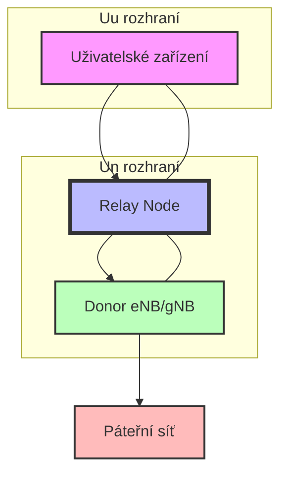
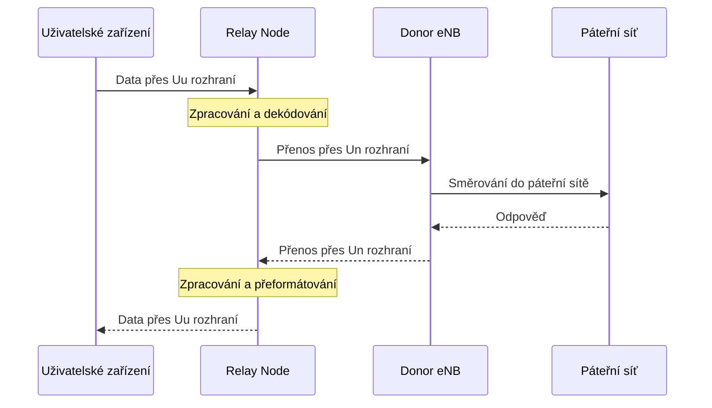

---
categories:
- 5G
- Mobilní sítě
- LTE
date: 2024-12-25
hide: true
layout: post
title: Relay Nodes -  přenosové uzly v mobilních sítích
---

Relay Node (RN) je zajímavá technologie, která vychází z původního poněkud nelegálního konceptu zesilovačů z GSM sítí. V devadesátých letech kvůli špatnému pokrytí GSM signálem při startu GSM sítí existovaly tzv. zesilovače, které zachytávaly, zesilovaly a znovu vysílali signál GSM sítí, aniž by do signálu jako takového jinak vstupovaly. S pokročilejšími technologiemi tento koncept získal trhliny, protože šlo potenciálně o klasický Man-in-the-middle útok. Do cesty mezi legitimního uživatele a legitimní základnovou stanici se dostal třetí prvek nekontrolovaný žádnou ze stran, který by mohl libovolně s daty manipulovat. 

Operátoři i výrobci nicméně naznali, že sám o sobě byl koncept rozumný a mít zesilovací prvky, které mohou signál předat či dokonce nějak legitimně zpracovat, by mohlo být pro budování pokrytí sítí zejména v odlehlých oblastech přínosné. A tak vznikl koncept Relay Node, Přenosových uzlů. 

Relay Node je v podstatě specializovaná základnová stanice, která slouží jako mezičlánek mezi hlavní základnovou stanicí (Donor eNB/gNB) a koncovými uživatelskými zařízeními. Představme si to jako sofistikovaný opakovač signálu, který však nabízí mnohem více funkcí než pouhé zesílení signálu.

## Historický vývoj v jednotlivých vydáních

### Release 10 ([LTE-Advanced](/mobilnisite/3gpp-release-10/))

V Release 10 byl koncept Relay Nodes poprvé standardizován jako součást [LTE-Advanced](/mobilnisite/3gpp-release-10/). Základní implementace představila dva typy Relay Nodes:

1. Type 1 RN: Plně funkční základnová stanice s vlastním cell ID, která vysílá vlastní synchronizační signály a referenční symboly. Podporuje samostatné plánování a řízení rádiových zdrojů.

2. Type 2 RN: Transparentní relay node, který nevysílá vlastní cell ID a slouží především ke zvýšení průchodnosti dat v rámci existující buňky.

### Release 11

S příchodem Release 11 došlo k významnému vylepšení RN technologie. Byla představena pokročilá správa interference mezi relay nodes a evolved NodeB (eNB). Implementovalo se:

- Dynamické řízení výkonu pro backhaul link
- Vylepšené CoMP (Koordinovaný multipoint) pro relay scenarios
- Zdokonalené mechanismy handoveru

### Release 12 a 13

Tyto vydání přinesly další optimalizace:

- Dual connectivity pro relay nodes
- Vylepšená podpora pro heterogenní sítě (HetNets)
- Pokročilé mechanismy pro správu mobility

## Technické aspekty a výhody

Relay Nodes přinášejí několik klíčových technických výhod:

### Zlepšení pokrytí
RN technologie umožňuje efektivně rozšířit pokrytí sítě v oblastech s horším signálem. Díky schopnosti zpracovat a přeposlat signál s minimální latencí dokáže:
- Překlenout rádiové stíny způsobené zástavbou
- Poskytnout kvalitní pokrytí uvnitř budov
- Zajistit lepší služby na okrajích buněk

### Zvýšení kapacity
Implementace RN vede k významnému navýšení kapacity sítě:
- Efektivnější využití rádiových zdrojů
- Možnost současné komunikace s větším počtem uživatelů
- Optimalizace přenosu dat díky lepšímu poměru signál/šum

## Relay Nodes: Komplexní průvodce technologií přenosových uzlů v LTE-Advanced

Technologie Relay Node (RN) představuje jeden z klíčových prvků standardu LTE-Advanced, který významně rozšiřuje možnosti mobilních sítí. Vývoj této technologie započal v lednu 2009 jako integrální součást standardizace LTE-Advanced, přičemž hlavním cílem bylo dosáhnout vyšších přenosových rychlostí a zejména zlepšit pokrytí pro uživatele na okrajích buněk.

Standard LTE-Advanced definuje tři základní typy Relay Nodes, které se liší svou komplexností a způsobem zpracování signálu. Nejjednodušší variantu představuje Layer 1 Relay, který funguje jako prostý zesilovač signálu. Tento typ využívá technologii Amplify and Forward (AF), kdy jednoduše zesiluje a přeposílá RF signály bez jakéhokoliv dekódování. Hlavní výhodou je nízká cena a minimální zpoždění, avšak významnou nevýhodou je zesilování interferencí a šumu, což může vést ke zhoršení poměru SINR.

Layer 1 Relay (L1)
- Nejjednodušší forma přenosového uzlu fungující jako zesilovač (booster/repeater)
- Využívá technologii Amplify and Forward (AF)
- Jednoduše zesiluje a přeposílá RF signály bez dekódování
- Výhody: nízká cena, minimální zpoždění
- Nevýhody: zesiluje také interference a šum, což zhoršuje poměr SINR

Pokročilejší variantu představuje Layer 2 Relay, který využívá sofistikovanější technologii Decode and Forward (DF). Tento typ přijatý signál nejprve demoduluje a dekóduje, následně jej znovu zakóduje a přepošle. Tento přístup umožňuje odstranit šum z přijatého signálu, ovšem za cenu vyšší složitosti implementace a mírného zvýšení latence. Layer 2 Relay také vyžaduje dodatečné funkce pro řízení rádiových zdrojů.

Layer 2 Relay (L2)
- Využívá technologii Decode and Forward (DF)
- Přijaté signály demoduluje a dekóduje před opětovným zakódováním a přeposláním
- Odstraňuje šum z přijatého signálu
- Vyžaduje dodatečné funkce pro řízení rádiových zdrojů
- Představuje kompromis mezi složitostí a výkonem

Nejvyspělejší variantu představuje Layer 3 Relay, který disponuje plnou funkcionalitou základnové stanice. Tento typ kompletně zpracovává uživatelská data včetně šifrování a obsahuje kompletní protokolový stack zahrnující vrstvy RRC, PDCP, RLC a MAC. Právě Layer 3 Relay byl vybrán pro standardizaci v Release 10 díky své flexibilitě a výkonu, i když za cenu vyšší latence.

Layer 3 Relay (L3)
- Nejpokročilejší typ s plnou funkcionalitou základnové stanice
- Kompletně zpracovává uživatelská data včetně šifrování
- Obsahuje vlastní protokolový stack včetně RRC, PDCP, RLC a MAC vrstev
- Nejvyšší flexibilita a výkon za cenu vyšší latence
- Vybraný typ pro standardizaci v Release 10

V praxi se Relay Nodes nasazují v několika klíčových scénářích. Ve venkovských oblastech s rozlehlým pokrytím a nízkou hustotou uživatelů se typicky využívají vysoko-výkonné fixní RN, kde je kladen důraz především na nákladovou efektivitu. V městských hot-spotech s vysokou hustotou uživatelů se naopak využívá větší počet RN s menšími buňkami v rámci jedné makro buňky, přičemž hlavním cílem je zvýšení kapacity sítě.

Specifickým případem je pokrytí hluchých míst, například oblastí stíněných vysokými budovami, kde se mohou využívat jak L3 RN, tak repeatery. Pro indoor hot-spoty, které jsou podobné femto-buňkám, se typicky nasazují nízko-výkonové RN s důrazem na vysokou propustnost dat. Zajímavou aplikací je také pokrytí mobilních skupin, například ve vlacích či autobusech, kde RN pomáhají řešit problémy s penetračním útlumem a agregací více spojení.

Z technického hlediska standard definuje dva typy rádiových rozhraní - Un rozhraní mezi Donor eNB a RN, a Uu rozhraní mezi RN a uživatelským zařízením (UE). Layer 3 RN implementuje stejné protokoly jako běžná základnová stanice, včetně PDCP pro šifrování a kompresi hlaviček, RLC pro retransmise a segmentaci, MAC pro HARQ a plánování, a RRC pro řízení mobility a QoS. Pro komunikaci s páteřní sítí využívá protokoly S1AP pro řídící rovinu a GTP-U pro uživatelská data.

Klíčovou součástí implementace je efektivní plánování rádiových zdrojů a řízení interferencí. To zahrnuje dynamickou alokaci zdrojů, koordinaci interferencí mezi RN a eNB, TDM multiplexování Un a Uu rozhraní a adaptivní řízení výkonu. Pro přesné modelování šíření signálu se využívají různé modely podle typu prostředí, zahrnující jak large scale fading (path loss modely pro LOS/NLOS, shadow fading), tak small scale fading (delay spread, angle spread, cross-polarization discrimination).

S příchodem 5G sítí se očekává další evoluce této technologie, především v oblasti integrace s [Network Slicing](/mobilnisite/network-slicing-5g/), pokročilejšího řízení interferencí, vyšší flexibility backhaulu a optimalizace pro specifické případy použití. Relay Node technologie tak zůstává významným nástrojem pro zlepšování pokrytí a kapacity mobilních sítí v různorodých scénářích nasazení.

Tento technologický přístup představuje elegantní řešení pro rozšíření pokrytí a zvýšení kapacity mobilních sítí, přičemž nabízí flexibilitu pro různé scénáře nasazení. Díky své standardizaci v rámci LTE-Advanced a dalšímu vývoji v kontextu 5G sítí zůstává Relay Node technologie důležitým prvkem v evolučním řetězci mobilních komunikací.

## Implementační výzvy

Přestože RN technologie přináší významné výhody, její implementace není bez výzev:

### Synchronizace a časování
Kritickým aspektem je přesná synchronizace mezi Donor eNB a Relay Node. Musí být zajištěno:
- Přesné časování pro koordinaci přenosu
- Minimalizace latence při zpracování signálu
- Správná synchronizace rámců a symbolů

### Správa interference
Relay Nodes musí pečlivě řešit potenciální interferenci:
- Mezi různými Relay Nodes v síti
- Mezi Relay Node a Donor eNB
- S okolními základnovými stanicemi

### Backhaul link management
Správa spojení mezi RN a Donor eNB vyžaduje:
- Dynamickou alokaci rádiových zdrojů
- Adaptivní řízení výkonu
- Zajištění kvality služeb (QoS)

## Budoucnost RN technologie

S příchodem 5G sítí se role Relay Nodes dále rozšiřuje. Nové standardy přinášejí:
- Podporu pro mmWave frekvence
- Vylepšenou integraci s [Network Slicing](/mobilnisite/network-slicing-5g/)
- Pokročilé možnosti pro Mobile Edge Computing

Relay Node technologie se stala zajímavou součástí moderních mobilních sítí. Její evoluce od základního konceptu v LTE-Advanced až po současné pokročilé implementace v 5G sítích demonstruje důležitost této technologie pro budoucnost mobilních komunikací. Díky své schopnosti zlepšit pokrytí, zvýšit kapacitu a optimalizovat využití síťových zdrojů může  RN představovat důležitou technologii pro další rozvoj mobilních sítí.

Určitý střet tu proběhne [v oblasti HetNet](/mobilnisite/hetnet), kde vznikla funkčně podobná záležitost. Femtocelly jsou ale plně zapojené do jádra sítě, zatímco RN komunikují jen se základnovou stanicí (a samozřejmě uživatelskými terminály). Výhodou RN měla být hlavně jednoduchost a tedy i cena, ale ceny femtocell padají střemhlavě. Můžeme tedy říci, že RN a femtocelly nejdou proti sobě, ale představují komplementární technologie v rámci HetNet konceptu. Jejich budoucnost spočívá především v inteligentní integraci a koordinaci, která umožní využít silné stránky každé technologie tam, kde jsou nejvíce potřeba. S příchodem 5G a budoucích generací mobilních sítí lze očekávat další sbližování těchto technologií a vznik hybridních řešení, která budou lépe odpovídat rostoucím nárokům na mobilní sítě.