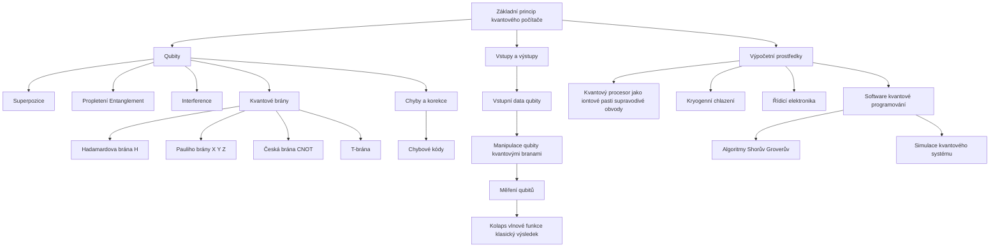

Třicet let se ve svém psaní důsledně vyhýbám kvantovým počítačům. Dnes je načase tomu udělat konec. A říct si něco víc o kvantových počítačích a otevřít jejich důsledky pro lidstvo.

Tak především: proč jsem se jim tak důsledně vyhýbal? Protože se musím přiznat, že stále neumím zjednodušeně říct, jak fungují. Ne proto, že bych to nevěděl, ale prostě proto, že to neumím říct tak jednoduše, abych s tím byl spokojený.

Za poslední rok se toho v kvantových počítačích událo mnoho nového a já jsem mimo jiné přečetl pětici knih, které se snažily v krátkosti představit na čtyřech stovkách stran, jak kvantové počítače fungují. Tím jsem poněkud ztratil ostych, neboť stručné vysvětlení se nedaří ani nositelům nobelových cen. Odpusťte tedy prosím mě, že se pokusím velmi zjednodušujícími příměry vysvětlit, o co jde a proč je to důležité.

Dnes jsme zvyklí na to, že každý počítač je takzvaným turingovým strojem, tedy mašinkou, která umí provádět operace s binárními čísly. Vše, co jde do klasického počítače, se musí převést na jedničky a nuly, takzvané bity. Chvilku se můžete trápit s teorií, můžeme si ukázat, jak se čísla v této dvojkové soustavě sčítají, ale je to v zásadě jedno, takhle hluboko se u běžných počítačů dostane málokdo, jen ten pojem "bit" a jeho násobky nám zůstávají. Bit může být representován libovolně: může to být zhasnutá či rozsvícená žárovka, sepnutý tranzistor atd. Jednička nebo nula.

Kvantové počítače používají kvantové bity, takzvané **qubity**. I ony mohou nabývat hodnoty jedna nebo nula - a pak také všech hodnot mezi tím. A klidně více hodnot zároveň. To tehdy, když se nacházejí v takzvané **superpozici**. To se lehce řekne, ale obtížně vysvětluje. Qubity jsou subatomární částice, zejména elektrony nebo fotony. A ty se mohou chovat jako částice i jako vlny, s čímž právě souvisí ona "mnohost", jíž se projevují.

Určitě jste slyšeli to rčení o [Schrodingerově kočce](https://cs.wikipedia.org/wiki/Schrödingerova_kočka) v krabici, o které nevíme, zda je mrtvá nebo živá, dokud se do krabice nepodíváme a nezjistíme, zda ji důmyslné zařízení v krabici neusmrtilo. Toto myšlenkové cvičení Erwina Schrodingera a především rovnice za ním vyneslo jeho autorovi Nobelovu cenu. Abych byl přesný, když hovořil o kočce, měl cenu už dva roky v kapse. Schrodinger tím chtěl poukázat na problematickou uchopitelnost takzvané kodaňské interpretace kvantové fyziky, jenže o sto let později je jeho kočka vnímána spíše jako zábavný mem. Ve skutečnosti, pokud přijmeme za své nejmodernější verzi kvantové fyziky popisující [multiversum](https://cs.wikipedia.org/wiki/Mnohovesmír), tedy mnohovesmír, ta kočka v krabici existuje ne ve dvou, ale hned v nekonečném množství stavů, živá, mrtvá, umírající, ale také třeba zcela zmizelá, s narozenými koťaty nebo třeba proměněná v pejska. Ve všech těchto stavech existuje ona kvantová Schrodingerova kočka do momentu, než otevřete krabici. Co se stane pak, o tom se [kvantoví fyzici přou](https://cs.wikipedia.org/wiki/Interpretace_kvantové_mechaniky). Někteří tvrdí, že v tu chvíli se vlna zhroutí do konkrétní pozice a kočka bude živá nebo mrtvá. Jiní říkají, že otevřením krabice jen podle zákona pravděpodobnosti uvidíte něco a že je to podobné, jako když naberete vodu do dlaní. Spousta jí vyteče, nemůžete přesně říct, kolik vody naberete, ale velmi pravděpodobně to bude více, jak několik atomů a méně, než tuna. Že z toho nejste moudří? Inu, proto jsou tomu věnovány knihy o stovkách stran. Jednoduché příměry z našeho světa nejsou dostatečné.

Podstatný je pro nás především ten jeden důsledek: qubit obsahuje najednou obrovské množství hodnot ale přitom právě jednu. A teď, co s tím dělá ten kvantový počítač? Představte si, že chcete udělat program, který nasimuluje pravděpodobnost stavu kočky v oné krabici. Už jsme si řekli, že to není ono "pade na pade", že je tu celá řada více či méně nepravděpodobných možností. Normální počítač dostane zadané varianty a nějakou dobu k nim bude počítat hromadu výpočtů a pak z něj něco vypadne. U kvantového počítače to proběhne jinak. Výpočet na kvantovém počítači funguje tak, že se připraví superpozice všech možných výpočetních stavů. Kvantový obvod připravený uživatelem používá interferenci selektivně na složky superpozice podle zadaného algoritmu. Mnoho možných výsledků je interferencí zrušeno, zatímco jiné jsou zesíleny. Zesílené výsledky jsou řešením výpočtu.  Tím pádem výpočet proběhne prakticky okamžitě. Také bychom mohli říct, že výpočet proběhne v nekonečném počtu všech možných vesmírů, v počítačích v nich umístěných a odečte se výsledek, který nejlépe zapadá do toho našeho vesmíru. Zní to jako magie, ale je to spíš pravděpodobnost a podobnost nebo naše neznalost skutečného fungování kvantového počítače. 

Jen qubity a jejich superpozice by na fungování kvantového počítače nestačily. Důležitým prvkem je možnost vytvářet páry qubitů, které jsou "entanglované", což znamená, že dva členové páru existují v jednom kvantovém stavu. Změna stavu jednoho z qubitů okamžitě změní stav druhého předvídatelným způsobem a na libovolnou vzdálenost. A když říkám okamžitě, tak myslím okamžitě, rychleji, než by se ta informace přenesla světlem. Nikdo zatím přesně neví, jak a proč provázání funguje. Dokonce to zmátlo i Einsteina, který to slavně popsal jako "strašidelné působení na dálku". Je však klíčem k výkonu kvantových počítačů. V běžném počítači zdvojnásobení počtu bitů zdvojnásobí jeho výpočetní výkon. Díky provázanosti však přidání dalších qubitů ke kvantovému stroji vede k exponenciálnímu nárůstu jeho schopnosti zpracovávat čísla. Superpozice umožňuje jednomu qubitu provádět dva výpočty najednou, a pokud jsou dva qubity propojeny entanglováním, mohou provést dva nebo čtyři výpočty současně; tři qubity až osm výpočtů atd. V principu by kvantový počítač s 300 qubity mohl v jednom okamžiku provést více výpočtů, než kolik je atomů ve viditelném vesmíru. Odtud také pojem **kvantová nadřazenost,** který označuje stav, kdy kvantové počítače dosáhnou úrovně rychlosti výpočtů, které nemohou klasické počítače ve vhodných úlohách konkurovat. Dnes se předpokládá, že kvantové nadřazenosti bude podle typu kvantového obvodu možné dosáhnout při 200-400 qubitech, tedy na počítačích nikoliv vzdálených od těch dnešních.

Výše uvedené také znamená, že jsou úlohy, na které se kvantový počítač hodí a naopak takové, na které je zcela zbytečný. Například udělat počítač zobrazující grafické rozhraní nebo kódující video, na to je podstatně lepší běžný počítače, protože je to lineárně běžící úloha, kterou za pořizovací náklady a elektřinu vyřídí podstatně lépe. Kvantové počítače jsou dobré na výpočty, které jsou strukturálně paralelizované a které by ani normálními počítači nešly provést, typicky na jevy svou povahou kvantové. Vezměme si třeba simulaci fotosyntézy. Obecně víme, jak funguje, ale její detailní pochopení a zopakování či napodobení nám uniká, protože běžnými počítači nelze simulaci provést, výpočet by nedoběhl v geologicky dohledné době. Zřejmě i proto, že fotosyntéza je svou povahou kvantový proces. A její rozluštění a nasimulování je úloha pro kvantový počítač.

Zajímavá otázka je, zda toto znamená, že vyrobením jediného kvantového počítače získáme nekonečný výkon počítačů z nekonečného počtu vesmírů. Nu, tak jednoduché to není. Za prvé nevíme, zda počet těch vesmírů či bublin je nekonečný, je to jen předpoklad, či spíše představa nebo zjednodušený popis nějakého abstraktnější představy. Takovou představu asi umíme uchopit lépe, než představu všech pravděpodobnostních variant koexistujících v našem prostoru a času tak, že připomínají mlhovinu, do níž se při pozorování noříme. Za druhé je tu i praktické omezení. Kvantové počítače jsou technicky velmi náročné a vlastně nestabilní. S qubity se pracuje v teplotách kolem absolutní nuly, v mechanicky stabilním prostředí, bez otřesů a se subatomární atomární přesností. Když dojde k odchylkám od ideálu, dochází k dekoherenci, tedy k rozpadu a zániku kvantového chování qubitů ještě před tím, než dokončí výpočet. Tím vzniká "šum", tedy defektně získané informace. Důležitou součástí každého kvantového počítače je jednotka, která ověřuje kvalitu získaných informací a vyřazuje ty zjevně špatné. Představte si, že byste dali svému počítači sečíst dvě čísla a počítač by musel mít součástku, která by tento výpočet provedla nějakolikrát a pak vybrala za správný výsledek ten většinový - tak nějak to mají kvantové počítače. Nu a právě schopnost udržet šum pod kontrolou spoluurčuje onen počet využívaných "mnohovesmírných počítačů", výsledků z nich a tím i výkonu. Aby to fungovalo dobře, je potřeba spojit větší množství qubitů (cca tisíce) do jednoho "logického qubitu", což zní teoreticky dobře, jenže v praxi mají dnešní kvantové počítače kolem 200 qubitů.

Zní to famózně, má to všechno své drobné slabiny. Například to, že kvantový počítač je extrémně složité vyrobit. Všechno je extrémně nízké: teploty, rozměry, snad jen rozpočty musí být extrémně vysoké. Podle některých kritiků kvůli tomu nebudou kvantové počítače nikdy praktické, budou jen takovou hračkou nebo velmi specializovaným počítačem pro vzácné typy úloh. Nu - kdo by byl před padesáti lety řekl, že budeme mít supervýkonný počítač připojený na internet v kapse? Tvrdší kritika se objevuje i z renomovaných zdrojů, například letos v květnu v [časopisu Nature](https://www.nature.com/articles/d41586-023-01692-9), kde se přímo píše, že kvantové počítače zatím nejsou k ničemu. Podobně kritický byl také šéfarchitekt švýcarského superpočítačového centra Torsten Hoefler ve článku [Oddělit hype od praktičnosti: O reálném dosažení kvantové výhody](https://cacm.acm.org/magazines/2023/5/272276-disentangling-hype-from-practicality-on-realistically-achieving-quantum-advantage/fulltext), který suše konstatuje: "naše analýza ukazuje, že široká škála často citovaných aplikací pravděpodobně nepovede k praktickému kvantovému náskoku bez významných algoritmických vylepšení." Bude potřeba přijít s novými algoritmy, které výhod kvantových počítačů využijí.

Podle Hoeflera jsou nejslibnějšími kandidáty na dosažení zrychlení pomocí kvantových počítačů "problémy s malými daty", například v chemii a materiálových vědách. Článek však také dochází k závěru, že velká řada uvažovaných potenciálních aplikací, jako je strojové učení, "nedosáhne v dohledné době kvantové výhody se současnými kvantovými algoritmy", a identifikoval vstupně-výstupní omezení, která činí zrychlení nepravděpodobným například pro tak zajímavé a atraktivní problémy s velkými daty.

Jsou tu i strukturálně-existenční výhrady. Paul Davies tvrdí, že 400-qubitový počítač by se dostal do rozporu s kosmologickou informační mezí, kterou předpokládá holografický princip. Podle něj pozorovatelný vesmír představuje konečnou kauzální oblast s omezenými materiálními a informačními zdroji a takový kvantový počítač by je přesáhl s neznámými následky, nebo naopak přesáhnout nemohl - a tím by nepřekonal hranici nutnou ke kvantové nadřazenosti.

Dnes se předpokládá, že kvantové počítače budou mít několik způsobů nasazení. Z médií čtete, že budou luštit šifry, protože takové AES256 chroupnou na počkání. Budiž, možná, proto se pomalu přechází na "postkvantové" šifry, tedy algoritmy vymyšlené tak, aby kvantovým počítačům daly zabrat. Tady to bude jako vždy: panika povzbuzovaná prodejci a médii, otočí se v tom nějaké peníze, ale mnoho ohně z toho kouře nebude. Problematika je dostatečně známá. Důležitější budou dva aspekty: chemicko-biologický výzkum, kde kvantové počítače mohou provádět simulace na úrovni buněk a atomů. Mohou přispět k výzkumu DNA i jevů, jimž nerozumíme a které bychom potřebovali zvládnout, jako je třeba právě fotosyntéza. A proto je také z průmyslového pohledu nutné kvantové počítače neminout: jsou momentálně nejzřetelnější šancí dosáhnout průlomu v těchto oborech, které jsou pro další posun klíčové. A ten, kdo ovládne fotosyntézu nebo zásadně porozumí DNA, bude mít opravdu průlomové výhody.

Třetím oborem je umělá inteligence. Ano, řada průlomů v ní nastala a velké jazykové modely jsou jedním z nich, který obor AI za poslední léta obrovsky posunul. Jenže v jednom z minulých článků jsme si také řekli, jaká jsou rizika pro to, že z AI se nestane kýžený průlom: že posuny v algoritmech nebudou sledovány rychlými posuny v technologiích.

A tím se dostáváme k poslední části povídání, které by vám mělo pomoci utvořit si názor na kvantové počítače. Nemůžeme zůstat u křemíku a klasických počítačů, tedy u [Turingových strojů](https://cs.wikipedia.org/wiki/Turingův_stroj)? Musíme experimentovat s kvanty, není to drahá zbytečnost? Nemáme se soustředit na další rozvoj běžných počítačů?

Zásadní dnešní problém výpočetní techniky se jmenuje Moorův zákon. A otázka, jak rychle se blížíme jeho konci. [Moorův zákon](https://cs.wikipedia.org/wiki/Moorův_zákon) říká, že počet tranzistorů (a tedy rychlost) integrovaného obvodu na stejné ploše se zhruba každých 18 měsíců zdvojnásobí. Bylo to praktické pozorování jednoho ze zakladatelů společnosti Intel, není to fyzikální zákon, jen se tomu tak říká. Moorův zákon má totiž jeden hlavní limit: fyzikální zákony. Dnešní technologie tvorby čipů na úrovni 3nm už pracují s atomární přesností. Dráhy, po nichž se na čipech pohybují elektrony, mají šířku několika desítek atomů a jít ta menší rozměry, je potíž. Čím užší jsou dráhy, tím vyšší je zahřívání a také možnosti chyb. Jakmile se dráhy dostanou na atomové rozměry, dochází v nich ke kvantovým efektům, které v elektronice vnímáme jako rušení. V běžné technologii procesorů už o mnoho níž jít nemůžeme. Existuje celá řada předpovědí, kdy a jakých rozměrů dosáhneme, obecně tak kolem roku 2040 narazí stávající procesorové technologie na atomární hranici. A to ještě předpokládáme, že takovéto procesory budou vyrobitelné masově a zaplatitelné trhem.

Pokud mají počítače pokračovat, musí přijít radikální změna v návrhu a kvantové počítače jsou dnes tou nejpokročilejší variantou. Tou druhou je mimochodem sdílení volného výpočetního výkonu lidských mozků. A řekněme si upřímně, to se mi víc líbí sypání peněz do kvantových mašinek.

A co retro country Česko?

Tak a to by bylo pro základní povídání všechno. Dovolte mi ale jeden povzdech. Kvantovým počítačům se v Česku věnujeme pramálo a ostatně jako ze všeho dění kolem moderních progresivních oborů je vidět, že spíše než "country for the future" jsme "retro country". Existuje extrémně málo knih v češtině a z českých autorů se kvantové mechanice věnuje Bedřich Velický, který napsal kolegou Janem Klímou knihu o kvantové mechanice. Pánům je ale 85 let (každému, ne v součtu) a i když jsou to legendy oboru, tak nějak bych očekával, že dobrou a čtivou publikaci zaměřenou na mladší čtenáře napíše čtyřicetiletý postdoc, který se aktuálně oborem zabývá a je v čilém komunikačním spojení s kolegy na světě. Nic a nikoho takového zřejmě nemáme, nebo o něm nevím. A tohle je moje veřejná nabídka: pokud někoho takového znáte, extrémně rád mu pomůžu takovou knihu napsat, protože jestli něco žánr kvantové fyziky potřebuje, tak je to jeho česká tvář (jeho, ne moje, já jen přepíšu věty ve vědečtině do češtiny).

Na lepší časy se mírně blízká. Jak se začalo debatovat o tom, že nám do Česka koupí EU kvantový počítač, začalo se to trochu hýbat. Jasně, bylo by trapné mít na technické univerzitě v Ostravě kvantový počítač projektu LUMI-Q a nemít k němu co s ním dělat. Takže na ČVUT i [VŠB](https://www.zlepsisitechniku.vsb.cz/program/707) se vypisují [první kurzy kvantových počítačů](https://fs.cvut.cz/aktuality/2089-212/na-cvut-bude-mozne-studovat-kvantovou-informatiku/) a máme tu právě ono [superpočítačové centrum](https://www.it4i.cz), kam kvantový počítač má přijít. Jenže to je jen začátek, postupujeme totiž jako vždycky. Kupují se drahé věci, dělají se drahá gesta, ale chybí propagace, chybí vědomí důležitosti projektu, které by politici i vědci sdíleli s veřejností. Chybí nadšení, chybí popularizace, takže to tak trochu vypadá, jako že nám přiklepli eurounijní peníze, za ty koupíme drahou mašinku, spálíme hromadu strojového času a dopadne to jako vždycky. Nijak. A pak se podíváte do databáze studenstkých prací ČVUT a zjistíte, že za poslední tři roky se zde obhajovalo deset prací na téma kvantové fyziky, z toho tři disertace. Na VŠB, která sousedí se superpočítačovým centrem, kam má přijít kvantový počítač, jsou to tak tři práce. Snad jen špatně hledám...

Pokud si chcete nějakou knihu v češtině o kvantové fyzice a počítačích koupit, tak doporučím začít u P[átrání po Schrodingerově kočce](https://www.kosmas.cz/knihy/294692/patrani-po-schrodingerove-kocce/) od Johna Gribbina. Je to už skoro osmdesátiletý britský fyzik, ale machr na popularizaci fyzikálních témat, protože taky píše scifi (dobrý, fyzikální). Tato kniha je bohužel už 40 let stará, napsal ji v roce 1984, ale je to klasika žánru, až na základě jejího úspěchu Hawking napsal svou Stručnou historii času. Tu si ostatně přeštěte taky. V regálech knihkupectví najdete o kvantech často spíš metafyzické záležitosti jako je [Kvantová kniha odpovědí](https://www.kosmas.cz/knihy/255181/kvantova-kniha-odpovedi/).  Je to sice teoretický fyzik, ale má to šoupnuté trochu do netafyzična a bude se vám kvantově snažit vysvětlit život a lásku, chraň vás ruka páně si tuhle knížku koupit mezi prvními. Tu se vyplatí číst až v momentě, když už máte načteno a umíte rozlišit mešuge názory jen od příliš odvážných. Slušnou knihou je také [Částice na konci vesmíru](https://www.kosmas.cz/knihy/190875/castice-na-konci-vesmiru/) od amerického teoretického fyzika Seana Carrolla (originál vyšel před deseti lety).

Pak u nás vyšel překlad knihy italského teoretického fyzika Carla Rovelliho, což je jeden z velmi uznávaných kvantových fyziků. Jeho kniha [Realita není, čím se zdá](https://www.kosmas.cz/knihy/248857/realita-neni-cim-se-zda/), vyšla v roce 2016 a je prostě dobrá, česky vyšla jen o dva roky později. Argo vydalo v edici Dokořán ještě dvě další slušné knihy česky, ale to už se opakujeme v základech.

Pokud můžete sáhnout do anglické literatury, doporučím od prvně zmíněného Johna Gribbina [Počítání s kvantovou kočkou](https://www.amazon.com/Quantum-Computing-Colossus-Qubits-Revolutionary/dp/1633888703), velmi dobrý úvod do kvantových počítačů, pak si půjdete rovnou koupit tekuté hélium a jeden si postavit. Od Gribbina si mimochodem přečtete cokoliv, je to skvělý popularizátor, jeho knihy mají hluboký vhled a jsou pochopitelné a z řady příbuzných oborů. Ne nadarmo bývá označován za nejlepšího popularizátora vědy vůbec.

Kniha Davida Deutsche [The Fabric of Reality](https://www.amazon.com/Fabric-Reality-Parallel-Universes-Implications/dp/014027541X) z roku 1997 je další dílo, které byste neměli minout. A přijde mi nepochopitelné, že nevyšla v češtině, je to jedno ze stěžejních děl oboru, ve kterém je Deutsch velmi oceňován, ačkoliv nobelovka mu stále uniká, přeci jen je více teoretik. Ačkoliv Deutsch vydal řadu skvělých knih, v češtině nevyšlo nic.

Sabine Hosenfelder je německá teoretická fyzička v oboru kvantové gravitace a její kniha [Lost in Math](https://www.goodreads.com/book/show/36341728-lost-in-math) je krásným povídáním o jazyku matematiky ve fyzice. Nebojte se, netrápí vás rovnicemi.

Tak a to je pro dnešek všechno. Snad jen jedna jediná věc: když se podíváte na seznam udělených Nobelových cen, záležitosti kolem kvant tam vedou spolu s věcmi kolem DNA. Jasně, jestli v tom neděláte třicet let, asi to příští rok neklapne, ale je to zkrátka obor, kde se dnes děje nejvíce. Ostatně, letos dostala Nobelovu cenu za chemii trojice vědců za kvantové tečky. Moungi Bawendi z MIT, Louis Brus z Kolumbijské univerzity a Alexej Ekimov ze společnosti Nanocrystals Technology byli oceněni za svou práci s drobnými částicemi, které "mají jedinečné vlastnosti a nyní šíří své světlo z televizních obrazovek a LED lamp", jak zní ve zdůvodnění ocenění.
