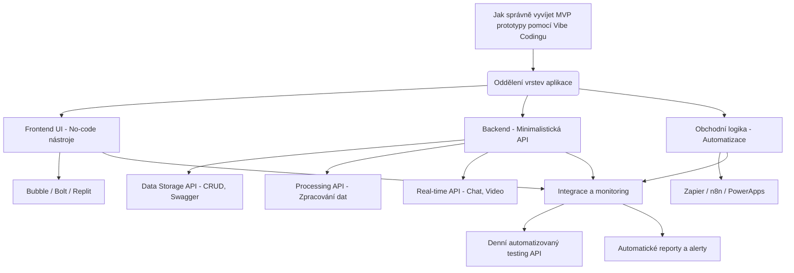

Vytvářet prototypy software (MVP) pomocí AI začíná být stále rozšířenější metoda. Jenže vibe coding, jak se nový přístup k vývoji MVP jmenuje, má své nástrahy. A nelze jej používat bezhlavě \- a na vechny projekty. Rychle narazíte na problém, kdy většinu času strávíte opravami kódu, který AI napsala nejasně nebo špatně. Klíčem k úspěchu je proto systémová jednoduchost a modulárnost, která umožní AI udržet si přehled v “kontextu”. 

Pojdme si spolu projít zásady, které se mi za posledních pár pokusů vydestilovaly jako základ úspěchu a rychlého posunu s vibe codingem: 

## **Hlavní princip: Modularizace a zjednodušení**

Klíčem k úspěšnému vývoji pomocí vibe codingu je důsledná modularizace a zjednodušení celého procesu. Nejlepší je rozdělit vývoj do tří jasně oddělených částí:

1. **Frontend vyvinutý pomocí no-code nástrojů** \- čistě pro UI/UX  
2. **Minimální sada API bez business logiky** \- pouze pro komunikaci a přístup k datům  
3. **Business logika implementovaná v automatizačním frameworku** \- pro skutečnou funkcionalitu systému

Tato struktura přináší několik významných výhod:

* Frontend kód zůstává čistý a jednoduchý, zaměřený pouze na zobrazování UI  
* API kód je krátký, přímočarý a snadno spravovatelný  
* Business logika je přehledně vizualizovaná v automatizačním frameworku, což usnadňuje debugging

## **Praktický postup implementace**

### **1\. Vývoj frontendu**

Začněte výběrem vhodného no-code nástroje jako Bubble, Bolt nebo Replit. Zaměřte se výhradně na vzhled a pocit z aplikace. V této fázi ignorujte technické detaily implementace a soustřeďte se pouze na UI/UX.

**Důležité tipy:**

* Vytvořte plně funkční frontend, který vypadá přesně tak, jak chcete  
* Nechte si ho generovat jako statický soubor (HTML/CSS/JS)  
* Autentizaci a volání API implementujte až později  
* Pro hosting využijte služby jako Cloudflare, které jsou pro statické soubory zdarma

### **2\. Implementace API**

Pro backend je nejlépe využít Python, který má vynikající podporu v AI nástrojích jako Cursor nebo Cline. Klíčová pravidla pro backend jsou:

* **Omezte počet souborů** (ideálně max. 25\)  
* **Limitujte délku jednotlivých souborů** (max. 250 řádků)  
* **Vytvářejte jen tři typy API:**  
* **Data storage API**: jednoduchá CRUD rozhraní, s jasně definovanou strukturou a Swagger dokumentací.  
* **Processing API**: slouží pro náročnější úkoly jako je komprese obrázků, generování videí či reportů. Držte je oddělené od datového API.  
* **Real-time API** (například pro chat, video, apod.): jde o složitější úkoly, u kterých stojí za to zvážit spolupráci se specializovaným vývojářem.

A dejte si pozor na jednu věc: řada AI nástrojů má tendenci databázi propojovat přímo s kódem, veškerá napojení na databází musí jít přes endpointy API na vašem serveru, jinak vystavíte databázi světu\! 

Proč tyto limity? Příliš mnoho souborů a řádků kódu znamená více kontextu pro AI, vyšší náklady a více potenciálních chyb.

### **3\. Implementace business logiky v automatizačním frameworku**

Klíčovým rozdílem oproti tradičním přístupům je přesun business logiky z backend kódu do vizuálního automatizačního frameworku jako je n8n, Make,  Zapier nebo PowerApps, pokud je to jen trochu možné. Především tak dostanete ověřenou funkcionalitu, jejíž fungování si můžete vizualizovat. I jako neprogramátor pak vidíte, co se s daty děje, jak a kudy putují a jak se zpracovávají. Ostatně, na propojování různých systémů je vibe coding a rychlá stavba prototypů založena \- můžete se tomu vysmívat, ale je to podobné, jako v Linuxu, kde využíváte vstupně/výstupní rozhraní nejrůznějších démonů, utilit či knihoven. Jen to má líbivější kabátek a “matlačku” mezi tím dělá AI nebo klikání  myší v rozhraní.  

Dodržením pravidla přesunu logiky do automatizačního frameworku dosáhnete několika zásadních výhod:

* **Menší AI kontext**: kratší a jednodušší kód znamená menší potřebu kontextu pro AI a tím i méně chyb.  
* **Úspora nákladů**: frontend můžete zdarma hostovat například na Cloudflare, backendové API jsou díky jednoduchosti levnější na provoz.  
* **Snadná údržba**: obchodní logika v nástrojích jako Zapier je snadno čitelná, což umožňuje rychlé změny a jasnou prezentaci týmu i klientům.

## **Důsledky pro celkovou architekturu**

Tento vibe coding přístup vede k systému složenému ze tří jasně oddělených vrstev:

1. **Frontend** (vibe coded) \- zodpovědný pouze za prezentaci  
2. **Backend API** (vibe coded) \- zodpovědný za ukládání, zpracování a komunikaci  
3. **Automatizační framework** \- zodpovědný za business logiku a propojení všech komponent

Takto strukturovaný systém je nejen snazší vyvíjet, ale také udržovat a rozšiřovat, protože každá část má jasně definovanou zodpovědnost a rozhraní.

## **Testování a monitoring**

Po úspěšné implementaci všech tří částí je důležité nezapomenout na testování a monitoring. Santoso doporučuje:

* Vytvořit automatizovaný workflow, který denně testuje funkčnost API  
* Implementovat pravidelné reportování a monitoring pomocí emailů nebo notifikací  
* Využít automatizační framework i pro účely testování

## **Závěr**

"Vibe coding" s využitím nejnovějších AI nástrojů představuje atraktivní způsob rychlého vývoje MVP a prototypů. Klíčem k úspěchu je však důsledné rozdělení zodpovědností mezi tři oddělené vrstvy \- frontend, API a automatizační framework. Tento přístup minimalizuje čas strávený debugováním, umožňuje rychlý vývoj a usnadňuje budoucí rozšíření a údržbu.

Pro vývojáře, kteří chtějí experimentovat s tímto přístupem, je důležité mít na paměti, že nejde o kompletní náhradu tradičních vývojových metod, ale spíše o komplementární přístup vhodný zejména pro rychlý vývoj prototypů a MVP před jejich případným přepracováním do produkční kvality.

Pro zajímavost si někdy popíšeme, jak jsem vibe codingem realizoval některé služby, jako jsou například [zajímaveprednasky.cz](http://maveprednasky.cz)…
