Meta právě vydala novou verzi svého open source LLM, který se jmenuje Llama 4. Ve skutečnosti jde o tři nové modely: Llama 4 Scout, Llama 4 Maverick a Llama 4 Behemoth, které se liší počtem aktivních parametrů a schopnostmi - a samozřejmě také požadovanou hardware výbavou. A to je to důležité: nová Llama 4 umí běžet na poměrně příznivé sestavě hardware, přitom nabízí skvělý výkon a open source prostředí. A co je naprosto famózní, je kontextové okno na 10 milionů tokenů, což je 10x více než dnes nabízí nejpokročilejší LLM Google Gemini. Jistě, rozsah kontextu se projevuje na výkonu, proto bude zajímavé sledovat, jak se to projeví v praxi, právě při použití velkého kontextu, který je dnes důležitý například při programování. K dlouhému kontextu si povíme detailní vysvětlení na závěr. 

📊 **Tři nové modely:**
- **Llama 4 Scout:** 17B aktivních parametrů s 16 experty, dokáže běžet na jediné H100 GPU
- **Llama 4 Maverick:** 17B aktivních parametrů se 128 experty, výjimečná multimodální schopnost
- **Llama 4 Behemoth:** 288B aktivních parametrů, stále ve vývoji, již nyní předčí GPT-4.5, Claude Sonnet 3.7 a Gemini 2.0 Pro v STEM benchmarcích

💡 **Klíčové technologické průlomy:**
- První nativně multimodální modely Mety využívající architekturu mixture-of-experts (MoE)
- Průlomové kontextové okno 10M tokenů u Llama 4 Scout (10x více než nabízí Google)
- Trénink na více než 30 bilionech tokenů (dvojnásobek oproti Llama 3)
- Podpora pro 200 jazyků s 10x více multilingválními tokeny než předchozí verze
- Zpracování různorodých dat včetně textu, obrazu a videa

⚖️ **Výrazné zlepšení v oblasti vyvážení a bezpečnosti:**
- Snížení míry odmítnutí odpovědí na kontroverzní témata ze 7% na méně než 2%
- Dosažení politické vyváženosti srovnatelné s modelem Grok, s výrazně menším počtem nevyvážených odpovědí
- Open-source bezpečnostní nástroje včetně Llama Guard, Prompt Guard a CyberSecEval
- Vývojáři mohou integrovat ochranné prvky proti potenciálně škodlivým vstupům a výstupům

🔥 **Výkonnostní přednosti:**
- Llama 4 Scout překonává Gemma 3, Gemini 2.0 Flash-Lite a Mistral 3.1
- Llama 4 Maverick předčí GPT-4o a Gemini 2.0 Flash v řadě benchmarků
- Srovnatelné výsledky s [DeepSeek](/item/deepseek/) v3 v oblasti uvažování a kódování - s polovinou aktivních parametrů
- Bezkonkurenční poměr výkonu a nákladů, chatovací verze skóruje 1417 ELO na LMArena

Výborné jsou také cenové parametry pro případ, že chcete použít Llama 4 přes API a nechcete ji instalovat na vlastní servery:

Musím říct, že je to velmi příjemné překvapení. I když jsou to zatím jen papírová data a osobní zkušenost chybí, vypadá to velmi slibně a Meta jistě nebude slibovat něco, co alespoň přibližně není pravda. Na větší testování si musím počkat na začátek týdne, až si trochu uvolním místo na serverech :)

[Více informací o modelech Llama 4 včetně detailů o tréninku a benchmarcích.](https://go.fb.me/gmjohs).

⬇️ [Stáhnout Llama 4 můžete zde](https://go.fb.me/bwwhe9).

## Architektura iRoPE čili jak se Meta dostala k desetimilionovému kontextu. 

Deset milionů tokenů není vůbec maličkost, to je mimo jiné třeba 20 hodin videa, které si může Llama 4 Scout nacpat do paměti. Za tímto průlomem stojí architektura iRoPE. 

Architektura iRoPE, kterou vyvinul tým Meta pro modely Llama 4, představuje inovativní přístup k řešení jednoho z největších problémů současných jazykových modelů - efektivní práce s extrémně dlouhým kontextem. Název iRoPE znamená _"interleaved Rotary Position Embedding"_, tedy prokládané rotační poziční kódování.

Tradiční transformerové architektury mají problém se zpracováním velmi dlouhých textů ze dvou důvodů. Za prvé, standardní attention mechanismus má kvadratickou složitost, což znamená, že paměťové a výpočetní nároky dramaticky rostou s délkou vstupu. Za druhé, poziční kódování, které umožňuje modelu rozlišovat pořadí slov, se obtížně extrapoluje na délky výrazně přesahující trénovací data.

Architektura iRoPE elegantně řeší tyto problémy kombinací dvou typů pozornostních vrstev, které se v modelu vzájemně prokládají (odtud "interleaved" v názvu). 

*První typ tvoří lokální vrstvy*, které používají tradiční rotační poziční kódování (RoPE). Tyto vrstvy zpracovávají pouze krátké úseky textu, typicky do 8K tokenů, a jsou zodpovědné za zachycení jemných místních souvislostí a jazykových vzorů. Klíčovou optimalizací je, že text rozdělují na menší části, které zpracovávají paralelně, což výrazně zvyšuje efektivitu.

*Druhý typ představují globální vrstvy*, které na rozdíl od lokálních vrstev zpracovávají celý dlouhý kontext bez použití pozičních embedingů. To je revoluční myšlenka - tyto vrstvy se nesnaží rozlišovat konkrétní pozice, ale soustředí se na sémantické vztahy mezi různými částmi textu. Tím, že se model nemusí spoléhat na poziční informace, dokáže lépe generalizovat na délky daleko přesahující trénovací data.

Síla architektury spočívá právě v prokládání těchto dvou typů vrstev. Lokální vrstvy poskytují přesné modelování blízkých vztahů, zatímco globální vrstvy umožňují modelu "vidět" a propojovat vzdálené části kontextu. Takto dokáže model efektivně pracovat s kontextem o délce 10 milionů tokenů, i když byl trénován na mnohem kratších sekvencích (maximálně 256K tokenů).

Dalším důležitým aspektem je řešení problému "zploštění" pozornosti. S rostoucí délkou kontextu totiž mechanismus pozornosti přirozeně ztrácí schopnost zaměřit se na důležité informace - pozornost se "rozptyluje" napříč mnoha tokeny. Tým Meta vyvinul speciální techniku teplotního škálování, kterou aplikují pouze během inference a pouze na globální vrstvy. Tato technika pomáhá modelu udržet "ostrou" pozornost i při práci s extrémně dlouhými kontexty, aniž by to negativně ovlivnilo jeho výkon na krátkých textech.

Klíčovým vhledem celého přístupu je změna perspektivy - místo snahy trénovat model přímo na velmi dlouhých sekvencích (což by bylo extrémně náročné na výpočetní zdroje), tým Meta přeformuloval problém jako dosažení "nekonečného kontextu". To vedlo k návrhu architektury, která dokáže elegantně extrapolovat z krátkých trénovacích sekvencí na mnohem delší vstupy při reálném použití. Tento přístup je nejen praktičtější z hlediska tréninku, ale také lépe škáluje směrem k budoucím modelům s ještě delším kontextem.

A tady si to ještě pro jistotu ukážeme v grafu:

```mermaid
flowchart TD
    subgraph Architecture["Architektura iRoPE"]
        Input[/"Vstupní sekvence\n(až 10M tokenů)"/] --> Split["Rozdělení zpracování"]
        
        Split --> LocalLayers["Lokální vrstvy s RoPE"]
        Split --> GlobalLayers["Globální vrstvy bez pozičních embedingů"]
        
        subgraph LocalProcessing["Zpracování lokálních vrstev"]
            LocalLayers --> Chunking["Rozdělení na chunky\n(typicky 8K tokenů)"]
            Chunking --> ParallelProc["Paralelní zpracování chunků"]
            ParallelProc --> LocalPatterns["Zachycení lokálních vzorů\na závislostí"]
        end
        
        subgraph GlobalProcessing["Zpracování globálních vrstev"]
            GlobalLayers --> FullContext["Zpracování celého kontextu"]
            FullContext --> SemanticRel["Zachycení sémantických vztahů\nbez ohledu na pozici"]
            SemanticRel --> TempScaling["Teplotní škálování při inferenci\n(kompenzace zploštění pozornosti)"]
        end
        
        LocalPatterns --> Interleaving["Prokládání (Interleaving)\nlokálních a globálních reprezentací"]
        TempScaling --> Interleaving
        
        Interleaving --> Output[/"Výstupní reprezentace\ns efektivním dlouhým kontextem"/]
    end
    
    style Architecture fill:#f5f5f5,stroke:#333,stroke-width:1px
    style LocalProcessing fill:#e1f5fe,stroke:#0288d1,stroke-width:1px
    style GlobalProcessing fill:#e8f5e9,stroke:#388e3c,stroke-width:1px
    
    style Input fill:#bbdefb,stroke:#1976d2,stroke-width:1px
    style Output fill:#c8e6c9,stroke:#43a047,stroke-width:1px
    style Split fill:#fff9c4,stroke:#fbc02d,stroke-width:1px
    style Interleaving fill:#f8bbd0,stroke:#e91e63,stroke-width:1px
```    

# Omezení nové licence Llama 4

Nová licence Llama 4 přichází s několika omezeními:

- Společnosti s více než 700 miliony měsíčně aktivních uživatelů musí požádat o speciální licenci od společnosti Meta, kterou Meta může udělit nebo odmítnout dle svého výhradního uvážení.
- Musíte viditelně zobrazit "Built with Llama" (Vytvořeno s Llama) na webových stránkách, rozhraních, dokumentaci atd.
- Jakýkoliv AI model, který vytvoříte s použitím modelu Llama, musí obsahovat "Llama" na začátku svého názvu.
- Musíte zahrnout specifické oznámení o autorských právech v textovém souboru "Notice" při jakékoliv distribuci.
- Vaše používání musí být v souladu se samostatnými [Zásadami přijatelného použití společnosti Meta](http://llama.com/llama4/use-policy).
- Omezená licence k používání názvu "Llama" pouze pro účely splnění požadavků na označení.