Context Engineering představuje zajímavý posun v přístupu k tvorbě AI systémů založených na velkých jazykových modelech. Zní to velmi technicky, ale rychle zjistíte, že to je něco velmi logického a očekávatelného. Namísto toho, aby kontextem bylo to, co zadáte v promptu, se kontextem stává všechno, co se problému může týkat. Jak?

Zatímco tradiční prompt engineering se zaměřuje na psaní dokonalých instrukcí, _Context Engineering_ řeší ten samý problém komplexněji, pomocí dynamického sestavování všech informací, které model potřebuje (nebo může potřebovat) pro úspěšné splnění úkolu. Podle odborníků jako je Tobi Lütke, zakladatel společnosti Shopify (a velký propagátor pojmu _Context Engineering_), jde o _"umění poskytnutí veškerého kontextu potřebného k tomu, aby byla úloha pro jazykový model věrohodně řešitelná"_.

Tato disciplína nabývá na významu s rozvojem AI agentů, kde kvalita kontextu často rozhoduje o úspěchu a neúspěchu celého agentního systému. Většina současných selhání agentů již není způsobena nedostatky samotných modelů, ale právě nedokonalým poskytnutím souvisejících informací, tedy kontextu. Takže, když se dnes bavíme o _kontextovém inženýrství_, bavíme se také především o práci s agentními systémy, nikoliv o nějakém zadávání jedoduchého promptu přes ChatGPT... 

Abychom si to nějak přirovnali: zatímco _prompt engineering_ si můžeme představit jako čerstvého absolventa sršícího nabiflovanými znalostmi, který přichází do zaběhlého firemního týmu, _context engineering_ je naopak zkušeným seniorním člověkem, který ve firmě strávil mnoho let a ví, co kde a jak funguje... 

### Definice kontextu v moderních AI systémech

Kontext v prostředí velkých jazykových modelů překračuje hranice jednoduchého textu, který uživatel zadá do modelu. Představuje komplexní soubor strukturovaných informací poskytovaných modelu v okamžiku inference. 

Zatímco tradiční prompt engineering pracoval s kontextem jako s jednoduchým řetězcem, Context Engineering rozkládá kontext na strukturované komponenty:

> kontext = sestavení(instrukce, znalosti, nástroje, paměť, stav, dotaz)

Tato formalizace umožňuje systematický přístup k optimalizaci jednotlivých komponent kontextu namísto intuitivního ladění textových šablon.

### Šest základních typů kontextu podle Hurynova modelu

Dnes uvažujeme o šesti základních typech kontextu, které tvoří základ každého efektivního AI systému. To poskytuje strukturovaný přístup k návrhu kontextu pro různé scénáře použití.

#### Instrukce a systémové pokyny

**Instrukce** definují základní chování modelu během konverzace a zahrnují několik klíčových elementů: _Definice role_ specifikuje, jak má model vystupovat - například jako odborný asistent, programátor nebo analytik. _Motivace a obchodní hodnota_ vysvětluje, proč je úkol důležitý a jaký má širší kontext. _Požadované výsledky_ definují konkrétní očekávání a kritéria úspěchu.

Výzkum dokumentovaný v příspěvku [Human Delegation Behavior in Human-AI Collaboration: The Effect of Contextual Information](https://arxiv.org/abs/2401.04729) ukazuje, že poskytnutí strategického kontextu nad rámec pouhé specifikace úkolu výrazně zlepšuje autonomii AI systémů. Modely s jasně definovaným účelem a obchodním kontextem vykazují lepší schopnost rozhodování a menší tendenci k odchýlení od stanoveného cíle.

#### Požadavky a implementační postupy

Druhá kategorie definuje konkrétní **kroky a omezení** pro vykonání úkolu. Zahrnuje specifikaci kroků uvažování, postupy řešení a konkrétní akce, které má model podniknout. Konvence definují styl komunikace, pravidla pro psaní kódu nebo návrh systémů. Omezení pokrývají výkonnostní požadavky, bezpečnostní aspekty, testovací pokrytí a regulatorní požadavky.

Důležitou součástí jsou formáty odpovědí - zda má model generovat JSON, XML nebo prostý text. Pozitivní i negativní příklady pomáhají modelu pochopit požadované chování. Negativní příklady jsou obzvlášť cenné pro řešení problémů identifikovaných během analýzy chyb.

#### Znalostní báze a externí kontext

Znalosti představují informace, které model potřebuje pro splnění úkolu, ale nejsou součástí jeho předtrénovaných parametrů. Externí kontext zahrnuje doménové informace jako obchodní strategie, tržní data a systémové informace o celkových cílech a dalších agentech nebo službách.

Kontextové informace o úkolu zahrnují workflow procesy, dokumentaci specifikací, procedury, záznamy a strukturovaná data ve formě proměnných, tabulek a JSON/XML struktur. Moderní implementace využívají pokročilé RAG (Retrieval-Augmented Generation) systémy schopné načítat relevantní informace z rozsáhlých znalostních bází v reálném čase.

### Paměťové systémy

Paměť v kontextu AI systémů se dělí na krátkodobou a dlouhodobou. Krátkodobá paměť zahrnuje předchozí zprávy v konverzaci, historii chatu a aktuální stav včetně kroků uvažování a průběhu řešení. Dlouhodobá paměť obsahuje sémantické informace jako fakta, preference uživatelů a doménové znalosti, episodické zkušenosti z předchozích interakcí a procedurální instrukce z dřívějších session.

Paměť není součástí promptu, který uživatel může zadat. Může být automaticky připojena orchestrační vrstvou nebo přístupná jako nástroj. Produkční systémy jako [MemGPT](https://github.com/cpacker/MemGPT) implementují sofistikované paměťové architektury inspirované operačními systémy.

### Nástroje a externí funkce

Nástroje umožňují modelům interakci s externími systémy a rozšiřují jejich schopnosti nad rámec generování textu. Každý nástroj musí mít jasnou dokumentaci popisující účel, způsob použití, návratové hodnoty a parametry. Definice nástrojů spotřebovává tokeny v kontextovém okně a ovlivňuje výkon systému.

Popisy nástrojů fungují jako mikro-prompty, které řídí uvažování agentů. Popisy poskytované standardními protokoly jako [Model Context Protocol (MCP)](https://github.com/modelcontextprotocol) jsou často nedostatečné a nezohledňují specifický kontext domény. Proto je nutné přizpůsobit dokumentaci nástrojů konkrétním potřebám aplikace.

### Výsledky nástrojů a orchestrace

Posledním typem kontextu jsou výsledky volání nástrojů. Pro vyvolání funkce používá model speciální formát interpretovaný systémem. Orchestrační vrstva následně připojuje speciální zprávu se výsledky do seznamu zpráv. Tento mechanismus umožňuje modelům pracovat se skutečnými daty a vykonávat konkrétní akce v reálném světě.

## Rozdíl mezi ukázkovými a produkčními systémy

Kvalita kontextu představuje hlavní rozdíl mezi jednoduchými ukázkami a "magickými" produkčními AI agenty. Philip Schmid na svém blogu demonstruje tento rozdíl na příkladu plánování schůzky na základě emailu: _"Ahoj, jenom se ptám, jestli máš zítra čas na rychlou synchronizaci."_

Ukázkový agent s chudým kontextem vidí pouze uživatelův požadavek a nic dalšího. Výstup je sice funkčně správný, ale neužitečný: _"Děkuji za vaši zprávu. Zítra mi to vyhovuje. Můžu se zeptat, na jakou dobu jste myslel?"_

Produkční agent s bohatým kontextem před voláním modelu rozšiřuje kontext o informace z kalendáře (který ukazuje plnou obsazenost), historii emailů s danou osobou (pro určení vhodného neformálního tónu), kontaktní seznam (pro identifikaci klíčového partnera) a nástroje pro odesílání pozvánek. Výsledek je výrazně kvalitnější: _"Ahoj Honzo! Zítra mám nabitý program, celý den schůzky za sebou. Čtvrtek dopoledne volno, pokud ti to vyhovuje? Poslal jsem pozvánku, dej vědět, jestli je to tak OK."_

## Vizualizace kontextového inženýrství

```mermaid
graph LR
    Root["6 typů kontextu<br/>pro AI agenty"] 
    
    Root --- Instructions["📋 Instrukce"]
    Root --- Examples["💡 Příklady"] 
    Root --- Knowledge["📚 Znalosti"]
    Root --- Memory["🧠 Paměť"]
    Root --- Tools["🔧 Nástroje"]
    Root --- Results["🎁 Výsledky nástrojů"]
    
    Instructions --- Role["Role (Kdo)"]
    Role --- RoleDesc["Povzbuzení LLM jednat jako persona<br/>např. PM, kodér, tržní analytik"]
    
    Instructions --- Objective["Cíl"]
    Objective --- ObjDesc["Proč je to důležité<br/>(motivace, širší cíl, obchodní hodnota)"]
    Objective --- Strategic["💡 Poskytnutí strategického kontextu<br/>zlepšuje AI autonomii<br/>arXiv:2401.04729"]
    
    Instructions --- Requirements["Požadavky (Jak)"]
    Requirements --- Steps["Kroky (uvažování, úkoly, akce)"]
    Requirements --- Conventions["Konvence (styl/tón, pravidla kódování)"]
    Requirements --- Constraints["Omezení (výkon, bezpečnost, regulace)"]
    Requirements --- Format["Formát odpovědi (JSON, XML, prostý text)"]
    
    Examples --- BehaviorEx["Příklady chování"]
    BehaviorEx --- Positive1["Pozitivní"]
    BehaviorEx --- Negative1["Negativní"]
    Negative1 --- NegTip["💡 Negativní příklady pomáhají<br/>řešit problémy z analýzy chyb"]
    
    Examples --- ResponseEx["Příklady odpovědí"]
    ResponseEx --- Positive2["Pozitivní"]
    ResponseEx --- Negative2["Negativní"]
    
    Knowledge --- External["Externí kontext"]
    External --- Domain["Doména (strategie, obchodní model, tržní fakta)"]
    External --- System["Systém (celkové cíle, ostatní agenti/služby)"]
    
    Knowledge --- TaskContext["Kontext úkolu"]
    TaskContext --- Workflow["Workflow (proces, předávání)"]
    TaskContext --- Documents["Dokumenty (specifikace, procedury, logy)"]
    TaskContext --- StructuredData["Strukturovaná data (proměnné, tabulky, JSON/XML)"]
    
    Memory --- ShortTerm["Krátkodobá paměť"]
    ShortTerm --- Messages["Předchozí zprávy, historie chatu"]
    ShortTerm --- State["Stav (kroky uvažování, průběh)"]
    ShortTerm --- Session["💡 Často existuje v rámci session"]
    
    Memory --- LongTerm["Dlouhodobá paměť"]
    LongTerm --- Semantic["Sémantická (fakta, preference, znalosti)"]
    LongTerm --- Episodic["Epizodická (zkušenosti, interakce)"]
    LongTerm --- Procedural["Procedurální (instrukce z předchozích session)"]
    LongTerm --- Storage["💡 Uloženo v databázi nebo souborovém systému"]
    LongTerm --- Attached["💡 Automaticky připojeno orchestrační vrstvou"]
    LongTerm --- Tool["💡 Přístupné jako nástroj"]
    
    Tools --- Description["Popis"]
    Description --- WhatItDoes["Co to dělá"]
    Description --- HowToUse["Jak to použít"]
    Description --- ReturnValue["Návratová hodnota"]
    
    Tools --- Parameters["Parametry"]
    Parameters --- Type["Typ"]
    Parameters --- ParamDesc["Popis"]
    Parameters --- Required["Je vyžadován"]
    Parameters --- ParamExamples["Příklady"]
    
    Tools --- ToolTips["💡 Speciální 'functions' blok v LLM kontextu<br/>Spotřebovává vstupní tokeny"]
    Tools --- MicroPrompts["💡 Popisy jako mikro-prompty pro uvažování"]
    Tools --- MCPLimits["💡 MCP servery často nedostatečné<br/>neuvažují specifický kontext domény"]
    
    Results --- CallFormat["💡 Volání funkce speciálním formátem<br/>interpretovaným systémem"]
    Results --- Response["💡 Orchestrační vrstva odpovídá<br/>připojením zprávy do seznamu"]
    
    classDef mainNode fill:#2563eb,stroke:#1e40af,stroke-width:3px,color:#fff
    classDef categoryNode fill:#3b82f6,stroke:#2563eb,stroke-width:2px,color:#fff
    classDef detailNode fill:#e0f2fe,stroke:#0277bd,stroke-width:1px,color:#333
    classDef tipNode fill:#fff3cd,stroke:#ffc107,stroke-width:2px,color:#333
    
    class Root mainNode
    class Instructions,Examples,Knowledge,Memory,Tools,Results categoryNode
    class Role,Objective,Requirements,BehaviorEx,ResponseEx,External,TaskContext,ShortTerm,LongTerm,Description,Parameters detailNode
    class Strategic,NegTip,Session,Storage,Attached,Tool,ToolTips,MicroPrompts,MCPLimits,CallFormat,Response tipNode
```

### Technické implementace a architektury

#### RAG systémy a načítání informací

RAG (Retrieval-Augmented Generation) představuje klíčovou komponentu moderních _Context Engineering_ systémů. Základní RAG implementace načítají relevantní dokumenty na základě podobnosti s dotazem. Pokročilé systémy využívají adaptivní strategie, kdy se rozhodování o načítání informací provádí dynamicky na základě složitosti dotazu. Tím se systémy vymaňují z délkového omezení kontextu, které by jinak bylo potřeba u jednotlivých LLM uplatňovat. 

Modulární RAG architektury umožňují kombinování více zdrojů informací - strukturovaných databází, grafových databází znalostí a real-time API. Agentic RAG systémy jdou ještě dál a implementují sebereflexi, kdy agent vyhodnocuje kvalitu načtených informací a podle potřeby dohledává další zdroje.

#### Správa paměti a persistence kontextu

Persistentní paměťové architektury řeší problém udržování kontextu napříč dlouhými konverzacemi. Systémy jako [Mem0](https://github.com/mem0ai/mem0) poskytují škálovatelnou dlouhodobou paměť pro produkční AI agenty. Epizodická paměť ukládá konkrétní interakce a zkušenosti, zatímco sémantická paměť obsahuje fakta a obecné znalosti.

Kontinuální učení umožňuje systémům aktualizovat své znalosti na základě nových informací bez nutnosti přetrénování. Konsolidace paměti optimalizuje ukládání důležitých informací a odstraňuje redundantní nebo zastaralé údaje.

#### Orchestrace více agentů

Komunikační protokoly mezi agenty využívají strukturované formáty pro výměnu informací a koordinaci akcí. Model Context Protocol (MCP) definuje standardní způsob sdílení kontextu mezi různými AI systémy. Agent-to-Agent Protocol (A2A)specifikuje mechanismy pro přímou komunikaci a spolupráci.

Distribuované systémy agentů řeší složité úlohy rozdělením práce mezi specializované komponenty. Každý agent má svou oblast expertízy a kontext optimalizovaný pro specifické úkoly. Koordinační mechanismy zajišťují koherenci a vyhýbání se konfliktům.

### Praktické poznatky z produkčního nasazení

Sám žádné podstatné zkušenosti v tomto ohledu zatím nemám, takže jsem se podíval jinam a našel pár zajímavých poznámek. 

Zkušenosti týmu Manus AI, vedený Yichaem 'Peak' Ji, přinášejí zajímavé poznatky z reálného nasazení Context Engineering v produkčním prostředí. Podle Ji: _"Context engineering se ukázal být experimentální vědou - náš agentní framework jsme přestavěli čtyřikrát, pokaždé po objevení lepšího způsobu tvarování kontextu."_

#### Optimalizace KV-cache jako klíčová metrika

KV-cache hit rate představuje nejkritičtější metriku pro produkční AI agenty. Ji zdůrazňuje: _"Pokud bych si měl vybrat jen jednu metriku, tvrdil bych, že KV-cache hit rate je nejdůležitější metrika pro produkčního AI agenta. Přímo ovlivňuje latenci i náklady."_

> **KV-cache hit rate** je metrika udávající, kolik procent tokenů v kontextu jazykový model může znovu využít z již vypočítané cache namísto nového výpočtu pozornostního mechanismu. Když model zpracovává text, ukládá si key-value páry pro každý token do cache. Pokud přijde nový požadavek s identickým prefixem (začátkem kontextu), model může tyto uložené výpočty znovu použít a přeskočit na první odlišný token. _Hit rate_ tak udává poměr "recyklovaných" tokenů k celkovému počtu tokenů v kontextu.
> Pro AI agenty je tato metrika kritická, protože jejich kontexty rostou s každou akcí a pozorováním, přičemž prefix (systémový prompt a počáteční instrukce) zůstává často identický. Vysoká _hit rate_ dramaticky snižuje čas do prvního tokenu (TTFT) a náklady, třeba u Claude Sonnet je rozdíl v ceně kešovaných a nekešovaných tokenů desetinásobný.  Proto jsou agenti navrženi s append-only kontextem a stabilními prefixy, aby maximalizovali znovuvyužití cache napříč iteracemi.

Konkrétní číselné údaje ukazují dramatické rozdíly:
- Poměr vstupních a výstupních tokenů u agentů dosahuje průměrně **100:1** (ve srovnání s chatboty)
- Cached tokeny u Claude Sonnet stojí **0.30 USD/MTok**, zatímco uncached **3 USD/MTok** - **desetinásobný rozdíl**

**Praktická doporučení pro optimalizaci KV-cache:**

1. **Stabilní prefix promptu** - vyhýbání se například časovým značkám v system promptu, protože i pidi-změna může zneplatit cache od daného tokenu dál
2. **Append-only kontext** - zabránění úpravám předchozích akcí a pozorování, zajištění deterministické serializace JSON objektů
3. **Explicitní cache breakpointy** - pro providery nebo frameworky nepodporující automatické inkrementální prefix caching

### Učení z chyb jako indikátor agentického chování

Klíčovou praktickou radou je **zachování neúspěšných akcí v kontextu**. Ji argumentuje: _"Mazání selhání odstraňuje důkazy. A bez důkazů se model nemůže adaptovat."_

Když model vidí neúspěšnou akci a výsledné pozorování nebo stack trace, implicitně aktualizuje své vnitřní přesvědčení a snižuje pravděpodobnost opakování stejné chyby. Ji považuje **error recovery za jeden z nejjasnějších indikátorů skutečného agentického chování**.

## Omezení a výzvy současných systémů

Omezení kontextového okna představuje stále základní problém, přestože se postupně rozšiřuje počet tokenů, které lze v rámci kontextového okna zvládnout. Výpočetní náročnost zpracování rozsáhlých kontextů vyžaduje značné zdroje. Udržování koherence napříč rozšířenými kontexty je i nadále technickou výzvou a je potřeba najít přístupy, které technickou náročnost (a tím i cenu) tlačí dolů.

Dynamická adaptace kontextu v reálném čase přináší složitost v podobě latence a synchronizace více zdrojů dat. Bezpečnost a soukromí citlivých informací v kontextových pipeline vyžaduje sofistikované šifrovací a kontrolní mechanismy.

## Budoucí směry vývoje

Nekonečný kontext představuje dlouhodobý cíl pro skutečně neomezené zpracování informací. Komprese kontextu umožňuje efektivní reprezentaci rozsáhlých znalostí v omezeném prostoru. Multimodální integrace spojuje text, obrázky, audio a další datové typy do jednotného kontextu.

Adaptivní systémy budou schopny samooptimalizace kontextu na základě zpětné vazby a výsledků. Autonomní generování kontextu umožní systémům vytvářet vlastní znalostní báze a iterativně je vylepšovat.

Kognitivní architektury inspirované lidským mozkem implementují rozdělení mezi pracovní pamětí, dlouhodobou pamětí a pozornostními mechanismy. Tyto systémy jednou budou schopny sofistikovaného uvažování o tom, které informace jsou v daném okamžiku nejrelevantnější. Zatím tady ale nejsme a je tu celá řada výzev a prostoru pro zlepšení. 

Context Engineering nicméně zjevně představuje klíčovou disciplínu pro tvorbu spolehlivých AI systémů schopných fungovat v produkčním prostředí. Přechod od jednoduchého prompt engineering k systematickému navrhování kontextu umožňuje vytváření skutečně užitečných AI asistentů a autonomních agentů, které chápou celé téma v širších souvislostech. 

## Zdroje a další informace

- [Paweł Huryn's Context Engineering Template](https://github.com/phuryn/examples/tree/main/prompts/context_engineering)
- [Awesome Context Engineering Repository](https://github.com/Meirtz/Awesome-Context-Engineering)
- [The New Skill in AI is Not Prompting, It's Context Engineering](https://www.philschmid.de/context-engineering)
- [Context Engineering for AI Agents: Lessons from Building Manus](https://blog.manus.ai/context-engineering) - Yichao 'Peak' Ji
- [LangChain Blog: The Rise of Context Engineering](https://blog.langchain.com/the-rise-of-context-engineering/)
- [Model Context Protocol Specification](https://github.com/modelcontextprotocol)
